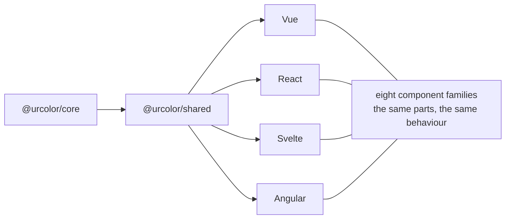

# Components

urcolor ships eight families of unstyled, accessible color picker primitives for
Vue, React, Svelte and Angular. Each family is a set of parts you compose, and
each works in any supported color space.

See them working together in the [full preview](/components/vue/preview).

## The families

| Family | What it does | Vue | React | Svelte | Angular |
| --- | --- | --- | --- | --- | --- |
| Color Area | Two channels on a plane, one drag sets both | [docs](/components/vue/color-area) | [docs](/components/react/color-area) | [docs](/components/svelte/color-area) | [docs](/components/angular/color-area) |
| Color Slider | One channel on a track, horizontal or vertical | [docs](/components/vue/color-slider) | [docs](/components/react/color-slider) | [docs](/components/svelte/color-slider) | [docs](/components/angular/color-slider) |
| Color Field | A numeric input per channel, with steppers | [docs](/components/vue/color-field) | [docs](/components/react/color-field) | [docs](/components/svelte/color-field) | [docs](/components/angular/color-field) |
| Color Swatch | One color as a filled element | [docs](/components/vue/color-swatch) | [docs](/components/react/color-swatch) | [docs](/components/svelte/color-swatch) | [docs](/components/angular/color-swatch) |
| Swatch Picker / Group | A keyboard-navigable palette | [docs](/components/vue/color-swatch-picker) | [docs](/components/react/color-swatch-group) | [docs](/components/svelte/color-swatch-group) | [docs](/components/angular/color-swatch-group) |
| Color Ring | One channel on a circle | [docs](/components/vue/color-ring) | [docs](/components/react/color-ring) | [docs](/components/svelte/color-ring) | [docs](/components/angular/color-ring) |
| Color Triangle | Two channels on a triangle, or three in barycentric mode | [docs](/components/vue/color-triangle) | [docs](/components/react/color-triangle) | [docs](/components/svelte/color-triangle) | [docs](/components/angular/color-triangle) |
| Color Wheel | One channel on the angle, another on the radius | [docs](/components/vue/color-wheel) | [docs](/components/react/color-wheel) | [docs](/components/svelte/color-wheel) | [docs](/components/angular/color-wheel) |

## Alpha

Every family can show opacity. Sliders and fields take `channel="alpha"`; the
area, slider and swatch take an `alpha` prop. The `Gradient` parts paint the
transparency checkerboard behind their own canvas, so nothing else is needed to
make it visible.

For step-by-step recipes, see [How to](/how-to/build-color-area-picker), which
shows all four frameworks side by side.
