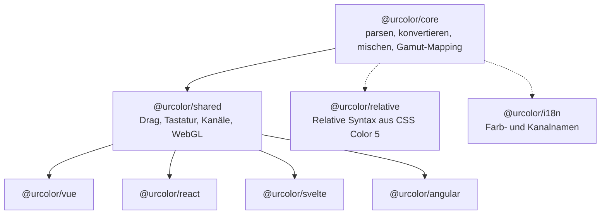

# Einführung

UrColor ist eine universelle, headless Komponentenbibliothek für Farbwähler. Sie liefert stillose, kombinierbare Primitive und überlässt dir die volle Kontrolle über Gestaltung und Verhalten.

## Pakete

Durchgezogene Pfeile sind Pflicht, gepunktete sind optional.

- `@urcolor/core` — Eine abhängigkeitsfreie CSS-Color-4-Bibliothek (parsen, konvertieren, serialisieren, Gamut-Mapping, interpolieren).
- `@urcolor/shared` — Die frameworkunabhängige Verhaltensschicht: Drag-Handling, Tastaturbelegungen, Kanalmodelle, WebGL-Canvas-Verlaufsgeneratoren für Farbflächen und Slider sowie Data-Attribute, die alle Bindings teilen.
- `@urcolor/relative` — Optionale relative Farbsyntax aus CSS Color 5 (`rgb(from red r g b)`) für `@urcolor/core`. Siehe [Relative Farben](/guide/relative-colors).
- `@urcolor/i18n` — Mehrsprachige Farbnamen und Kanalbezeichnungen. Siehe [Farbbenennung](/guide/color-naming).
- `@urcolor/vue` — Headless Vue-3-Komponenten und Composables zum Bau von Farbwählern.
- `@urcolor/react` — Dieselben Primitive für React.
- `@urcolor/svelte` — Dieselben Primitive für Svelte 5, als Komponenten plus Rune-basierte Hooks.
- `@urcolor/angular` — Dieselben Primitive für Angular, als Direktiven plus Signal-Stores.

Alle vier Bindings liefern dieselben acht Komponentenfamilien. Jede Anleitung unter [Anleitungen](/how-to/build-color-area-picker) zeigt Vue, React, Svelte und Angular nebeneinander – wähle einfach den Tab, der zu deinem Stack passt.

## Philosophie

Inspiriert von Radix UI, Reka UI und React Spectrum liefert UrColor Logik und Barrierefreiheit, die Gestaltung kommt von dir. Die Farbflächen-Komponente unterstützt beliebige Zwei-Kanal-Kombinationen (etwa Hue+Saturation oder Hue+Chroma in LCH) und rendert sie über WebGL – für weiche, GPU-beschleunigte Verläufe.
