# Benchmarks

`@urcolor/core` against the color libraries people actually reach for, plus
the canvas grid samplers `@urcolor/shared` layers on top. Every number comes
from the suites in
[`packages/core/bench`](https://github.com/ur-color/urcolor/tree/main/packages/core/bench),
regenerated with `bun run --cwd packages/core bench:report`.

::: warning Read the groups, not the totals
No library wins everywhere. These libraries trade spec coverage, perceptual
accuracy and object model against each other, so a group urcolor loses says
something about one of those choices rather than about the library. Where a
comparison is not like for like, the note above the group says so.

A library missing from a group cannot express that operation at all. Nothing
was dropped for being slow.
:::

Each chart plots the fast end of its group. Bars past 10× the leader
are named underneath and printed in the table, because one very slow bar
flattens every other one to a pixel. Bar labels are in the unit named on the
axis, rounded to three figures; the table under each chart has the rest.

Every library keeps the same color on every chart:

<p class="bench-key"><span class="bench-key-item"><span class="bench-key-dot" style="background:#ff4081"></span>urcolor</span><span class="bench-key-item"><span class="bench-key-dot" style="background:#2f9e44"></span>culori</span><span class="bench-key-item"><span class="bench-key-dot" style="background:#f59f00"></span>chroma-js</span><span class="bench-key-item"><span class="bench-key-dot" style="background:#7048e8"></span>colorjs.io</span><span class="bench-key-item"><span class="bench-key-dot" style="background:#1c7ed6"></span>colord</span><span class="bench-key-item"><span class="bench-key-dot" style="background:#0ca678"></span>tinycolor2</span><span class="bench-key-item"><span class="bench-key-dot" style="background:#e8590c"></span>@ctrl/tinycolor</span></p>

## Setup

Measured on Apple M1 at ~0.91 GHz,
bun 1.3.0 (arm64-darwin), with
[mitata](https://github.com/evanwashere/mitata). Times are the mean per
operation.

| Library | Version |
| --- | --- |
| **@urcolor/core** | **2.0.0** |
| **@urcolor/shared** | **1.0.0** |
| [culori](https://www.npmjs.com/package/culori) | 4.0.2 |
| [chroma-js](https://www.npmjs.com/package/chroma-js) | 3.2.0 |
| [colorjs.io](https://www.npmjs.com/package/colorjs.io) | 0.7.1 |
| [colord](https://www.npmjs.com/package/colord) | 2.9.3 |
| [tinycolor2](https://www.npmjs.com/package/tinycolor2) | 1.6.0 |
| [@ctrl/tinycolor](https://www.npmjs.com/package/@ctrl/tinycolor) | 4.2.0 |

```sh
# every suite
bun run --cwd packages/core bench

# one suite at a time
bun run --cwd packages/core bench parse convert

# regenerate this page
bun run --cwd packages/core bench:report
```

Each row runs against a rotating pool of eight colors. Against a single
constant the JIT inlines the smaller operations and hoists them out of the
measurement loop: an early draft of this suite had
`tinycolor2.toRgbString()` "running" in 0.17 picoseconds. The rotation costs
about a nanosecond, and every row pays it.

::: tip Two APIs, two costs
The same engine ships twice: a tree-shakeable functional API (`parse`,
`convert`, `mix`) and the [`Color`](./color-class) class on top of it. Groups
listing both rows show what the wrapper costs, usually one allocation. Reach
for the functions in per-pixel loops and the class everywhere else.
:::

## Parsing

CSS string in, the library's own representation out. Hex and the legacy functional notations are the common denominator. `oklch()`, `lab()` and `color(display-p3 …)` are CSS Color 4, which only urcolor, culori and colorjs.io parse.

### parse: hex

<div class="bench-chart" style="--bench-1:#ff4081;--bench-2:#2f9e44;--bench-3:#1c7ed6;--bench-4:#ff4081;--bench-5:#f59f00;--bench-6:#0ca678;--bench-7:#e8590c">

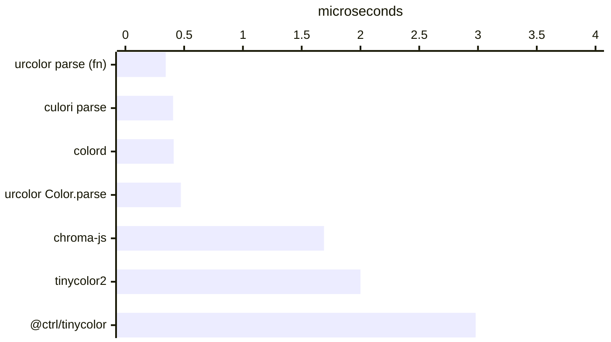

</div>

Off the chart: colorjs.io at 25.07 µs. The table below carries every row.

<details>
<summary>Exact timings</summary>

| Library | Time | Relative |
| --- | --- | --- |
| **urcolor  parse (fn)** | 343.1 ns | **fastest** |
| culori   parse | 405.7 ns | 1.18× slower |
| colord | 411.4 ns | 1.20× slower |
| **urcolor  Color.parse** | 471.9 ns | 1.38× slower |
| chroma-js | 1.69 µs | 4.92× slower |
| tinycolor2 | 2.00 µs | 5.82× slower |
| @ctrl/tinycolor | 2.98 µs | 8.69× slower |
| colorjs.io | 25.07 µs | 73.05× slower |

</details>

### parse: hex + alpha (#rrggbbaa)

<div class="bench-chart" style="--bench-1:#1c7ed6;--bench-2:#ff4081;--bench-3:#2f9e44;--bench-4:#e8590c;--bench-5:#0ca678;--bench-6:#f59f00">

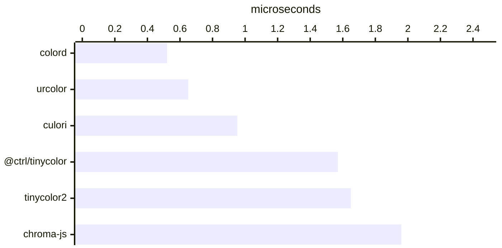

</div>

Off the chart: colorjs.io at 12.45 µs. The table below carries every row.

<details>
<summary>Exact timings</summary>

| Library | Time | Relative |
| --- | --- | --- |
| colord | 521.4 ns | **fastest** |
| **urcolor** | 650.9 ns | 1.25× slower |
| culori | 952.5 ns | 1.83× slower |
| @ctrl/tinycolor | 1.57 µs | 3.02× slower |
| tinycolor2 | 1.65 µs | 3.16× slower |
| chroma-js | 1.96 µs | 3.75× slower |
| colorjs.io | 12.45 µs | 23.88× slower |

</details>

### parse: rgb() modern syntax

<div class="bench-chart" style="--bench-1:#1c7ed6;--bench-2:#ff4081;--bench-3:#2f9e44;--bench-4:#f59f00">

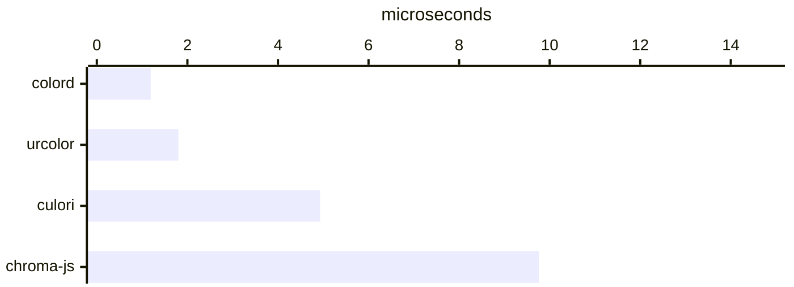

</div>

Off the chart: colorjs.io at 32.45 µs. The table below carries every row.

<details>
<summary>Exact timings</summary>

| Library | Time | Relative |
| --- | --- | --- |
| colord | 1.19 µs | **fastest** |
| **urcolor** | 1.80 µs | 1.51× slower |
| culori | 4.93 µs | 4.16× slower |
| chroma-js | 9.76 µs | 8.23× slower |
| colorjs.io | 32.45 µs | 27.37× slower |

</details>

### parse: rgba() legacy syntax

<div class="bench-chart" style="--bench-1:#1c7ed6;--bench-2:#e8590c;--bench-3:#2f9e44;--bench-4:#0ca678;--bench-5:#ff4081">

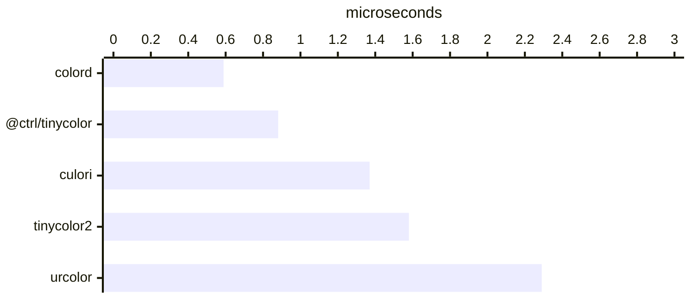

</div>

Off the chart: colorjs.io at 17.93 µs. The table below carries every row.

<details>
<summary>Exact timings</summary>

| Library | Time | Relative |
| --- | --- | --- |
| colord | 589.1 ns | **fastest** |
| @ctrl/tinycolor | 881.1 ns | 1.50× slower |
| culori | 1.37 µs | 2.32× slower |
| tinycolor2 | 1.58 µs | 2.68× slower |
| **urcolor** | 2.29 µs | 3.89× slower |
| colorjs.io | 17.93 µs | 30.43× slower |

</details>

### parse: hsl()

<div class="bench-chart" style="--bench-1:#0ca678;--bench-2:#ff4081;--bench-3:#e8590c;--bench-4:#1c7ed6;--bench-5:#2f9e44;--bench-6:#f59f00;--bench-7:#7048e8">

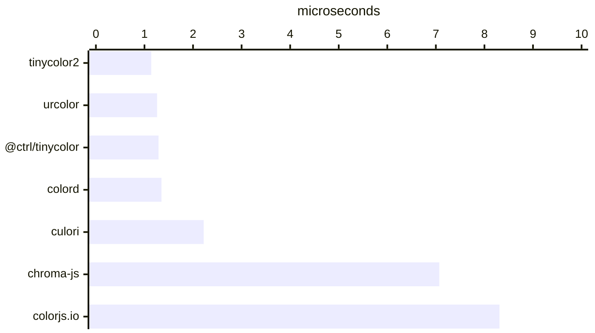

</div>

<details>
<summary>Exact timings</summary>

| Library | Time | Relative |
| --- | --- | --- |
| tinycolor2 | 1.14 µs | **fastest** |
| **urcolor** | 1.26 µs | 1.11× slower |
| @ctrl/tinycolor | 1.29 µs | 1.13× slower |
| colord | 1.35 µs | 1.19× slower |
| culori | 2.22 µs | 1.95× slower |
| chroma-js | 7.07 µs | 6.22× slower |
| colorjs.io | 8.31 µs | 7.32× slower |

</details>

### parse: named color

<div class="bench-chart" style="--bench-1:#ff4081;--bench-2:#1c7ed6;--bench-3:#f59f00;--bench-4:#2f9e44;--bench-5:#0ca678;--bench-6:#e8590c">

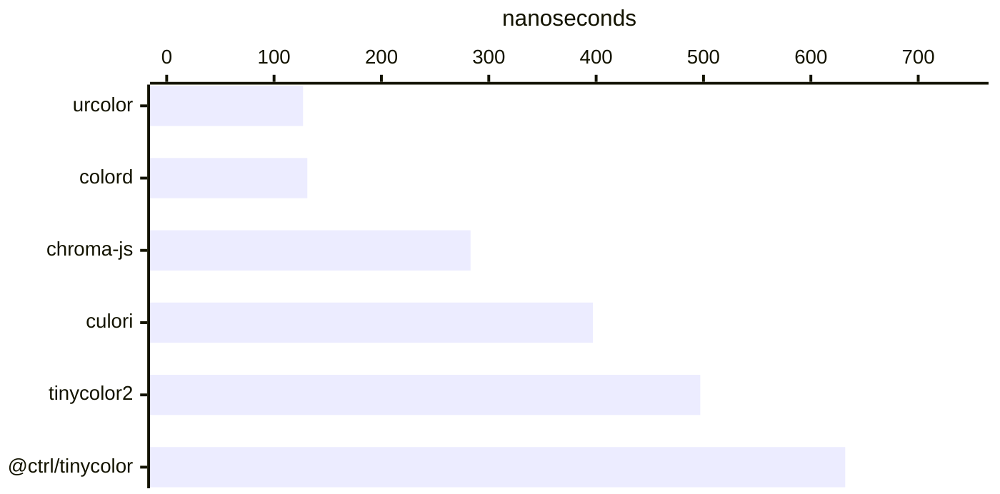

</div>

Off the chart: colorjs.io at 4.97 µs. The table below carries every row.

<details>
<summary>Exact timings</summary>

| Library | Time | Relative |
| --- | --- | --- |
| **urcolor** | 127.0 ns | **fastest** |
| colord | 131.1 ns | 1.03× slower |
| chroma-js | 282.8 ns | 2.23× slower |
| culori | 397.2 ns | 3.13× slower |
| tinycolor2 | 496.9 ns | 3.91× slower |
| @ctrl/tinycolor | 632.1 ns | 4.98× slower |
| colorjs.io | 4.97 µs | 39.16× slower |

</details>

### parse: oklch() [CSS Color 4]

<div class="bench-chart" style="--bench-1:#ff4081;--bench-2:#2f9e44">

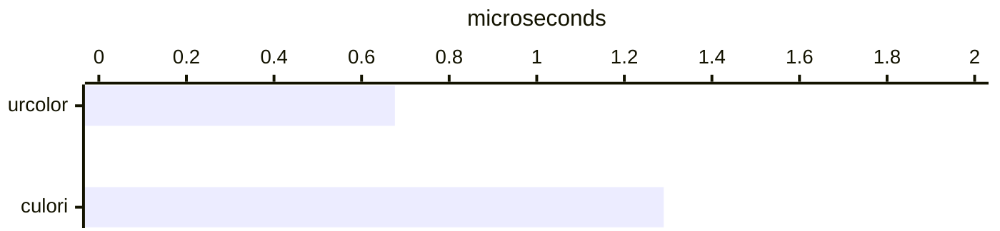

</div>

Off the chart: colorjs.io at 10.67 µs. The table below carries every row.

<details>
<summary>Exact timings</summary>

| Library | Time | Relative |
| --- | --- | --- |
| **urcolor** | 676.0 ns | **fastest** |
| culori | 1.29 µs | 1.91× slower |
| colorjs.io | 10.67 µs | 15.79× slower |

</details>

### parse: lab() [CSS Color 4]

<div class="bench-chart" style="--bench-1:#ff4081;--bench-2:#2f9e44;--bench-3:#7048e8">

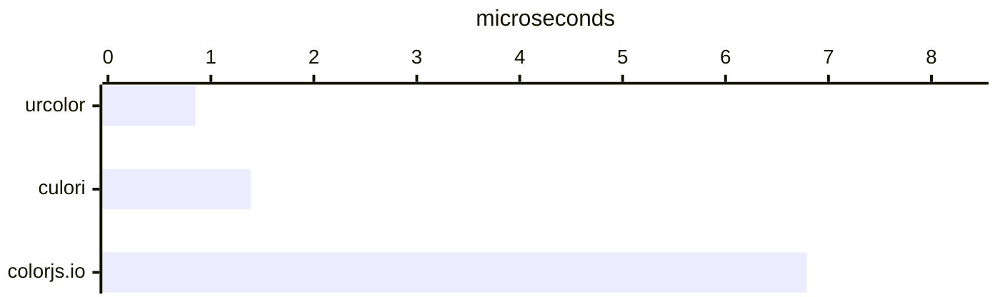

</div>

<details>
<summary>Exact timings</summary>

| Library | Time | Relative |
| --- | --- | --- |
| **urcolor** | 851.1 ns | **fastest** |
| culori | 1.39 µs | 1.63× slower |
| colorjs.io | 6.79 µs | 7.97× slower |

</details>

### parse: color(display-p3 …) [CSS Color 4]

<div class="bench-chart" style="--bench-1:#ff4081;--bench-2:#2f9e44">

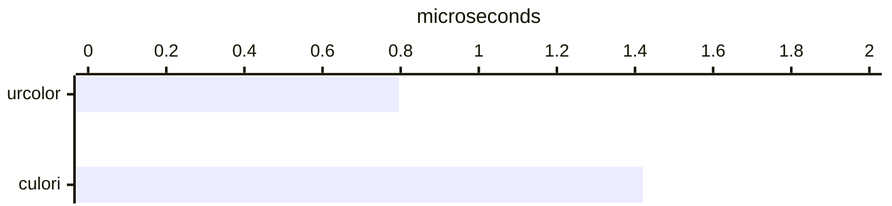

</div>

Off the chart: colorjs.io at 11.35 µs. The table below carries every row.

<details>
<summary>Exact timings</summary>

| Library | Time | Relative |
| --- | --- | --- |
| **urcolor** | 796.1 ns | **fastest** |
| culori | 1.42 µs | 1.79× slower |
| colorjs.io | 11.35 µs | 14.25× slower |

</details>

### parse: invalid input (rejection)

<div class="bench-chart" style="--bench-1:#ff4081;--bench-2:#1c7ed6;--bench-3:#e8590c;--bench-4:#2f9e44;--bench-5:#0ca678">

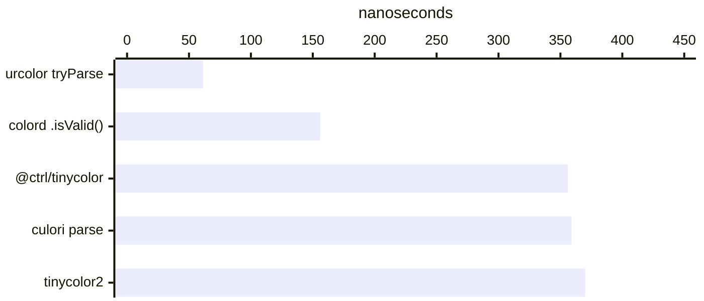

</div>

<details>
<summary>Exact timings</summary>

| Library | Time | Relative |
| --- | --- | --- |
| **urcolor  tryParse** | 61.4 ns | **fastest** |
| colord   .isValid() | 156.1 ns | 2.54× slower |
| @ctrl/tinycolor | 355.8 ns | 5.79× slower |
| culori   parse | 359.1 ns | 5.85× slower |
| tinycolor2 | 369.9 ns | 6.02× slower |

</details>

## Conversion

An already-parsed color moved into another space: transfer functions and matrices, with no parsing mixed in. Where a group converts *out* of a perceptual space, every operand is pre-converted, so each library pays for exactly one leg.

### convert: sRGB → HSL

<div class="bench-chart" style="--bench-1:#2f9e44;--bench-2:#ff4081;--bench-3:#1c7ed6;--bench-4:#0ca678;--bench-5:#ff4081;--bench-6:#f59f00">

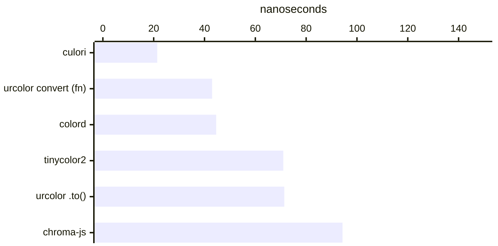

</div>

Off the chart: @ctrl/tinycolor at 342.7 ns, colorjs.io at 1.79 µs. The table below carries every row.

<details>
<summary>Exact timings</summary>

| Library | Time | Relative |
| --- | --- | --- |
| culori | 21.4 ns | **fastest** |
| **urcolor  convert (fn)** | 43.0 ns | 2.01× slower |
| colord | 44.6 ns | 2.08× slower |
| tinycolor2 | 71.0 ns | 3.31× slower |
| **urcolor  .to()** | 71.4 ns | 3.33× slower |
| chroma-js | 94.3 ns | 4.41× slower |
| @ctrl/tinycolor | 342.7 ns | 16.00× slower |
| colorjs.io | 1.79 µs | 83.66× slower |

</details>

### convert: sRGB → Oklch

<div class="bench-chart" style="--bench-1:#2f9e44;--bench-2:#ff4081;--bench-3:#ff4081;--bench-4:#f59f00;--bench-5:#7048e8">

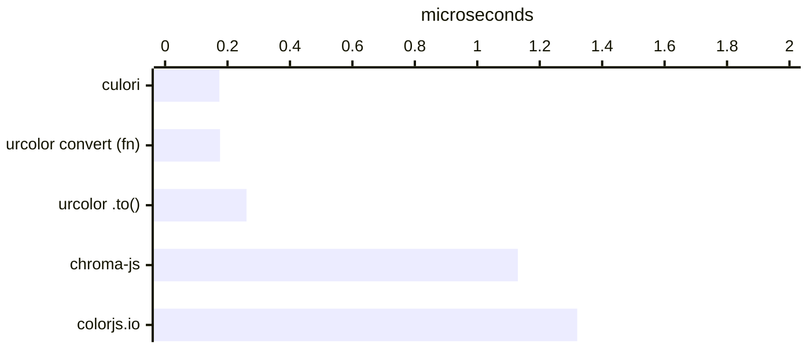

</div>

<details>
<summary>Exact timings</summary>

| Library | Time | Relative |
| --- | --- | --- |
| culori | 174.0 ns | **fastest** |
| **urcolor  convert (fn)** | 175.8 ns | 1.01× slower |
| **urcolor  .to()** | 260.7 ns | 1.50× slower |
| chroma-js | 1.13 µs | 6.47× slower |
| colorjs.io | 1.32 µs | 7.60× slower |

</details>

### convert: sRGB → Oklab

<div class="bench-chart" style="--bench-1:#2f9e44;--bench-2:#ff4081;--bench-3:#f59f00">

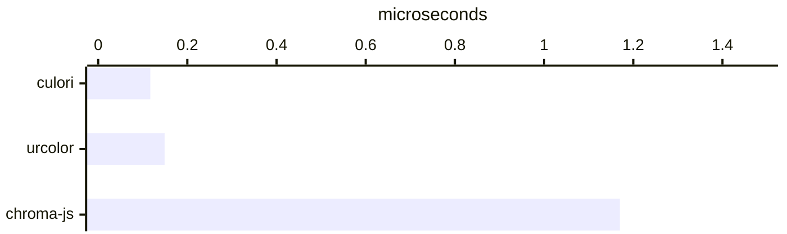

</div>

Off the chart: colorjs.io at 1.59 µs. The table below carries every row.

<details>
<summary>Exact timings</summary>

| Library | Time | Relative |
| --- | --- | --- |
| culori | 117.5 ns | **fastest** |
| **urcolor** | 149.3 ns | 1.27× slower |
| chroma-js | 1.17 µs | 9.92× slower |
| colorjs.io | 1.59 µs | 13.57× slower |

</details>

### convert: sRGB → CIE Lab

<div class="bench-chart" style="--bench-1:#2f9e44;--bench-2:#1c7ed6;--bench-3:#ff4081;--bench-4:#f59f00">

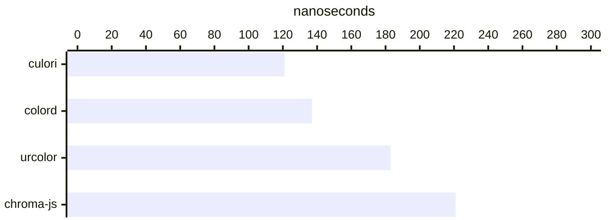

</div>

Off the chart: colorjs.io at 1.38 µs. The table below carries every row.

<details>
<summary>Exact timings</summary>

| Library | Time | Relative |
| --- | --- | --- |
| culori | 121.2 ns | **fastest** |
| colord | 137.2 ns | 1.13× slower |
| **urcolor** | 182.6 ns | 1.51× slower |
| chroma-js | 220.6 ns | 1.82× slower |
| colorjs.io | 1.38 µs | 11.41× slower |

</details>

### convert: sRGB → XYZ D65

<div class="bench-chart" style="--bench-1:#2f9e44;--bench-2:#ff4081">

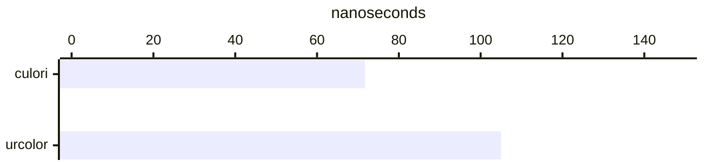

</div>

Off the chart: colorjs.io at 1.22 µs. The table below carries every row.

<details>
<summary>Exact timings</summary>

| Library | Time | Relative |
| --- | --- | --- |
| culori | 71.7 ns | **fastest** |
| **urcolor** | 105.4 ns | 1.47× slower |
| colorjs.io | 1.22 µs | 17.04× slower |

</details>

### convert: Oklch → sRGB

<div class="bench-chart" style="--bench-1:#2f9e44;--bench-2:#ff4081;--bench-3:#7048e8;--bench-4:#f59f00">

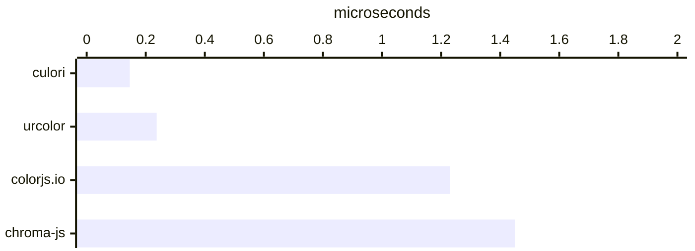

</div>

<details>
<summary>Exact timings</summary>

| Library | Time | Relative |
| --- | --- | --- |
| culori | 145.9 ns | **fastest** |
| **urcolor** | 237.3 ns | 1.63× slower |
| colorjs.io | 1.23 µs | 8.44× slower |
| chroma-js | 1.45 µs | 9.92× slower |

</details>

### convert: sRGB → Display P3

<div class="bench-chart" style="--bench-1:#2f9e44;--bench-2:#ff4081;--bench-3:#7048e8">

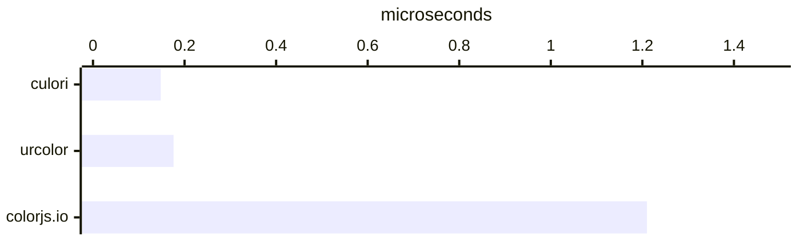

</div>

<details>
<summary>Exact timings</summary>

| Library | Time | Relative |
| --- | --- | --- |
| culori | 147.7 ns | **fastest** |
| **urcolor** | 175.6 ns | 1.19× slower |
| colorjs.io | 1.21 µs | 8.17× slower |

</details>

### convert: sRGB → Rec. 2020

<div class="bench-chart" style="--bench-1:#2f9e44;--bench-2:#ff4081;--bench-3:#7048e8">

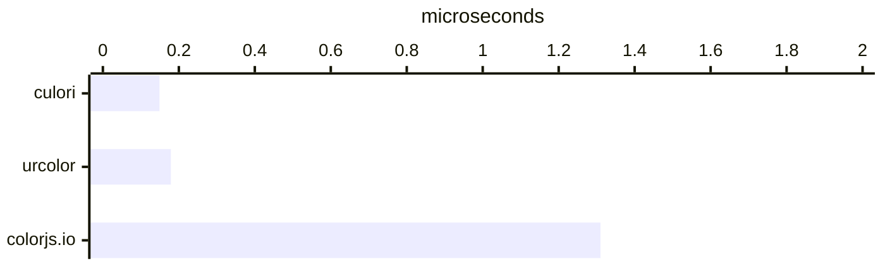

</div>

<details>
<summary>Exact timings</summary>

| Library | Time | Relative |
| --- | --- | --- |
| culori | 148.7 ns | **fastest** |
| **urcolor** | 179.4 ns | 1.21× slower |
| colorjs.io | 1.31 µs | 8.80× slower |

</details>

### convert: chain sRGB → Oklch → Lab → sRGB

<div class="bench-chart" style="--bench-1:#2f9e44;--bench-2:#ff4081;--bench-3:#7048e8">

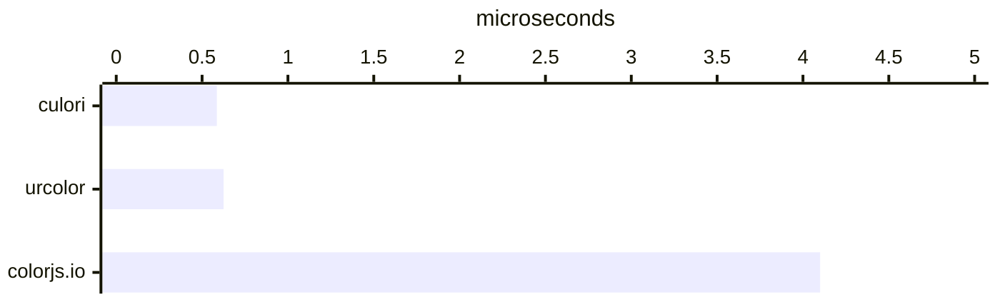

</div>

<details>
<summary>Exact timings</summary>

| Library | Time | Relative |
| --- | --- | --- |
| culori | 585.5 ns | **fastest** |
| **urcolor** | 624.5 ns | 1.07× slower |
| colorjs.io | 4.10 µs | 7.00× slower |

</details>

### gamut: map into sRGB

<div class="bench-chart" style="--bench-1:#2f9e44;--bench-2:#ff4081">

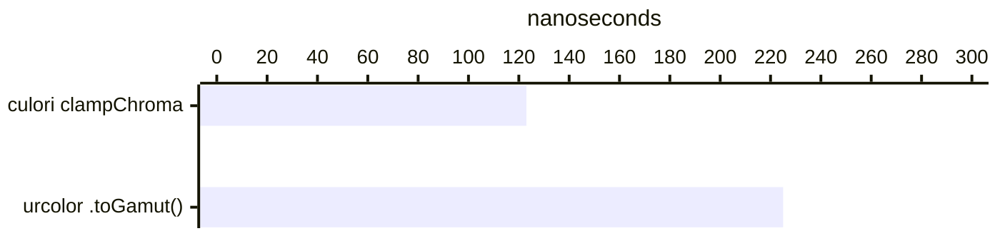

</div>

Off the chart: colorjs.io .toGamut() at 1.82 µs. The table below carries every row.

<details>
<summary>Exact timings</summary>

| Library | Time | Relative |
| --- | --- | --- |
| culori   clampChroma | 122.6 ns | **fastest** |
| **urcolor  .toGamut()** | 225.1 ns | 1.84× slower |
| colorjs.io .toGamut() | 1.82 µs | 14.84× slower |

</details>

### gamut: inGamut check

<div class="bench-chart" style="--bench-1:#2f9e44;--bench-2:#ff4081;--bench-3:#7048e8">

```mermaid
---
config:
  xyChart:
    height: 208
---
xychart-beta horizontal
  x-axis ["culori", "urcolor", "colorjs.io"]
  y-axis "nanoseconds" 0 --> 1500
  bar [125, 265, 864]
```

</div>

<details>
<summary>Exact timings</summary>

| Library | Time | Relative |
| --- | --- | --- |
| culori | 124.8 ns | **fastest** |
| **urcolor** | 265.1 ns | 2.12× slower |
| colorjs.io | 863.7 ns | 6.92× slower |

</details>

## Mixing and interpolation

One-shot blends, then the gradient shape: build an interpolator once and sample it repeatedly. colord and the tinycolors mix only in sRGB, which is cheaper and perceptually worse than an Oklab blend, so they appear in the sRGB group alone.

### mix: sRGB, 50%

<div class="bench-chart" style="--bench-1:#ff4081;--bench-2:#ff4081;--bench-3:#f59f00;--bench-4:#1c7ed6;--bench-5:#2f9e44;--bench-6:#e8590c;--bench-7:#0ca678">

```mermaid
---
config:
  xyChart:
    height: 392
---
xychart-beta horizontal
  x-axis ["urcolor mix (fn)", "urcolor .mix()", "chroma-js", "colord", "culori", "@ctrl/tinycolor", "tinycolor2"]
  y-axis "microseconds" 0 --> 1.5
  bar [0.138, 0.204, 0.422, 0.532, 0.757, 1.11, 1.24]
```

</div>

Off the chart: colorjs.io at 3.83 µs. The table below carries every row.

<details>
<summary>Exact timings</summary>

| Library | Time | Relative |
| --- | --- | --- |
| **urcolor  mix (fn)** | 137.8 ns | **fastest** |
| **urcolor  .mix()** | 204.4 ns | 1.48× slower |
| chroma-js | 422.4 ns | 3.07× slower |
| colord | 532.5 ns | 3.86× slower |
| culori | 757.3 ns | 5.50× slower |
| @ctrl/tinycolor | 1.11 µs | 8.04× slower |
| tinycolor2 | 1.24 µs | 9.01× slower |
| colorjs.io | 3.83 µs | 27.81× slower |

</details>

### mix: Oklab, 50%

<div class="bench-chart" style="--bench-1:#ff4081;--bench-2:#ff4081;--bench-3:#2f9e44;--bench-4:#7048e8;--bench-5:#f59f00">

```mermaid
---
config:
  xyChart:
    height: 300
---
xychart-beta horizontal
  x-axis ["urcolor mix (fn)", "urcolor .mix()", "culori", "colorjs.io", "chroma-js"]
  y-axis "microseconds" 0 --> 4.5
  bar [0.419, 0.446, 0.836, 3.24, 3.8]
```

</div>

<details>
<summary>Exact timings</summary>

| Library | Time | Relative |
| --- | --- | --- |
| **urcolor  mix (fn)** | 419.1 ns | **fastest** |
| **urcolor  .mix()** | 446.4 ns | 1.06× slower |
| culori | 835.9 ns | 1.99× slower |
| colorjs.io | 3.24 µs | 7.74× slower |
| chroma-js | 3.80 µs | 9.06× slower |

</details>

### mix: Oklch (shorter hue arc), 50%

<div class="bench-chart" style="--bench-1:#ff4081;--bench-2:#2f9e44;--bench-3:#f59f00">

```mermaid
---
config:
  xyChart:
    height: 208
---
xychart-beta horizontal
  x-axis ["urcolor", "culori", "chroma-js"]
  y-axis "microseconds" 0 --> 5.5
  bar [0.489, 0.897, 4.56]
```

</div>

Off the chart: colorjs.io at 8.25 µs. The table below carries every row.

<details>
<summary>Exact timings</summary>

| Library | Time | Relative |
| --- | --- | --- |
| **urcolor** | 489.0 ns | **fastest** |
| culori | 897.3 ns | 1.84× slower |
| chroma-js | 4.56 µs | 9.33× slower |
| colorjs.io | 8.25 µs | 16.87× slower |

</details>

### mix: CIE Lab, 50%

<div class="bench-chart" style="--bench-1:#ff4081;--bench-2:#2f9e44;--bench-3:#f59f00">

```mermaid
---
config:
  xyChart:
    height: 208
---
xychart-beta horizontal
  x-axis ["urcolor", "culori", "chroma-js"]
  y-axis "microseconds" 0 --> 1.5
  bar [0.368, 0.902, 1.21]
```

</div>

Off the chart: colorjs.io at 3.86 µs. The table below carries every row.

<details>
<summary>Exact timings</summary>

| Library | Time | Relative |
| --- | --- | --- |
| **urcolor** | 367.6 ns | **fastest** |
| culori | 902.2 ns | 2.45× slower |
| chroma-js | 1.21 µs | 3.30× slower |
| colorjs.io | 3.86 µs | 10.51× slower |

</details>

### gradient: 64 Oklab samples (interpolator reused)

<div class="bench-chart" style="--bench-1:#ff4081;--bench-2:#2f9e44">

```mermaid
---
config:
  xyChart:
    height: 162
---
xychart-beta horizontal
  x-axis ["urcolor", "culori"]
  y-axis "microseconds" 0 --> 8
  bar [2.7, 6.43]
```

</div>

Off the chart: colorjs.io at 36.10 µs, chroma-js at 235.94 µs. The table below carries every row.

<details>
<summary>Exact timings</summary>

| Library | Time | Relative |
| --- | --- | --- |
| **urcolor** | 2.70 µs | **fastest** |
| culori | 6.43 µs | 2.38× slower |
| colorjs.io | 36.10 µs | 13.39× slower |
| chroma-js | 235.94 µs | 87.53× slower |

</details>

### gradient: 64 Oklab samples (mix per sample)

<div class="bench-chart" style="--bench-1:#ff4081;--bench-2:#2f9e44;--bench-3:#7048e8">

```mermaid
---
config:
  xyChart:
    height: 208
---
xychart-beta horizontal
  x-axis ["urcolor", "culori", "colorjs.io"]
  y-axis "microseconds" 0 --> 250
  bar [20.8, 52, 197]
```

</div>

Off the chart: chroma-js at 225.04 µs. The table below carries every row.

<details>
<summary>Exact timings</summary>

| Library | Time | Relative |
| --- | --- | --- |
| **urcolor** | 20.77 µs | **fastest** |
| culori | 52.03 µs | 2.50× slower |
| colorjs.io | 197.01 µs | 9.48× slower |
| chroma-js | 225.04 µs | 10.83× slower |

</details>

### palette: 11 stops from two anchors

<div class="bench-chart" style="--bench-1:#ff4081;--bench-2:#2f9e44">

```mermaid
---
config:
  xyChart:
    height: 162
---
xychart-beta horizontal
  x-axis ["urcolor", "culori"]
  y-axis "microseconds" 0 --> 4
  bar [3.31, 3.35]
```

</div>

Off the chart: colorjs.io at 39.14 µs, chroma-js at 39.42 µs. The table below carries every row.

<details>
<summary>Exact timings</summary>

| Library | Time | Relative |
| --- | --- | --- |
| **urcolor** | 3.31 µs | **fastest** |
| culori | 3.35 µs | 1.01× slower |
| colorjs.io | 39.14 µs | 11.81× slower |
| chroma-js | 39.42 µs | 11.90× slower |

</details>

## Manipulation

The libraries disagree about *where* an adjustment happens. urcolor and chroma-js lighten in a perceptual space and pay for two conversions on top of the arithmetic. colord and the tinycolors nudge HSL lightness directly. Same verb, different job.

### manipulate: lighten (perceptual: urcolor/chroma-js; HSL: rest)

<div class="bench-chart" style="--bench-1:#1c7ed6;--bench-2:#ff4081;--bench-3:#ff4081;--bench-4:#f59f00">

```mermaid
---
config:
  xyChart:
    height: 254
---
xychart-beta horizontal
  x-axis ["colord .lighten()", "urcolor lighten (fn)", "urcolor .lighten()", "chroma-js .brighten()"]
  y-axis "nanoseconds" 0 --> 600
  bar [132, 342, 457, 494]
```

</div>

Off the chart: tinycolor2 at 1.72 µs, @ctrl/tinycolor at 1.83 µs. The table below carries every row.

<details>
<summary>Exact timings</summary>

| Library | Time | Relative |
| --- | --- | --- |
| colord   .lighten() | 131.9 ns | **fastest** |
| **urcolor  lighten (fn)** | 342.0 ns | 2.59× slower |
| **urcolor  .lighten()** | 457.1 ns | 3.47× slower |
| chroma-js .brighten() | 493.8 ns | 3.74× slower |
| tinycolor2 | 1.72 µs | 13.06× slower |
| @ctrl/tinycolor | 1.83 µs | 13.87× slower |

</details>

### manipulate: darken

<div class="bench-chart" style="--bench-1:#1c7ed6;--bench-2:#ff4081;--bench-3:#f59f00">

```mermaid
---
config:
  xyChart:
    height: 208
---
xychart-beta horizontal
  x-axis ["colord", "urcolor", "chroma-js"]
  y-axis "nanoseconds" 0 --> 700
  bar [128, 356, 587]
```

</div>

Off the chart: tinycolor2 at 2.09 µs, @ctrl/tinycolor at 2.25 µs. The table below carries every row.

<details>
<summary>Exact timings</summary>

| Library | Time | Relative |
| --- | --- | --- |
| colord | 128.1 ns | **fastest** |
| **urcolor** | 356.3 ns | 2.78× slower |
| chroma-js | 586.9 ns | 4.58× slower |
| tinycolor2 | 2.09 µs | 16.28× slower |
| @ctrl/tinycolor | 2.25 µs | 17.53× slower |

</details>

### manipulate: saturate

<div class="bench-chart" style="--bench-1:#1c7ed6;--bench-2:#ff4081;--bench-3:#f59f00">

```mermaid
---
config:
  xyChart:
    height: 208
---
xychart-beta horizontal
  x-axis ["colord", "urcolor", "chroma-js"]
  y-axis "nanoseconds" 0 --> 800
  bar [119, 348, 645]
```

</div>

Off the chart: tinycolor2 at 1.51 µs, @ctrl/tinycolor at 1.86 µs. The table below carries every row.

<details>
<summary>Exact timings</summary>

| Library | Time | Relative |
| --- | --- | --- |
| colord | 119.3 ns | **fastest** |
| **urcolor** | 348.0 ns | 2.92× slower |
| chroma-js | 644.6 ns | 5.41× slower |
| tinycolor2 | 1.51 µs | 12.69× slower |
| @ctrl/tinycolor | 1.86 µs | 15.62× slower |

</details>

### manipulate: rotate hue 60°

<div class="bench-chart" style="--bench-1:#1c7ed6;--bench-2:#ff4081">

```mermaid
---
config:
  xyChart:
    height: 162
---
xychart-beta horizontal
  x-axis ["colord", "urcolor"]
  y-axis "nanoseconds" 0 --> 450
  bar [147, 356]
```

</div>

Off the chart: tinycolor2 at 1.80 µs, @ctrl/tinycolor at 2.08 µs. The table below carries every row.

<details>
<summary>Exact timings</summary>

| Library | Time | Relative |
| --- | --- | --- |
| colord | 146.5 ns | **fastest** |
| **urcolor** | 356.3 ns | 2.43× slower |
| tinycolor2 | 1.80 µs | 12.30× slower |
| @ctrl/tinycolor | 2.08 µs | 14.23× slower |

</details>

### channel: set lightness in Oklch

<div class="bench-chart" style="--bench-1:#ff4081;--bench-2:#7048e8">

```mermaid
---
config:
  xyChart:
    height: 162
---
xychart-beta horizontal
  x-axis ["urcolor .with()", "colorjs.io .set()"]
  y-axis "microseconds" 0 --> 3
  bar [0.21, 2.13]
```

</div>

<details>
<summary>Exact timings</summary>

| Library | Time | Relative |
| --- | --- | --- |
| **urcolor  .with()** | 210.3 ns | **fastest** |
| colorjs.io .set() | 2.13 µs | 10.14× slower |

</details>

### channel: read one channel

<div class="bench-chart" style="--bench-1:#ff4081;--bench-2:#1c7ed6">

```mermaid
---
config:
  xyChart:
    height: 162
---
xychart-beta horizontal
  x-axis ["urcolor .get()", "colord"]
  y-axis "nanoseconds" 0 --> 25
  bar [7.34, 18.6]
```

</div>

Off the chart: chroma-js at 96.0 ns, colorjs.io at 666.5 ns. The table below carries every row.

<details>
<summary>Exact timings</summary>

| Library | Time | Relative |
| --- | --- | --- |
| **urcolor  .get()** | 7.3 ns | **fastest** |
| colord | 18.6 ns | 2.54× slower |
| chroma-js | 96.0 ns | 13.08× slower |
| colorjs.io | 666.5 ns | 90.84× slower |

</details>

### alpha: set opacity

<div class="bench-chart" style="--bench-1:#ff4081;--bench-2:#1c7ed6;--bench-3:#f59f00">

```mermaid
---
config:
  xyChart:
    height: 208
---
xychart-beta horizontal
  x-axis ["urcolor .withAlpha()", "colord .alpha()", "chroma-js .alpha()"]
  y-axis "nanoseconds" 0 --> 300
  bar [27.3, 73.7, 253]
```

</div>

Off the chart: @ctrl/tinycolor at 712.9 ns, tinycolor2 at 726.8 ns. The table below carries every row.

<details>
<summary>Exact timings</summary>

| Library | Time | Relative |
| --- | --- | --- |
| **urcolor  .withAlpha()** | 27.3 ns | **fastest** |
| colord   .alpha() | 73.7 ns | 2.70× slower |
| chroma-js .alpha() | 253.2 ns | 9.29× slower |
| @ctrl/tinycolor | 712.9 ns | 26.14× slower |
| tinycolor2 | 726.8 ns | 26.65× slower |

</details>

## Difference and contrast

ΔE2000 is the expensive one: trigonometry plus a rotation term. ΔE76 is here so the cost of the 2000 formula is visible rather than implied. WCAG contrast is a handful of multiplications, so that group mostly measures each library's object-model overhead.

### deltaE: CIEDE2000

<div class="bench-chart" style="--bench-1:#2f9e44;--bench-2:#ff4081;--bench-3:#ff4081;--bench-4:#1c7ed6;--bench-5:#f59f00;--bench-6:#7048e8">

```mermaid
---
config:
  xyChart:
    height: 346
---
xychart-beta horizontal
  x-axis ["culori", "urcolor deltaE (fn)", "urcolor .deltaE()", "colord .delta()", "chroma-js", "colorjs.io"]
  y-axis "microseconds" 0 --> 2.5
  bar [0.384, 0.412, 0.433, 0.559, 0.654, 1.71]
```

</div>

<details>
<summary>Exact timings</summary>

| Library | Time | Relative |
| --- | --- | --- |
| culori | 384.1 ns | **fastest** |
| **urcolor  deltaE (fn)** | 412.3 ns | 1.07× slower |
| **urcolor  .deltaE()** | 432.6 ns | 1.13× slower |
| colord   .delta() | 558.9 ns | 1.46× slower |
| chroma-js | 654.0 ns | 1.70× slower |
| colorjs.io | 1.71 µs | 4.44× slower |

</details>

### deltaE: CIE76 (Euclidean Lab)

<div class="bench-chart" style="--bench-1:#ff4081;--bench-2:#2f9e44;--bench-3:#7048e8">

```mermaid
---
config:
  xyChart:
    height: 208
---
xychart-beta horizontal
  x-axis ["urcolor", "culori", "colorjs.io"]
  y-axis "microseconds" 0 --> 1.5
  bar [0.29, 0.353, 1.23]
```

</div>

<details>
<summary>Exact timings</summary>

| Library | Time | Relative |
| --- | --- | --- |
| **urcolor** | 290.4 ns | **fastest** |
| culori | 353.2 ns | 1.22× slower |
| colorjs.io | 1.23 µs | 4.24× slower |

</details>

### deltaE: ΔEOK (Oklab Euclidean)

<div class="bench-chart" style="--bench-1:#ff4081;--bench-2:#2f9e44;--bench-3:#7048e8">

```mermaid
---
config:
  xyChart:
    height: 208
---
xychart-beta horizontal
  x-axis ["urcolor", "culori", "colorjs.io"]
  y-axis "microseconds" 0 --> 1.5
  bar [0.26, 0.276, 1.2]
```

</div>

<details>
<summary>Exact timings</summary>

| Library | Time | Relative |
| --- | --- | --- |
| **urcolor** | 260.5 ns | **fastest** |
| culori | 276.3 ns | 1.06× slower |
| colorjs.io | 1.20 µs | 4.62× slower |

</details>

### contrast: WCAG 2.1 ratio

<div class="bench-chart" style="--bench-1:#ff4081;--bench-2:#2f9e44;--bench-3:#ff4081;--bench-4:#1c7ed6;--bench-5:#f59f00;--bench-6:#0ca678;--bench-7:#e8590c">

```mermaid
---
config:
  xyChart:
    height: 392
---
xychart-beta horizontal
  x-axis ["urcolor contrast (fn)", "culori", "urcolor .contrast()", "colord", "chroma-js", "tinycolor2", "@ctrl/tinycolor"]
  y-axis "microseconds" 0 --> 1.5
  bar [0.14, 0.152, 0.156, 0.262, 0.303, 1.12, 1.25]
```

</div>

Off the chart: colorjs.io at 2.97 µs. The table below carries every row.

<details>
<summary>Exact timings</summary>

| Library | Time | Relative |
| --- | --- | --- |
| **urcolor  contrast (fn)** | 140.2 ns | **fastest** |
| culori | 151.6 ns | 1.08× slower |
| **urcolor  .contrast()** | 156.2 ns | 1.11× slower |
| colord | 262.1 ns | 1.87× slower |
| chroma-js | 302.6 ns | 2.16× slower |
| tinycolor2 | 1.12 µs | 8.01× slower |
| @ctrl/tinycolor | 1.25 µs | 8.89× slower |
| colorjs.io | 2.97 µs | 21.21× slower |

</details>

### contrast: APCA

<div class="bench-chart" style="--bench-1:#ff4081;--bench-2:#7048e8">

```mermaid
---
config:
  xyChart:
    height: 162
---
xychart-beta horizontal
  x-axis ["urcolor", "colorjs.io"]
  y-axis "microseconds" 0 --> 2.5
  bar [0.196, 1.7]
```

</div>

<details>
<summary>Exact timings</summary>

| Library | Time | Relative |
| --- | --- | --- |
| **urcolor** | 196.2 ns | **fastest** |
| colorjs.io | 1.70 µs | 8.65× slower |

</details>

### relative luminance

<div class="bench-chart" style="--bench-1:#1c7ed6;--bench-2:#2f9e44;--bench-3:#f59f00;--bench-4:#ff4081">

```mermaid
---
config:
  xyChart:
    height: 254
---
xychart-beta horizontal
  x-axis ["colord", "culori", "chroma-js", "urcolor"]
  y-axis "nanoseconds" 0 --> 150
  bar [55.4, 69.3, 93.4, 97.9]
```

</div>

<details>
<summary>Exact timings</summary>

| Library | Time | Relative |
| --- | --- | --- |
| colord | 55.4 ns | **fastest** |
| culori | 69.3 ns | 1.25× slower |
| chroma-js | 93.4 ns | 1.69× slower |
| **urcolor** | 97.9 ns | 1.77× slower |

</details>

### equality: same color, different space

<div class="bench-chart" style="--bench-1:#f59f00;--bench-2:#1c7ed6;--bench-3:#ff4081">

```mermaid
---
config:
  xyChart:
    height: 208
---
xychart-beta horizontal
  x-axis ["chroma-js hex compare", "colord .isEqual()", "urcolor .equals()"]
  y-axis "nanoseconds" 0 --> 550
  bar [394, 433, 445]
```

</div>

<details>
<summary>Exact timings</summary>

| Library | Time | Relative |
| --- | --- | --- |
| chroma-js hex compare | 394.2 ns | **fastest** |
| colord   .isEqual() | 433.3 ns | 1.10× slower |
| **urcolor  .equals()** | 445.4 ns | 1.13× slower |

</details>

## Serialization

Color object to CSS string, the last step of every render path. It runs as often as parsing does.

### serialize: → hex

<div class="bench-chart" style="--bench-1:#ff4081;--bench-2:#ff4081;--bench-3:#2f9e44;--bench-4:#1c7ed6;--bench-5:#0ca678;--bench-6:#e8590c;--bench-7:#f59f00">

```mermaid
---
config:
  xyChart:
    height: 392
---
xychart-beta horizontal
  x-axis ["urcolor serialize (fn)", "urcolor .toString()", "culori formatHex", "colord .toHex()", "tinycolor2", "@ctrl/tinycolor", "chroma-js .hex()"]
  y-axis "nanoseconds" 0 --> 200
  bar [36.6, 45.6, 57.4, 84.3, 114, 119, 145]
```

</div>

Off the chart: colorjs.io at 619.0 ns. The table below carries every row.

<details>
<summary>Exact timings</summary>

| Library | Time | Relative |
| --- | --- | --- |
| **urcolor  serialize (fn)** | 36.6 ns | **fastest** |
| **urcolor  .toString()** | 45.6 ns | 1.25× slower |
| culori   formatHex | 57.4 ns | 1.57× slower |
| colord   .toHex() | 84.3 ns | 2.30× slower |
| tinycolor2 | 113.8 ns | 3.11× slower |
| @ctrl/tinycolor | 118.8 ns | 3.25× slower |
| chroma-js .hex() | 144.9 ns | 3.96× slower |
| colorjs.io | 619.0 ns | 16.92× slower |

</details>

### serialize: → rgb()

<div class="bench-chart" style="--bench-1:#0ca678;--bench-2:#e8590c;--bench-3:#2f9e44;--bench-4:#1c7ed6;--bench-5:#ff4081">

```mermaid
---
config:
  xyChart:
    height: 300
---
xychart-beta horizontal
  x-axis ["tinycolor2", "@ctrl/tinycolor", "culori", "colord", "urcolor"]
  y-axis "nanoseconds" 0 --> 60
  bar [11.2, 12.8, 34.7, 39, 50.1]
```

</div>

Off the chart: chroma-js at 246.5 ns, colorjs.io at 791.6 ns. The table below carries every row.

<details>
<summary>Exact timings</summary>

| Library | Time | Relative |
| --- | --- | --- |
| tinycolor2 | 11.2 ns | **fastest** |
| @ctrl/tinycolor | 12.8 ns | 1.14× slower |
| culori | 34.7 ns | 3.09× slower |
| colord | 39.0 ns | 3.48× slower |
| **urcolor** | 50.1 ns | 4.47× slower |
| chroma-js | 246.5 ns | 21.96× slower |
| colorjs.io | 791.6 ns | 70.54× slower |

</details>

### serialize: → hsl()

<div class="bench-chart" style="--bench-1:#1c7ed6;--bench-2:#0ca678;--bench-3:#ff4081;--bench-4:#2f9e44;--bench-5:#e8590c">

```mermaid
---
config:
  xyChart:
    height: 300
---
xychart-beta horizontal
  x-axis ["colord", "tinycolor2", "urcolor", "culori", "@ctrl/tinycolor"]
  y-axis "nanoseconds" 0 --> 400
  bar [55.3, 79.7, 127, 137, 324]
```

</div>

Off the chart: colorjs.io at 2.01 µs. The table below carries every row.

<details>
<summary>Exact timings</summary>

| Library | Time | Relative |
| --- | --- | --- |
| colord | 55.3 ns | **fastest** |
| tinycolor2 | 79.7 ns | 1.44× slower |
| **urcolor** | 127.3 ns | 2.30× slower |
| culori | 136.9 ns | 2.47× slower |
| @ctrl/tinycolor | 323.9 ns | 5.86× slower |
| colorjs.io | 2.01 µs | 36.40× slower |

</details>

### serialize: → oklch()

<div class="bench-chart" style="--bench-1:#ff4081;--bench-2:#2f9e44">

```mermaid
---
config:
  xyChart:
    height: 162
---
xychart-beta horizontal
  x-axis ["urcolor", "culori"]
  y-axis "nanoseconds" 0 --> 75
  bar [59.3, 61.8]
```

</div>

Off the chart: colorjs.io at 1.99 µs. The table below carries every row.

<details>
<summary>Exact timings</summary>

| Library | Time | Relative |
| --- | --- | --- |
| **urcolor** | 59.3 ns | **fastest** |
| culori | 61.8 ns | 1.04× slower |
| colorjs.io | 1.99 µs | 33.49× slower |

</details>

### serialize: sRGB color → oklch() string (convert + print)

<div class="bench-chart" style="--bench-1:#2f9e44;--bench-2:#ff4081;--bench-3:#7048e8">

```mermaid
---
config:
  xyChart:
    height: 208
---
xychart-beta horizontal
  x-axis ["culori", "urcolor", "colorjs.io"]
  y-axis "microseconds" 0 --> 2.5
  bar [0.218, 0.281, 1.96]
```

</div>

<details>
<summary>Exact timings</summary>

| Library | Time | Relative |
| --- | --- | --- |
| culori | 217.5 ns | **fastest** |
| **urcolor** | 280.9 ns | 1.29× slower |
| colorjs.io | 1.96 µs | 9.00× slower |

</details>

## Canvas gradient rendering

The CPU path behind a picker surface: a slider track, an SV plane, a hue wheel. Each call returns an `Uint8ClampedArray` of RGBA bytes ready for `putImageData`, so these are milliseconds per frame. No other library ships a grid sampler, so the comparison rows hand-roll the same loop with that library's interpolator. urcolor's WebGL entry points are not measured here: they need a live canvas and a GPU context, and their cost is one uniform upload and one draw call whatever the surface size.

### canvas: 512px linear track, Oklab → RGBA bytes

<div class="bench-chart" style="--bench-1:#ff4081;--bench-2:#2f9e44;--bench-3:#7048e8">

```mermaid
---
config:
  xyChart:
    height: 208
---
xychart-beta horizontal
  x-axis ["urcolor interpolateStops", "culori (hand-rolled)", "colorjs.io (hand-rolled)"]
  y-axis "microseconds" 0 --> 1000
  bar [93.8, 108, 832]
```

</div>

Off the chart: chroma-js (hand-rolled) at 1.89 ms. The table below carries every row.

<details>
<summary>Exact timings</summary>

| Library | Time | Relative |
| --- | --- | --- |
| **urcolor  interpolateStops** | 93.75 µs | **fastest** |
| culori   (hand-rolled) | 108.43 µs | 1.16× slower |
| colorjs.io (hand-rolled) | 831.88 µs | 8.87× slower |
| chroma-js (hand-rolled) | 1.89 ms | 20.19× slower |

</details>

### canvas: 128×128 bilinear plane, Oklab → RGBA bytes

<div class="bench-chart" style="--bench-1:#ff4081;--bench-2:#2f9e44">

```mermaid
---
config:
  xyChart:
    height: 162
---
xychart-beta horizontal
  x-axis ["urcolor sampleBilinearGrid", "culori (hand-rolled)"]
  y-axis "milliseconds" 0 --> 40
  bar [4.18, 31.1]
```

</div>

Off the chart: colorjs.io (hand-rolled) at 178.23 ms. The table below carries every row.

<details>
<summary>Exact timings</summary>

| Library | Time | Relative |
| --- | --- | --- |
| **urcolor  sampleBilinearGrid** | 4.18 ms | **fastest** |
| culori   (hand-rolled) | 31.07 ms | 7.43× slower |
| colorjs.io (hand-rolled) | 178.23 ms | 42.65× slower |

</details>

### canvas: 128×128 HSV S/V plane → RGBA bytes

<div class="bench-chart" style="--bench-1:#2f9e44;--bench-2:#ff4081">

```mermaid
---
config:
  xyChart:
    height: 162
---
xychart-beta horizontal
  x-axis ["culori (hand-rolled)", "urcolor sampleChannelGrid"]
  y-axis "milliseconds" 0 --> 2.5
  bar [1.11, 1.81]
```

</div>

Off the chart: colorjs.io (hand-rolled) at 30.45 ms. The table below carries every row.

<details>
<summary>Exact timings</summary>

| Library | Time | Relative |
| --- | --- | --- |
| culori   (hand-rolled) | 1.11 ms | **fastest** |
| **urcolor  sampleChannelGrid** | 1.81 ms | 1.63× slower |
| colorjs.io (hand-rolled) | 30.45 ms | 27.54× slower |

</details>

### canvas: 128×128 Oklch polar wheel → RGBA bytes

<div class="bench-chart" style="--bench-1:#2f9e44;--bench-2:#ff4081">

```mermaid
---
config:
  xyChart:
    height: 162
---
xychart-beta horizontal
  x-axis ["culori (hand-rolled)", "urcolor samplePolarGrid"]
  y-axis "milliseconds" 0 --> 4.5
  bar [2.85, 3.56]
```

</div>

<details>
<summary>Exact timings</summary>

| Library | Time | Relative |
| --- | --- | --- |
| culori   (hand-rolled) | 2.85 ms | **fastest** |
| **urcolor  samplePolarGrid** | 3.56 ms | 1.25× slower |

</details>

### canvas: 128×128 conic hue ring → RGBA bytes

<div class="bench-chart" style="--bench-1:#2f9e44;--bench-2:#ff4081">

```mermaid
---
config:
  xyChart:
    height: 162
---
xychart-beta horizontal
  x-axis ["culori (hand-rolled)", "urcolor sampleConicRing"]
  y-axis "milliseconds" 0 --> 4.5
  bar [2.93, 3.78]
```

</div>

<details>
<summary>Exact timings</summary>

| Library | Time | Relative |
| --- | --- | --- |
| culori   (hand-rolled) | 2.93 ms | **fastest** |
| **urcolor  sampleConicRing** | 3.78 ms | 1.29× slower |

</details>

### canvas: per-pixel cost, 1 000 Oklch → sRGB pixels

<div class="bench-chart" style="--bench-1:#ff4081;--bench-2:#2f9e44;--bench-3:#f59f00">

```mermaid
---
config:
  xyChart:
    height: 208
---
xychart-beta horizontal
  x-axis ["urcolor sampleConicRing", "culori (hand-rolled)", "chroma-js (hand-rolled)"]
  y-axis "milliseconds" 0 --> 2
  bar [0.135, 0.164, 1.31]
```

</div>

Off the chart: colorjs.io (hand-rolled) at 1.99 ms. The table below carries every row.

<details>
<summary>Exact timings</summary>

| Library | Time | Relative |
| --- | --- | --- |
| **urcolor  sampleConicRing** | 135.22 µs | **fastest** |
| culori   (hand-rolled) | 163.91 µs | 1.21× slower |
| chroma-js (hand-rolled) | 1.31 ms | 9.68× slower |
| colorjs.io (hand-rolled) | 1.99 ms | 14.73× slower |

</details>

## End-to-end pipelines

String in, string out. The groups above isolate one cost each; these measure the round trip an application actually pays, which is where a library's object model shows up.

### pipeline: hex → lighten → hex

<div class="bench-chart" style="--bench-1:#1c7ed6;--bench-2:#ff4081;--bench-3:#2f9e44;--bench-4:#ff4081;--bench-5:#f59f00;--bench-6:#0ca678;--bench-7:#e8590c">

```mermaid
---
config:
  xyChart:
    height: 392
---
xychart-beta horizontal
  x-axis ["colord", "urcolor fn", "culori (hand-rolled)", "urcolor Color", "chroma-js", "tinycolor2", "@ctrl/tinycolor"]
  y-axis "microseconds" 0 --> 2.5
  bar [0.409, 0.51, 0.521, 0.589, 1.13, 1.51, 2.11]
```

</div>

Off the chart: colorjs.io at 30.32 µs. The table below carries every row.

<details>
<summary>Exact timings</summary>

| Library | Time | Relative |
| --- | --- | --- |
| colord | 409.3 ns | **fastest** |
| **urcolor  fn** | 510.4 ns | 1.25× slower |
| culori   (hand-rolled) | 520.8 ns | 1.27× slower |
| **urcolor  Color** | 589.0 ns | 1.44× slower |
| chroma-js | 1.13 µs | 2.77× slower |
| tinycolor2 | 1.51 µs | 3.69× slower |
| @ctrl/tinycolor | 2.11 µs | 5.17× slower |
| colorjs.io | 30.32 µs | 74.08× slower |

</details>

### pipeline: hex → oklch → hex (round trip)

<div class="bench-chart" style="--bench-1:#ff4081;--bench-2:#2f9e44;--bench-3:#ff4081;--bench-4:#f59f00">

```mermaid
---
config:
  xyChart:
    height: 254
---
xychart-beta horizontal
  x-axis ["urcolor fn", "culori", "urcolor Color", "chroma-js"]
  y-axis "microseconds" 0 --> 4
  bar [0.488, 0.495, 0.607, 3.11]
```

</div>

Off the chart: colorjs.io at 8.04 µs. The table below carries every row.

<details>
<summary>Exact timings</summary>

| Library | Time | Relative |
| --- | --- | --- |
| **urcolor  fn** | 488.0 ns | **fastest** |
| culori | 495.4 ns | 1.02× slower |
| **urcolor  Color** | 607.2 ns | 1.24× slower |
| chroma-js | 3.11 µs | 6.37× slower |
| colorjs.io | 8.04 µs | 16.47× slower |

</details>

### pipeline: two hex strings → mixed hex (Oklab)

<div class="bench-chart" style="--bench-1:#ff4081;--bench-2:#ff4081;--bench-3:#2f9e44;--bench-4:#f59f00">

```mermaid
---
config:
  xyChart:
    height: 254
---
xychart-beta horizontal
  x-axis ["urcolor fn", "urcolor Color", "culori", "chroma-js"]
  y-axis "microseconds" 0 --> 7
  bar [0.749, 0.859, 1.39, 5.71]
```

</div>

Off the chart: colorjs.io at 15.89 µs. The table below carries every row.

<details>
<summary>Exact timings</summary>

| Library | Time | Relative |
| --- | --- | --- |
| **urcolor  fn** | 748.5 ns | **fastest** |
| **urcolor  Color** | 859.4 ns | 1.15× slower |
| culori | 1.39 µs | 1.85× slower |
| chroma-js | 5.71 µs | 7.63× slower |
| colorjs.io | 15.89 µs | 21.22× slower |

</details>

### pipeline: two hex strings → ΔE2000

<div class="bench-chart" style="--bench-1:#2f9e44;--bench-2:#1c7ed6;--bench-3:#ff4081;--bench-4:#ff4081;--bench-5:#f59f00">

```mermaid
---
config:
  xyChart:
    height: 300
---
xychart-beta horizontal
  x-axis ["culori", "colord", "urcolor fn", "urcolor Color", "chroma-js"]
  y-axis "microseconds" 0 --> 2
  bar [0.676, 0.701, 0.717, 0.803, 1.54]
```

</div>

Off the chart: colorjs.io at 9.60 µs. The table below carries every row.

<details>
<summary>Exact timings</summary>

| Library | Time | Relative |
| --- | --- | --- |
| culori | 676.0 ns | **fastest** |
| colord | 700.7 ns | 1.04× slower |
| **urcolor  fn** | 717.2 ns | 1.06× slower |
| **urcolor  Color** | 803.2 ns | 1.19× slower |
| chroma-js | 1.54 µs | 2.28× slower |
| colorjs.io | 9.60 µs | 14.20× slower |

</details>

### pipeline: two hex strings → WCAG contrast

<div class="bench-chart" style="--bench-1:#1c7ed6;--bench-2:#ff4081;--bench-3:#2f9e44;--bench-4:#ff4081;--bench-5:#0ca678;--bench-6:#f59f00">

```mermaid
---
config:
  xyChart:
    height: 346
---
xychart-beta horizontal
  x-axis ["colord", "urcolor fn", "culori", "urcolor Color", "tinycolor2", "chroma-js"]
  y-axis "microseconds" 0 --> 1.5
  bar [0.408, 0.478, 0.518, 0.535, 0.964, 1.19]
```

</div>

Off the chart: colorjs.io at 11.09 µs. The table below carries every row.

<details>
<summary>Exact timings</summary>

| Library | Time | Relative |
| --- | --- | --- |
| colord | 408.3 ns | **fastest** |
| **urcolor  fn** | 478.0 ns | 1.17× slower |
| culori | 518.1 ns | 1.27× slower |
| **urcolor  Color** | 535.0 ns | 1.31× slower |
| tinycolor2 | 964.4 ns | 2.36× slower |
| chroma-js | 1.19 µs | 2.90× slower |
| colorjs.io | 11.09 µs | 27.17× slower |

</details>

### batch: 10 swatches → darken → hex

<div class="bench-chart" style="--bench-1:#1c7ed6;--bench-2:#ff4081;--bench-3:#2f9e44;--bench-4:#ff4081;--bench-5:#f59f00;--bench-6:#0ca678">

```mermaid
---
config:
  xyChart:
    height: 346
---
xychart-beta horizontal
  x-axis ["colord", "urcolor fn", "culori (hand-rolled)", "urcolor Color", "chroma-js", "tinycolor2"]
  y-axis "microseconds" 0 --> 20
  bar [3.65, 5.18, 5.22, 6.05, 13.3, 16.9]
```

</div>

Off the chart: colorjs.io at 188.20 µs. The table below carries every row.

<details>
<summary>Exact timings</summary>

| Library | Time | Relative |
| --- | --- | --- |
| colord | 3.65 µs | **fastest** |
| **urcolor  fn** | 5.18 µs | 1.42× slower |
| culori   (hand-rolled) | 5.22 µs | 1.43× slower |
| **urcolor  Color** | 6.05 µs | 1.66× slower |
| chroma-js | 13.25 µs | 3.63× slower |
| tinycolor2 | 16.88 µs | 4.62× slower |
| colorjs.io | 188.20 µs | 51.57× slower |

</details>

## Reproducing

A benchmark is worth what the machine running it is worth. To check these
numbers yourself:

```sh
git clone https://github.com/ur-color/urcolor
cd urcolor && bun install
bun run --cwd packages/core bench
```

Close everything else first, because background load lands squarely in the
mean. If your ordering differs from these tables and you can reproduce it,
[open an issue](https://github.com/ur-color/urcolor/issues). A benchmark that
holds on one laptop only is not a benchmark.
