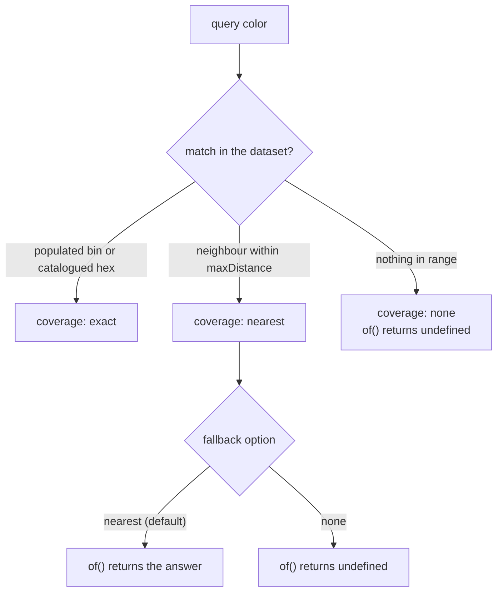

# Color Naming

`@urcolor/i18n` answers "what does this color get called?" in a given language,
from either of two independent sources. `uwdata` is crowdsourced
color-perception data that models how speakers spontaneously name a region of
color space. `wikidata` is an editorial catalogue of discrete named colors
contributed by Wikidata editors. They answer different questions, described
under [Sources](#sources). By default `uwdata` answers the 20 locales it covers
and `wikidata` answers the rest, and whichever one answered is named by
`resolvedOptions().source`.

## Basic usage

```ts
import { ColorNames } from "@urcolor/i18n";
import { Color } from "@urcolor/core";

const names = await ColorNames.load("ko", { source: "uwdata" });
names.of(Color.parse("#3b82f6")!); // "파랑색"
```

The API mirrors the built-in `Intl` classes on purpose, so it should feel like
native platform localization: a constructor taking locales and options, `of()`
for the common case, `resolvedOptions()` to see what was negotiated, and a
static `supportedLocalesOf()`.

## Loading

Language data ships as lazily loaded chunks, so construction is asynchronous:

```ts
const names = await ColorNames.load(["ko-KR", "en"], { source: "uwdata" });
names.resolvedOptions().locale; // "ko", negotiated by BCP 47 lookup
```

Once a language is loaded, the synchronous constructor works for it:

```ts
new ColorNames("ko", { source: "uwdata" }); // fine, chunk is cached
new ColorNames("ru", { source: "uwdata" }); // throws, call load() first
```

## Probabilities and confidence

For `uwdata`'s full and hue models, color naming is not deterministic.
`resolve()` exposes the sampled distribution of what study participants actually
called a color.

```ts
names.resolve(Color.parse("#3b82f6")!);
// {
//   name: "파랑색",
//   term: "파랑",
//   probability: 0.79,
//   candidates: [{ name, term, probability }, …],
//   model: "full",
//   source: "uwdata",
//   coverage: "exact",
//   binDistance: 0,
// }
```

`wikidata`'s palette model works differently. It has no sampled distribution,
only a catalogue of discrete colors. There `probability` is a proximity
confidence derived from Oklab distance to the nearest catalogued color rather
than a naming frequency, and `candidates` ranks the nearest few catalogued
colors rather than the most commonly used terms. `binDistance` is the underlying
Oklab distance for either model, so it is the number to read when you need
ground truth rather than a model-dependent score.



`coverage` is the honest part either way. `"exact"` means the color matched real
data: a populated bin for `uwdata`, or a catalogued hex within a tiny epsilon
for `wikidata`. `"nearest"` means the answer came from a neighbouring bin or the
closest catalogued color within `maxDistance`. `"none"` means the dataset has
nothing to say, and `of()` returns `undefined` rather than guessing. `resolve()`
always reports the true `coverage` and `binDistance` whatever the `fallback`
option says, because `fallback` only changes what `of()` does with a
`"nearest"` result, so a nearby answer is always detectable even when `of()` is
configured to withhold it.

For hue-model locales (`ar da el hu it tr`), `resolve()` also returns
`hueProjectionDistance`: the Oklab distance from the query color to the fully
saturated color at the same hue. The hue model only describes that saturated
ring, so a large value means the model has nothing meaningful to say about this
particular color. It is `undefined` for full-model locales. The hue model cannot
fall back to a neighbouring bin, so a lookup either lands in a populated bin
(`"exact"`) or misses (`"none"`). It never reports `"nearest"`, and
`fallback: "none"` is a no-op for those 6 locales.

::: warning Achromatic extremes are unreliable (uwdata full model)
Colors near the edges of the sampled space, very light, very dark or near-grey,
have little or no direct data. A `"nearest"` answer there can be a real
perceptual distance from what a speaker would say while still reporting a
plausible-looking probability. This is specific to `uwdata`'s full model.
`wikidata`'s palette lookup has no bins to run out of data near, though a
`"nearest"` answer there can still be far from the query color when
`maxDistance` is generous, so check `binDistance`.

Pure white (`#ffffff`) resolves to 연분홍색 ("light pink", 36% probability,
`binDistance` 0.050) in Korean, and to 浅蓝色 ("light blue", 22%, `binDistance`
0.071) in Chinese. Both are wrong and both look confident.

Check `coverage` and `binDistance` on `resolve()` to detect this, or pass
`fallback: "none"` to get `undefined` instead of a nearest-bin guess near those
extremes.
:::

## Options

| Option | Values | Default | Meaning |
| --- | --- | --- | --- |
| `source` | source id, or an array of them | `["uwdata", "wikidata"]` | Which dataset(s) answer, in priority order. A single id pins the instance and throws if that source lacks the locale |
| `style` | `"long"` \| `"short"` | `"long"` | Display name vs. matching key |
| `fallback` | `"nearest"` \| `"none"` | `"nearest"` | Whether a `"nearest"` result is withheld by `of()`. Meaningfully filters full-model results; a no-op for hue-model locales (see above); highly consequential for `wikidata`'s palette locales, where almost every query reports `"nearest"` |
| `maxDistance` | number | `0.075` (full/hue), `0.15` (palette) | Oklab search radius used at lookup time, unconditionally rather than only when `fallback` is `"nearest"`. Wider by default for `wikidata`, because 964 catalogued colors leave real gaps a bin-tuned radius would miss |
| `topN` | number | `5` | Candidates returned by `resolve()` |

## Reverse lookup

```ts
names.colorOf("파랑"); // Color, the term's average color
names.resolveColorOf("파랑");
// { color, term: "파랑", name: "파랑색", pCT: 0.025 }
```

`pCT` is upstream's signal for how strongly a term identifies its own color: the
maximum across the term's bins, which is the bin where the term is the most
distinctive label for its color. It is `null` when the source data does not
carry that signal for this term's model, which is always the case for
`wikidata`. The palette model has no per-term bin data of any kind, so every
`resolveColorOf()` result from that source has `pCT: null` unconditionally
rather than as a per-term gap.

## Coverage by language

`uwdata` spans 20 languages: 14 with a full-color-space model (`de en es fa fi
fr ko nl pl pt ro ru sv zh`) and 6 with a hue-circle model that only describes
saturated colors (`ar da el hu it tr`). Sample volume differs by orders of
magnitude between them. English alone accounts for hundreds of terms, while
Romanian has only a handful, so `resolvedOptions().coverage`, the fraction of
sRGB-reachable Oklab space that has data, ranges from about 96% (en) down to
single digits (ro).

`wikidata` spans 298 languages with a discrete-palette model: 964 catalogued
colors, each with one exact sRGB value, named in whatever languages Wikidata
editors have supplied. This is where the long tail lives, and languages like
Georgian and Cherokee have color names here and none in `uwdata`.
`resolvedOptions().coverage` means `terms / itemCount` there, the fraction of
the catalogue this language names rather than of Oklab space, and it ranges from
93% (en, 897 terms) down to a single term for the thinnest locales. Georgian's
14-term chunk (coverage 1.45%) cannot name an arbitrary color, but it resolves
`colorOf("ყვითელი")` correctly, which is exactly the capability `uwdata` lacks
there.

## Sources

Datasets are namespaced and never merged, because they use different
methodologies and blending them would produce answers no source actually
supports. Exactly one source answers an entire `ColorNames` instance, chosen at
load time and fixed thereafter.

Omitting `source` walks the default chain, `uwdata` then `wikidata`. Provenance
is then implicit in the request but still explicit in the result:
`resolve().source` and `resolvedOptions().source` always name the dataset that
answered, and `resolvedOptions().sources` reports the whole chain that was
considered. `getDefaultSources()` reads that chain, `["uwdata", "wikidata"]`,
without constructing a `ColorNames` instance first.

A tag one source has exactly beats a tag another only reaches by stripping
subtags, so `load("zh-Hant")` gets `wikidata`'s Traditional Chinese rather than
`uwdata`'s Simplified `zh`. `load("zh")` still gets `uwdata`.

```ts
import { listSources, getSource } from "@urcolor/i18n";

getSource("uwdata").citation; // attribution text to display
getSource("uwdata").disclaimer;
getSource("wikidata").citation; // same shape, different provenance
getSource("wikidata").disclaimer;
```

Please surface the citation and disclaimer in any UI built on this data.

`uwdata` covers 20 locales, several of them thinly: Romanian has 4 terms,
Finnish 11 and Swedish 16, where `wikidata` has 65, 65 and 170. The chain is
locale-level, so `load("ro")` stays on `uwdata`'s 4 terms. That is deliberate,
because switching sources on a coverage threshold would return perceptual data
for one language and catalogue data for another with no defensible cutoff. Pass
`{ source: ["wikidata"] }` when you want breadth over perceptual fidelity.

## Channel labels

```ts
import { ChannelNames } from "@urcolor/i18n";

new ChannelNames("ko").of("hue"); // "색조"
```

77 locales, synchronous, with no source concept: these strings are
hand-authored rather than derived from a dataset. See
[Internationalized](/guide/features#languages) for the full list.
