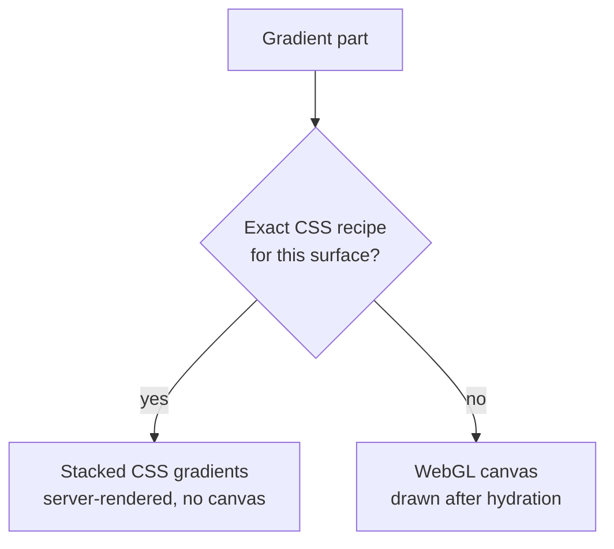
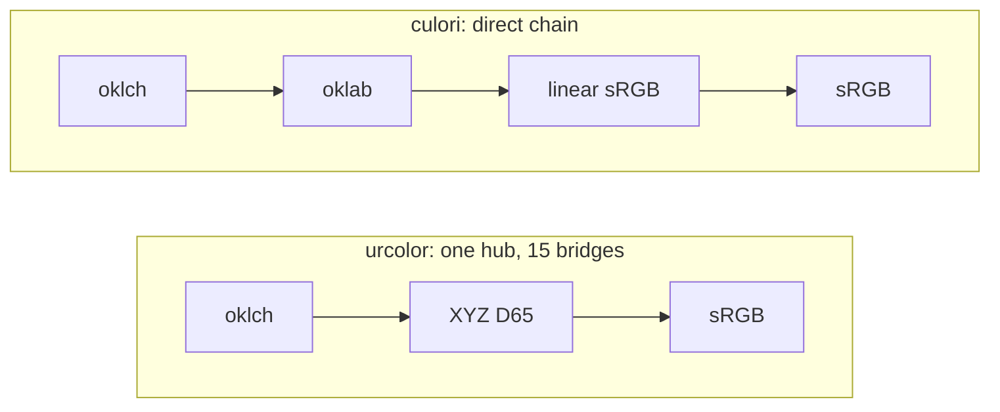

# Features

## Unstyled {#unstyled}

Every component is headless and renderless, with no default styles at all. The
design follows [Reka UI](https://reka-ui.com/) (Vue) and
[Base UI](https://base-ui.com/) (React): low-level primitives that expose state
and behavior through props, slots and data attributes, and leave the visual
design to you.

Eight component families ship in every binding, each split into parts you
compose yourself:

| Family | Parts |
| --- | --- |
| Color Area | Root, Area (Vue), Gradient, Checkerboard (Vue, React), Thumb |
| Color Slider | Root, Track, Range, Control (React, Svelte, Angular), Gradient, Checkerboard (Vue, React), Thumb |
| Color Field | Root, Input, Increment, Decrement, Swatch |
| Color Swatch | Root |
| Color Swatch Picker (Vue) / Swatch Group | Root, Item, Item Swatch, Item Indicator (Vue); Root elsewhere |
| Color Wheel | Root, Gradient, Checkerboard (Vue, React), Thumb |
| Color Triangle | Root, Gradient, Checkerboard (Vue, React), Thumb |
| Color Ring | Root, Track, Gradient, Checkerboard (Vue, React), Thumb |

The parts take whatever the surrounding UI is built with: Tailwind, plain CSS, a
component library, a house design system.

## Any color space {#color-spaces}

Conversion and manipulation run on urcolor's own zero-dependency, spec-accurate
CSS Color 4 implementation. Spaces are identified by their CSS Color 4 ids:

<details>
<summary>Supported color spaces</summary>

| Color Space | Id |
| --- | --- |
| sRGB | `srgb` |
| Linear sRGB | `srgb-linear` |
| HSL | `hsl` |
| HSV / HSB | `hsv` |
| HWB | `hwb` |
| CIELAB | `lab` |
| CIELCh | `lch` |
| OKLab | `oklab` |
| OKLCH | `oklch` |
| Display P3 | `display-p3` |
| Adobe RGB 1998 | `a98-rgb` |
| ProPhoto RGB | `prophoto-rgb` |
| Rec. 2020 | `rec2020` |
| CIE XYZ (D65) | `xyz-d65` |
| CIE XYZ (D50) | `xyz-d50` |

</details>

## Accessible {#accessible}

The accessibility work is modelled on
[React Spectrum](https://react-spectrum.adobe.com/react-aria/ColorArea.html),
Adobe's reference implementation of accessible color pickers.

Every component follows the WAI-ARIA color picker pattern:

- Keyboard navigation with arrow keys, Page Up/Down and Home/End
- Screen reader announcements when the color value changes
- ARIA roles, labels and live regions
- Focus management with visible focus indicators

## Server rendered {#ssr}

Where an exact recipe exists, a gradient paints as stacked CSS gradients. It
then appears in server-rendered HTML and on first paint, with no `<canvas>`
element, no WebGL context and no repaint after hydration. In a VitePress, Nuxt,
Next or SvelteKit page the picker is already in the markup.



What that covers:

| Surface | CSS | Canvas |
| --- | --- | --- |
| Color Slider | every color space | — |
| Color Ring | every color space | — |
| Color Area | any `hsv` or `hsl` channel pair, explicit corner colors, any `alpha` axis | perceptual and RGB-family channel pairs, `hwb`, corner colors with `interpolationSpace` |
| Color Wheel | hue × saturation in `hsv` and `hsl` | every other space and channel pair |
| Color Triangle | — | always |

The stops themselves are computed with `Color`, which runs on a server perfectly
well, so a perceptual space is no obstacle to a one-dimensional ramp. Only the
interpolation *between* stops has to be something CSS can express, which is why
a slider is CSS in `oklch` while a two-channel `oklch` area is not.

Each recipe is an exact algebraic equivalent of the sampler it replaces rather
than an approximation. One exception is deliberate: an axis bound to hue is 36
stops lerped in sRGB rather than a per-pixel sweep, the same trade the slider and
ring have always made.

Every `Gradient` part takes a `renderer` prop, `'auto'` (the default), `'css'`
or `'canvas'`, for pinning the behaviour.

The Angular bindings are directives *on* your `<canvas>`, so there is no element
to drop. The recipe becomes that canvas' own CSS background and no drawing
context is acquired. The two recipes that need a `mask-image` on their own
layer, corner-mode areas and areas with an `alpha` axis, fall back to the canvas
there.

## Fast {#fast}

Gradients CSS cannot express, such as a two-channel plane in OKLab, Lab, LCH or
OKLCH where every pixel has to be evaluated in the correct color space, render
on the GPU through WebGL at full resolution.

The runtime has no external dependencies beyond the core color math, which keeps
the bundle small.

### The color engine

`@urcolor/core` is benchmarked against culori, chroma-js, colorjs.io, colord,
tinycolor2 and @ctrl/tinycolor on every operation a picker performs. A
selection, measured on an Apple M1 under Bun:

| Operation | urcolor | Next fastest | Margin |
| --- | --- | --- | --- |
| Parse a hex color | **137 ns** | colord, 138 ns | 1.0× |
| Reject an invalid color | **48 ns** | colord, 92 ns | 1.9× |
| Convert sRGB → OKLCH | **145 ns** | culori, 153 ns | 1.1× |
| Chain sRGB → OKLCH → Lab → sRGB | **419 ns** | culori, 449 ns | 1.1× |
| Mix two colors in OKLab | **283 ns** | culori, 669 ns | 2.4× |
| Mix two colors in OKLCH | **436 ns** | culori, 846 ns | 1.9× |
| WCAG 2.1 contrast ratio | **152 ns** | culori, 155 ns | 1.0× |
| Read one channel | **8 ns** | colord, 22 ns | 2.8× |
| Set alpha | **37 ns** | colord, 90 ns | 2.4× |
| Serialize to hex | **44 ns** | culori, 66 ns | 1.5× |
| Serialize to `oklch()` | **62 ns** | culori, 69 ns | 1.1× |

The [`Color`](./color-class) class costs about one allocation over the bare
functions. `Color.parse()` and `parse()` both run in 137 ns, and `.mix()` costs
335 ns against `mix()`'s 283 ns, so the ergonomic API is not the slow one. Use
the functions in per-pixel loops and the class everywhere else.

urcolor does not win everything. The [comparison](#comparison) section lists
where it loses and why, and the [benchmarks page](./benchmarks) has the full
picture, group by group.

### Canvas gradient rendering

Component gradients go through WebGL, but the same surfaces can be rasterized on
the CPU. `sampleBilinearGrid`, `sampleChannelGrid`, `samplePolarGrid`,
`sampleConicRing` and `interpolateStops` each return an `Uint8ClampedArray` of
RGBA bytes ready for `putImageData`. No other color library ships a grid
sampler, so the comparisons below hand-roll the same loop with that library's
interpolator:

| Surface | urcolor | culori (hand-rolled) | colorjs.io | chroma-js |
| --- | --- | --- | --- | --- |
| 64-stop OKLab gradient, interpolator reused | **2.61 µs** | 9.88 µs | 47.9 µs | 266 µs |
| 128×128 bilinear plane → RGBA | **4.4 ms** | 35.3 ms | 170 ms | — |
| 128×128 HSV S/V plane → RGBA | 2.2 ms | **1.2 ms** | 31.0 ms | — |
| 128×128 OKLCH hue ring → RGBA | 4.1 ms | **3.3 ms** | — | — |

Interpolation is where urcolor is furthest ahead: 3.8× faster than culori and
102× faster than chroma-js on a 64-stop OKLab ramp, and 8× faster than culori on
the bilinear plane, whose cost is dominated by mixing rather than conversion.

The per-pixel channel samplers run the other way round. The HSV plane and hue
ring evaluate a fresh color at all 16 384 pixels, so they are paced by
single-conversion throughput, where culori's direct converter chain stays 1.2× to
1.8× ahead of urcolor's XYZ-hub routing. That gap is why the surfaces that still
need a canvas go through WebGL where they can, since the shader does the same
work in one draw call whatever the surface size, and why the ones with an exact
CSS recipe skip the sampling entirely.

## Comparison {#comparison}

How `@urcolor/core` stacks up against the color libraries it is benchmarked
against. Every capability below was executed rather than read off a README. A
feature counts only if the call returns a usable, finite result, because a
library that parses `oklch()` into `NaN` is not one you can build a picker on.

Versions probed: culori 4.0.2, colorjs.io 0.7.1, chroma-js 3.2.0, colord 2.9.3,
tinycolor2 1.6.0, @ctrl/tinycolor 4.2.0. All seven have zero runtime
dependencies, so that is not a differentiator.

### Capabilities

🔌 means the feature exists but needs an opt-in plugin.

| Capability | urcolor | culori | colorjs.io | chroma-js | colord | tinycolor2 | @ctrl/tinycolor |
| --- | :-: | :-: | :-: | :-: | :-: | :-: | :-: |
| Parse `oklch()` / `oklab()` | ✅ | ✅ | ✅ | ✅ | — | — | — |
| Parse `lab()` / `lch()` | ✅ | ✅ | ✅ | ✅ | — | — | — |
| Parse `color(display-p3 …)` | ✅ | ✅ | ✅ | — | — | — | — |
| Parse `hwb()` | ✅ | ✅ | ✅ | — | — | — | — |
| Convert to OKLCH / OKLab | ✅ | ✅ | ✅ | ✅ | — | — | — |
| Convert to CIE Lab / LCh | ✅ | ✅ | ✅ | ✅ | 🔌 | — | — |
| Convert to Display P3 / Rec. 2020 | ✅ | ✅ | ✅ | — | — | — | — |
| Convert to CIE XYZ | ✅ | ✅ | ✅ | — | — | — | — |
| Serialize to `oklch()` | ✅ | ✅ | ✅ | — | — | — | — |
| ΔE CIEDE2000 | ✅ | ✅ | ✅ | ✅ | ✅ | — | — |
| ΔE OK (Oklab) | ✅ | ✅ | ✅ | — | — | — | — |
| WCAG 2.1 contrast | ✅ | ✅ | ✅ | ✅ | ✅ | ✅ | ✅ |
| APCA contrast | ✅ | — | ✅ | — | — | — | — |
| CSS Color 4 gamut mapping | ✅ | ✅ | ✅ | — | — | — | — |
| Mix in a chosen space | ✅ | ✅ | ✅ | ✅ | ✅ | ✅ | ✅ |
| Hue-arc control (shorter / longer / increasing) | ✅ | ✅ | ✅ | — | — | — | — |
| Reverse color naming | ✅ | — | — | — | 🔌 | ✅ | ✅ |
| Grid samplers → `putImageData` | ✅ | — | — | — | — | — | — |
| WebGL gradient rendering | ✅ | — | — | — | — | — | — |
| Accessible UI components | ✅ | — | — | — | — | — | — |

Two rows need their footnotes read, because the ✅ hides a difference in kind:

- **Reverse color naming.** tinycolor2, @ctrl/tinycolor and colord's `names`
  plugin all answer with the nearest English CSS keyword (`royalblue`).
  `@urcolor/i18n` answers in up to 298 languages, and separately translates
  channel labels into 77. See [Color Naming](/guide/color-naming).
- **Convert to CIE Lab / LCh.** colord reaches Lab and LCh through its `lab` /
  `lch` plugins as *object* conversions. It still cannot parse or emit the CSS
  `lab()` string, which is the row above it.

The bottom four rows are the picker-specific ones, and they are why urcolor
exists rather than being a wrapper. No general-purpose color library ships a
grid sampler, a GPU renderer or accessible components, because none of them are
trying to draw a color picker.

### Speed

Apple M1, Bun 1.3, mitata. Fastest per row in **bold**. `—` means the library
cannot express that operation at all, never "too slow to measure". Full
methodology and all 59 groups are on the [benchmarks page](./benchmarks).

| Operation | urcolor | culori | colorjs.io | chroma-js | colord | tinycolor2 | @ctrl/tinycolor |
| --- | --- | --- | --- | --- | --- | --- | --- |
| Parse hex | ⭐ **137 ns** | 142 ns | 4.52 µs | 330 ns | 138 ns | 362 ns | 393 ns |
| Parse `oklch()` | ⭐ **535 ns** | 904 ns | 6.37 µs | — | — | — | — |
| Reject invalid input | ⭐ **48 ns** | 261 ns | — | — | 92 ns | 191 ns | 185 ns |
| sRGB → OKLCH | ⭐ **145 ns** | 153 ns | 1.08 µs | 886 ns | — | — | — |
| OKLCH → sRGB | 165 ns | ⭐ **101 ns** | 1.06 µs | 920 ns | — | — | — |
| Mix in OKLab | ⭐ **283 ns** | 669 ns | 2.89 µs | 3.47 µs | — | — | — |
| ΔE CIEDE2000 | 456 ns | ⭐ **437 ns** | 1.89 µs | 698 ns | 625 ns | — | — |
| WCAG 2.1 contrast | ⭐ **152 ns** | 155 ns | 3.66 µs | 280 ns | 281 ns | 1.20 µs | 1.21 µs |
| Serialize to hex | ⭐ **44 ns** | 66 ns | 625 ns | 164 ns | 97 ns | 134 ns | 121 ns |
| Serialize to `oklch()` | ⭐ **62 ns** | 69 ns | 2.17 µs | — | — | — | — |
| Gamut-map into sRGB | 209 ns | ⭐ **116 ns** | 1.75 µs | — | — | — | — |
| Read one channel | ⭐ **8 ns** | — | 774 ns | 104 ns | 22 ns | — | — |
| hex → OKLCH → hex | 621 ns | ⭐ **577 ns** | 9.30 µs | 3.28 µs | — | — | — |
| 64-stop OKLab ramp | ⭐ **2.61 µs** | 9.88 µs | 47.88 µs | 265.64 µs | — | — | — |
| 128×128 bilinear plane → RGBA | ⭐ **4.4 ms** | 35.3 ms | 169.5 ms | — | — | — | — |

### Where urcolor loses

Publishing only the wins would make the table worthless, so:

- **culori is faster converting *out* of OKLCH** (101 ns against 165 ns) and at
  gamut mapping (116 ns against 209 ns). urcolor routes every conversion through
  an XYZ-D65 hub, so 15 spaces need 15 bridges rather than 210 direct paths.
  culori composes `oklch → oklab → linear sRGB` directly and allocates less. It
  also edges the hex → OKLCH → hex round trip, which is that same leg.
- **culori is faster on the per-pixel channel samplers**, the HSV S/V plane by
  1.8× (1.2 ms against 2.2 ms) and the OKLCH hue ring by 1.2× (3.3 ms against
  4.1 ms), for the same reason compounded 16 384 times. urcolor wins the
  bilinear plane by 8×, because that surface's cost is interpolation rather than
  conversion.
- **colord is faster at manipulation** (`lighten` 323 ns against 394 ns) because
  it adjusts in HSL. urcolor adjusts in OKLCH, which is perceptually even but
  more arithmetic. Against chroma-js, the other library doing it perceptually,
  urcolor is 2.2× faster.
- **colord and tinycolor2 serialize `hsl()` faster** (63 ns and 102 ns against
  119 ns), since HSL is their native storage and urcolor converts first.



If your app only ever touches sRGB and HSL, colord is smaller and quicker at the
handful of things it does. urcolor's case is that a color picker does not stay
in sRGB.

### Picker component libraries

The libraries above are color *engines*. These are the ones that draw a picker,
the direct alternatives to `@urcolor/vue`, `/react`, `/svelte` and `/angular`.
Facts below come from each package's shipped source and type declarations rather
than its README.

| Library | Frameworks | Color models | Component families | Runtime deps | Ships CSS |
| --- | --- | --- | --- | :-: | :-: |
| **urcolor** | Vue, React, Svelte, Angular | **15** including OKLCH, OKLab, Lab, LCh, HWB, P3, Rec. 2020, XYZ | area, slider, field, swatch, swatch picker, wheel, triangle, ring | 0 | no |
| [React Aria Components](https://react-spectrum.adobe.com/react-aria/ColorPicker.html) | React | 3: sRGB, HSL, HSB | area, slider, field, swatch, swatch picker, wheel, thumb | 7 | no |
| [Reka UI](https://reka-ui.com/) | Vue | 3: sRGB, HSL, HSB | area, slider, field, swatch, swatch picker | 10 | no |
| [Ark UI](https://ark-ui.com/docs/components/color-picker) | React, Vue, Svelte, Solid | 3: sRGB, HSL, HSB | area, channel slider, channel input, swatch, swatch group, eyedropper, format select | 67 | no |
| [Zag.js](https://zagjs.com/components/react/color-picker) | React, Vue, Svelte, Solid | 3: sRGB, HSL, HSB | state machine only, you supply the markup | 8 | no |
| [@uiw/react-color](https://uiwjs.github.io/react-color/) | React | 3: HSV, HSL, RGB | area, sliders, wheel, field, swatch, eyedropper | 20 | no |
| [react-color](https://casesandberg.github.io/react-color/) | React | 3: HSV, HSL, RGB | area, field, swatches | 7 | no |
| [react-colorful](https://github.com/omgovich/react-colorful) | React | 3: HSV, HSL, RGB | area + hue slider | 0 | no |
| [@rc-component/color-picker](https://github.com/react-component/color-picker) | React | 3: HSV, HSL, RGB | area + sliders (antd internals) | 3 | 2 KB |
| [vue-color](https://github.com/xiaokaike/vue-color) | Vue | 3: HSV, HSL, RGB | area, slider, field, swatch | 2 | 42 KB |
| [vue3-colorpicker](https://github.com/aesoper101/vue3-colorpicker) | Vue | 3: HSV, HSL, RGB | packaged picker | 7 | 35 KB |
| [svelte-awesome-color-picker](https://github.com/Ennoriel/svelte-awesome-color-picker) | Svelte | 2: HSV, RGB | packaged picker + swatch | 2 | no |
| [ngx-colors](https://github.com/luchsamapparat/ngx-colors) | Angular | 3: HSV, HSL, RGB | packaged picker, eyedropper | 1 | no |
| [iro.js](https://iro.js.org/) | Vanilla | 3: HSV, HSL, RGB | wheel, box, sliders | 2 | no |
| [Pickr](https://github.com/simonwep/pickr) | Vanilla | 3: HSV, HSL, RGB | packaged picker, swatches | 0 | 26 KB |
| [vanilla-picker](https://github.com/Sphinxxxx/vanilla-picker) | Vanilla | 2: HSL, RGB | packaged picker | 1 | 4 KB |

Not one of them models a perceptual or wide-gamut space. React Aria and Reka UI
both declare the identical public type, `ColorSpace = 'rgb' | 'hsl' | 'hsb'`, and
Ark UI and Zag.js share those same three through `@zag-js/color-utils`. Every
other package on the list stores HSV or RGB and converts on the way out. That is
the gap urcolor is built for: an OKLCH area, an Lab slider or a P3 gamut boundary
cannot be expressed by any of them, which is also why none of them need a GPU
renderer.

Read the rest honestly, though:

- **React Aria Components is the closest thing to a peer** and the reference
  urcolor's own accessibility is modelled on. It ships the same family split
  (area, slider, wheel, field, swatch, swatch picker) with genuine
  `aria-valuetext` announcements, and it is React-only. If you are on React and
  sRGB/HSL/HSB is enough, it is an excellent and far more battle-tested choice.
- **Reka UI added color primitives in 2.9.0** (March 2026): `ColorArea`,
  `ColorSlider`, `ColorField`, `ColorSwatch` and `ColorSwatchPicker`, with
  `aria-valuetext` on the interactive parts. `@urcolor/vue` is *built on* Reka
  UI, so on Vue the two now overlap. If you already depend on Reka and only need
  an sRGB/HSL/HSB picker, its own primitives follow conventions you know.
  urcolor adds the perceptual and wide-gamut spaces, the GPU renderer, the
  wheel, triangle and ring families, and the same API on React, Svelte and
  Angular. Reka is a build-time dependency there rather than an install: the
  primitives `@urcolor/vue` uses are bundled and tree-shaken into its own
  `dist`, so it costs you no extra package either way. Note this repo builds
  against `reka-ui` `^2.8.0`, which predates the color primitives.
- **Ark UI covers four frameworks** as urcolor does, and adds an eyedropper
  trigger and format select that urcolor has no equivalent for. 66 of its 67
  dependencies are its own `@zag-js/*` packages rather than third-party weight
  (the exception is `@internationalized/date`), and installing the color picker
  does not pull in the other components' machines.
- **Zag.js is not a component library.** It is the state machine underneath Ark
  UI, listed because it is a genuine alternative if you intend to write all the
  markup yourself.
- **react-colorful is 70 KB with zero dependencies** and will beat urcolor on
  bundle size for a plain sRGB swatch picker every time.
- Nothing here ships a color wheel, triangle and ring together. Only urcolor,
  React Aria (wheel), @uiw/react-color (wheel) and iro.js (wheel) offer a wheel
  at all.

## Multi-framework {#multi-framework}

One shared core, one component model, one set of behaviours, exposed idiomatically
per framework.

- **Vue 3** (v3.4+): `@urcolor/vue`, built on [Reka UI](https://reka-ui.com/) primitives, with `v-model` and slot props.
- **React** (v18+): `@urcolor/react`, namespaced components (`ColorArea.Root`) with `value` / `onValueChange`.
- **Svelte 5** (v5.29+): `@urcolor/svelte`, components with `bind:value`, `child` snippets, and rune-based hooks (`useColor`, `useOKLCh`, …).
- **Angular** (v21.2+): `@urcolor/angular`, standalone directives (`[urcColorAreaRoot]`) with `[(value)]` models, signal stores, and Signal Forms support via `[field]`.

Drag handling, keyboard maps, channel models, data attributes and WebGL
rendering live once in `@urcolor/shared`; color conversion lives once in
`@urcolor/core`. Each binding is a thin idiomatic layer over those two, so
behaviour and accessibility are identical across all four. A Solid adapter is
planned.

Every recipe under [How to](/how-to/build-color-area-picker) shows all four
frameworks side by side.

## Internationalized {#languages}

Internationalization lives in one optional package, `@urcolor/i18n`. Nothing in
the core or the framework bindings depends on it.

It answers two separate questions from two independently sourced datasets.
`ChannelNames` translates channel labels into 77 languages, and `ColorNames`
answers "what is this color called?" in up to 298. Color naming has its own
page: [Color Naming](/guide/color-naming).

<details>
<summary>Full language list</summary>

| Code | Language | Code | Language |
|------|----------|------|----------|
| aa | 🇩🇯 Afar | na | 🇳🇷 Nauru |
| ab | 🇬🇪 Abkhazian | nb | 🇳🇴 Norwegian Bokmål |
| af | 🇿🇦 Afrikaans | ne | 🇳🇵 Nepali |
| ak | 🇬🇭 Akan | nl | 🇳🇱 Dutch |
| am | 🇪🇹 Amharic | nn | 🇳🇴 Norwegian Nynorsk |
| ar | 🇸🇦 Arabic | no | 🇳🇴 Norwegian |
| az | 🇦🇿 Azerbaijani | ny | 🇲🇼 Chichewa |
| bg | 🇧🇬 Bulgarian | oc | 🇫🇷 Occitan |
| bn | 🇧🇩 Bengali | pa | 🇮🇳 Punjabi |
| ca | 🇪🇸 Catalan | pl | 🇵🇱 Polish |
| cr | 🇨🇦 Cree | ps | 🇦🇫 Pashto |
| cs | 🇨🇿 Czech | pt | 🇵🇹 Portuguese |
| cy | 🏴󠁧󠁢󠁷󠁬󠁳󠁿 Welsh | ro | 🇷🇴 Romanian |
| da | 🇩🇰 Danish | ru | 🇷🇺 Russian |
| de | 🇩🇪 German | si | 🇱🇰 Sinhala |
| el | 🇬🇷 Greek | sk | 🇸🇰 Slovak |
| en | 🇬🇧 English | sl | 🇸🇮 Slovenian |
| es | 🇪🇸 Spanish | sm | 🇼🇸 Samoan |
| et | 🇪🇪 Estonian | so | 🇸🇴 Somali |
| fa | 🇮🇷 Persian | sq | 🇦🇱 Albanian |
| fi | 🇫🇮 Finnish | sr | 🇷🇸 Serbian |
| fr | 🇫🇷 French | su | 🇮🇩 Sundanese |
| ga | 🇮🇪 Irish | sv | 🇸🇪 Swedish |
| gu | 🇮🇳 Gujarati | ta | 🇮🇳 Tamil |
| he | 🇮🇱 Hebrew | te | 🇮🇳 Telugu |
| hi | 🇮🇳 Hindi | th | 🇹🇭 Thai |
| hr | 🇭🇷 Croatian | tl | 🇵🇭 Tagalog |
| hu | 🇭🇺 Hungarian | tr | 🇹🇷 Turkish |
| id | 🇮🇩 Indonesian | uk | 🇺🇦 Ukrainian |
| is | 🇮🇸 Icelandic | ur | 🇵🇰 Urdu |
| it | 🇮🇹 Italian | vi | 🇻🇳 Vietnamese |
| ja | 🇯🇵 Japanese | zh | 🇨🇳 Chinese |
| ka | 🇬🇪 Georgian | ja-traditional | 🇯🇵 Japanese wa-iro |
| kn | 🇮🇳 Kannada | zh-traditional | 🇨🇳 Chinese traditional |
| ko | 🇰🇷 Korean | ko-traditional | 🇰🇷 Korean obangsaek |
| lb | 🇱🇺 Luxembourgish | | |
| lt | 🇱🇹 Lithuanian | | |
| lv | 🇱🇻 Latvian | | |
| mk | 🇲🇰 Macedonian | | |
| ml | 🇮🇳 Malayalam | | |
| ms | 🇲🇾 Malay | | |
| my | 🇲🇲 Burmese | | |

</details>

What gets translated is the words behind abbreviations like `H`, `S`, `L`, `V`,
`R`, `G`, `B`: hue, saturation, lightness, value, red, green, blue and the rest.
Construct a `ChannelNames` for a locale and call `of()`, or use the
`translations` map directly for a locale's full dictionary.

```ts
import { ChannelNames } from "@urcolor/i18n";

const channels = new ChannelNames("ko");
channels.of("hue"); // "색조"
channels.resolvedOptions(); // { locale: "ko" }
```

::: warning
Only channel labels are localized. Color format codes such as `hex`, `srgb` and
`hsl`, and numeric values, are not translated.
:::
