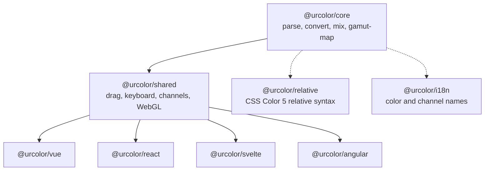

# Introduction

UrColor is a universal, headless color picker library. It ships unstyled,
composable primitives and leaves styling and behavior to you.

## Packages

Solid arrows are required, dotted ones opt in.

- `@urcolor/core` is a zero-dependency CSS Color 4 library: parse, convert,
  serialize, gamut-map, interpolate.
- `@urcolor/shared` is the framework-agnostic behavior layer: drag handling,
  keyboard maps, channel models, WebGL canvas gradient generators for color area
  sliders, and the data attributes every binding shares.
- `@urcolor/relative` adds CSS Color 5 relative color syntax
  (`rgb(from red r g b)`) to `@urcolor/core`. See
  [Relative Colors](/guide/relative-colors).
- `@urcolor/i18n` covers multilingual color naming and channel labels. See
  [Color Naming](/guide/color-naming).
- `@urcolor/vue` holds headless Vue 3 components and composables.
- `@urcolor/react`, `@urcolor/svelte` and `@urcolor/angular` expose the same
  primitives, as components for React, components plus rune-based hooks for
  Svelte 5, and directives plus signal stores for Angular.

All four bindings ship the same eight component families. Every recipe under
[How to](/how-to/build-color-area-picker) shows Vue, React, Svelte and Angular
side by side, so pick the tab that matches your stack.

## Philosophy

Following Radix UI, Reka UI and React Spectrum, UrColor supplies the logic and
the accessibility while you bring the styles. The color area component takes
arbitrary two-channel combinations, such as hue with saturation, or hue with
chroma in LCH, and renders them through WebGL.
