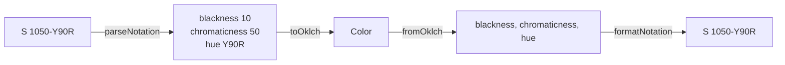

# NCS Colors

`@urcolor/ncs` teaches `@urcolor/core` the [Natural Colour System](https://en.wikipedia.org/wiki/Natural_Color_System)
notation, in both directions:

```
S 1050-Y90R
NCS S 2030-Y90R
4030-B50G
S 0500-N
```

It ships as a separate package. `@urcolor/core` never parses this notation on
its own, so anyone who does not use NCS pays nothing for it.



## Installation

::: code-group

```sh [bun]
bun add @urcolor/ncs
```

```sh [npm]
npm install @urcolor/ncs
```

```sh [pnpm]
pnpm add @urcolor/ncs
```

:::

## Usage

Parsing is not enabled by importing the package. Call `registerNcsColor()` once
where the app boots:

```ts
import { Color } from "@urcolor/core";
import { registerNcsColor, toNcs } from "@urcolor/ncs";

registerNcsColor();

Color.parse("S 1050-Y90R");
toNcs(Color.parse("#eb7f7a")!); // "S 1050-Y90R"
```

The call returns an idempotent dispose function, so a test can register and
unregister without leaking state into the next one:

```ts
const dispose = registerNcsColor();
dispose();
dispose(); // no-op
```

Registered parsers run after every built-in, so this package can neither shadow
nor slow a standard notation.

## Notation

Both prefixes are optional, `ncs(…)` wraps any form, and parsing is
case-insensitive.

| Form | Meaning |
| --- | --- |
| `S 1050-Y90R` | blackness 10, chromaticness 50, hue 90% from `Y` toward `R` |
| `1050-Y90R` | the same, prefix omitted |
| `NCS S 1050-Y90R` | the same, full prefix |
| `S 0580-Y` | an elementary hue, no second hue |
| `S 0500-N` | the neutral axis |
| `ncs(1050-Y90R)` | functional wrapper |

Two rules return `null` rather than a wrong color. Blackness plus chromaticness
must not exceed 100, since whiteness is the remainder. And a hue pair must name
adjacent hues: the circle runs `Y → R → B → G → Y`, and NCS holds that no hue
resembles both members of an opponent pair, so `Y90R` is a color while `R90G`
and `Y50B` are not.

## Accuracy

::: warning This is an approximation
NCS Colour AB holds the Natural Colour System as proprietary and publishes no
open notation-to-sRGB mapping. The conversion is a model fitted against 2,031
published values, not a specification. Matching physical paint needs an
official NCS fan deck.

NCS and Natural Colour System are trademarks of NCS Colour AB. This package
ships a conversion, not the color system, and is affiliated with neither.
:::

Measured against the full reference set: mean ΔE00 1.65, median 1.41, 95th
percentile 3.76, worst 10.6, with 25 of 2,031 samples over 5.

Two weak spots are structural rather than incidental:

- **Very dark near-neutrals**, around `S 8505-*`, where the color is nearly
  black and ΔE00 magnifies small absolute differences.
- **Chromaticness above about 75**, where the model's chroma curve peaks and
  falls away, so two chromaticness values give the same lightness and chroma.
  No inverse can separate them, and `toNcs()` takes the lower reading.

## Serialization

`toNcs()` returns exact two-digit values such as `S 1347-Y83R`, not snapped to
the NCS standard sample grid. A result therefore round-trips through
`Color.parse()` but does not necessarily name a real, orderable NCS sample.
Snapping would require NCS Colour AB's copyrighted sample list and would move
the color silently.

Colors outside what NCS expresses are clamped, so `toNcs()` always answers.
Round-trip it when that matters:

```ts
import { deltaE } from "@urcolor/core";

const notation = toNcs(color);
const faithful = deltaE(color.toObject(), Color.parse(notation)!.toObject(), "2000") < 2;
```

Across a sweep of the whole notation space a round trip is mean ΔE00 0.19, 95th
percentile 1.01, worst 6.17.
