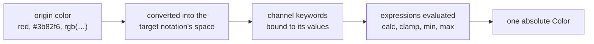

# Relative Colors

`@urcolor/relative` adds [CSS Color 5 relative color syntax](https://developer.mozilla.org/en-US/docs/Web/CSS/Guides/Colors/Using_relative_colors)
to `@urcolor/core`, deriving one color from another by referencing its channels:

```css
rgb(from red r g b)
hsl(from red calc(h + 180) s l)
oklch(from #ff0000 calc(l * 0.8) c h)
```

It ships as a separate package. `@urcolor/core` never parses this syntax on its
own, so anyone who does not use relative colors pays nothing for them.

## Installation

::: code-group

```sh [bun]
bun add @urcolor/relative
```

```sh [npm]
npm install @urcolor/relative
```

```sh [pnpm]
pnpm add @urcolor/relative
```

```sh [yarn]
yarn add @urcolor/relative
```

:::

## Enabling the plugin

Parsing is opt-in and there is no side-effect import. Call
`registerRelativeColor()` once, before any `Color.parse()` call that needs it:

```ts
import { Color } from "@urcolor/core";
import { registerRelativeColor } from "@urcolor/relative";

registerRelativeColor();

Color.parse("oklch(from #3b82f6 calc(l * 0.8) c h)");
```

`registerRelativeColor()` returns a dispose function that removes the parser
again. Disposal is idempotent, so calling it twice is safe from a test teardown
that does not guard against double cleanup:

```ts
const dispose = registerRelativeColor();
dispose();
dispose(); // no-op
```

Before registration, or after disposal, relative syntax is unparseable:
`Color.parse()` returns `null`, as it does for any other string core does not
recognise.

## The `from` syntax

A relative color names an origin after `from`, then rewrites its own channels
from that origin's values:

```
<notation>(from <origin> <c1> <c2> <c3> [/ <alpha>])
```



The origin can be any color string `@urcolor/core` parses on its own: a named
color, a hex string or another functional notation, including one carrying its
own alpha.

```ts
Color.parse("rgb(from red r g b)");                 // red itself
Color.parse("rgb(from rgb(1 2 3 / 40%) r g b / alpha)"); // origin's own alpha, preserved
```

Each channel slot takes a literal, a channel keyword or a math expression. A
bare keyword passes the origin's value through, and a literal replaces it:

```ts
Color.parse("rgb(from red 0 g b)"); // green and blue channels from red, red channel zeroed
```

## Channel keywords per notation

The origin is converted into the target notation's own color space before its
channels are read, so `oklch(from red l c h)` sees red's Oklch lightness rather
than its sRGB red channel. Each notation exposes its own three keywords, plus
`alpha` everywhere:

| notation | channel keywords | CSS units in expressions |
| --- | --- | --- |
| `rgb()` | `r` `g` `b` | `0–255` |
| `hsl()` | `h` `s` `l` | `h` in degrees; `s`/`l` `0–100` |
| `hwb()` | `h` `w` `b` | `h` in degrees; `w`/`b` `0–100` |
| `lab()` | `l` `a` `b` | `l` `0–100`; `a`/`b` `−125–125` |
| `lch()` | `l` `c` `h` | `l` `0–100`; `c` `0–150`; `h` in degrees |
| `oklab()` | `l` `a` `b` | `l` `0–1`; `a`/`b` `−0.4–0.4` |
| `oklch()` | `l` `c` `h` | `l` `0–1`; `c` `0–0.4`; `h` in degrees |
| `color()` | `r` `g` `b` for RGB-family spaces; `x` `y` `z` for the XYZ spaces | `0–1` |
| every notation | `alpha` | `0–1` |

`color()`'s keyword set depends on the resolved space, since one function covers
both the RGB-family spaces (`srgb`, `srgb-linear`, `display-p3`, `a98-rgb`,
`prophoto-rgb`, `rec2020`) and the XYZ spaces (`xyz`, `xyz-d50`, `xyz-d65`):

```ts
Color.parse("color(from red display-p3 r g b)"); // r, g, b
Color.parse("color(from red xyz x y z)");         // x, y, z
Color.parse("color(from red xyz r g b)");          // null, wrong keywords for xyz
```

::: tip Every keyword is a `<number>`, not a `<percentage>`
CSS Color 5 types every component keyword as a `<number>`, `hsl()`'s `s`/`l` and
`hwb()`'s `w`/`b` included. A saturated color's `s` reads as `100`, not `100%`.
So `calc(s + 10)` is valid plain-number arithmetic giving `110`, while
`calc(s + 10%)` is invalid: CSS forbids mixing a number and a percentage under
`+` and `-`. This trips people up because `s`/`l`/`w`/`b` feel like percentages.
The CSS working group considered typing them that way in
[issue #7114](https://github.com/w3c/csswg-drafts/issues/7114) and decided
against it.
:::

## Arithmetic

Channel expressions take the full CSS math grammar: `calc()`, `clamp()`,
`min()`, `max()`, arbitrary nesting, parenthesised sub-expressions, and standard
precedence, where `*` and `/` bind tighter than `+` and `-`.

```ts
// Complement: rotate hue by 180 degrees
Color.parse("hsl(from red calc(h + 180) s l)");

// Darken by scaling Oklch lightness
Color.parse("oklch(from #3b82f6 calc(l * 0.8) c h)");

// Clamp lightness into a range
Color.parse("oklch(from red clamp(0.2, l, 0.8) c h)");

// Cap a channel with min/max
Color.parse("rgb(from red min(r, 128) g b)");

// Nested: calc() inside clamp() inside min() all compose
Color.parse("oklch(from red min(clamp(0, calc(l * 2), 1), 0.9) c h)");
```

Angle units (`deg`, `grad`, `rad`, `turn`) are accepted on hue expressions and
normalised to degrees:

```ts
Color.parse("hsl(from red calc(h + 0.5turn) s l)"); // same as + 180deg
```

Percentages resolve against each channel's own reference range, so `50%` means
something different per channel. `lch()`'s `c` has a reference of `150`, and
`oklch()`'s `c` a reference of `0.4`:

```ts
Color.parse("lch(from red l 50% h)");   // c = 75
Color.parse("oklch(from red l 50% h)"); // c = 0.2
```

Alpha can be computed the same way:

```ts
Color.parse("rgb(from red r g b / calc(alpha * 0.5))"); // half the origin's alpha
```

## Failure modes

`@urcolor/relative` has no stylesheet, cascade or custom-property registry.
These are parse failures rather than silent defaults, so resolve them to a
concrete color before passing a string in:

```ts
Color.parse("rgb(from var(--brand) r g b)");   // null, var() origin
Color.parse("rgb(from currentcolor r g b)");   // null, currentcolor origin
Color.parse("rgb(from inherit r g b)");        // null, inherit origin
```

Every other error path returns `null` too, with no new error type: an
unparseable origin, an unknown channel keyword, a number/percentage type
mismatch such as `calc(s + 10%)`, division by zero, unbalanced parentheses, or a
wrong argument count to `clamp()`.

```ts
Color.parse("rgb(from nonsense r g b)");        // null, unparseable origin
Color.parse("rgb(from red r g q)");             // null, unknown channel keyword
Color.parse("hsl(from red h calc(s + 10%) l)"); // null, number/percentage mismatch
Color.parse("rgb(from red calc(r / 0) g b)");   // null, division by zero
```

`none` is a deliberate deviation from the spec. CSS Color 5 carries `none`
through a relative color as a genuine missing component that participates in
interpolation. This library has no missing-component representation anywhere, so
`none` in a channel slot or in an origin channel collapses to `0`, matching the
rest of its absolute parsers:

```ts
Color.parse("hsl(from hsl(none 50% 50%) h s l)"); // h reads as 0, not "missing"
```

::: tip
Like the rest of `@urcolor/core`'s parsers, `@urcolor/relative` never mutates or
reserializes. A parsed relative color resolves once, to a plain absolute
`Color`, and behaves from then on like one parsed from any other notation.
:::
