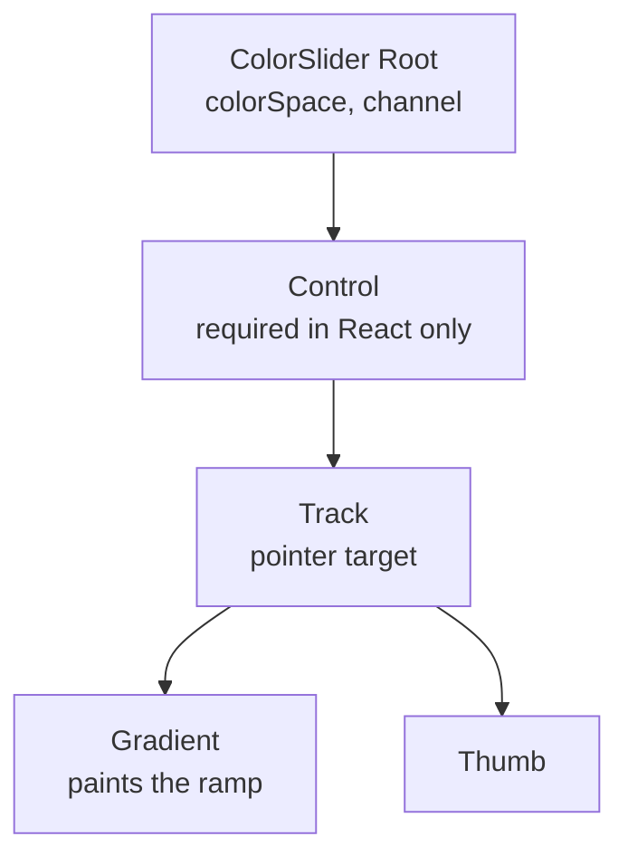

# How to Build a Color Channel Slider

A color slider maps one channel onto a track.

<script setup>
import ColorSliderGuide from './demo/vue/ColorSliderGuide.vue'
</script>

Here's what we'll end up with:

<ColorSliderGuide />

<details>
<summary>Click to view the full code</summary>

::: code-group

<<< @/how-to/demo/vue/ColorSliderGuide.vue [Vue]
<<< @/how-to/demo/react/ColorSliderGuide.tsx [React]
<<< @/how-to/demo/svelte/ColorSliderGuide.svelte [Svelte]
<<< @/how-to/demo/angular/color-slider-guide.ts [Angular]

:::

</details>

The parts, and how they nest:



## Step 1: Set up state

Import the color model and create the color state.

::: code-group

```vue [Vue]
<script setup lang="ts">
import { useColor } from "@urcolor/vue";  // [!code ++]

const { color } = useColor("hsl(210, 80%, 50%)");  // [!code ++]
</script>
```

```tsx [React]
import { useColor } from "@urcolor/react"; // [!code ++]

function MySlider() {
  const { color, setColor } = useColor("hsl(210, 80%, 50%)"); // [!code ++]
}
```

```svelte [Svelte]
<script lang="ts">
  import { useColor } from "@urcolor/svelte"; // [!code ++]

  const colorState = useColor("hsl(210, 80%, 50%)"); // [!code ++]
</script>
```

```ts [Angular]
import { Component, signal } from "@angular/core";
import { Color } from "@urcolor/core"; // [!code ++]

@Component({
  selector: "my-slider",
  template: ``,
})
export class MySlider {
  protected readonly color = signal<Color>(Color.parse("hsl(210, 80%, 50%)")!); // [!code ++]
}
```

:::

`useColor()` creates color state from any CSS color string. Vue returns a `{ color }` shallow ref and React returns `{ color, setColor }`. Svelte returns a rune-backed object whose `color`, `hex` and `alpha` are getters, so keep the object and read `colorState.color` rather than destructuring it, or reactivity is lost. Angular has no hook: a plain `signal<Color>()` is the state, and `[(value)]` binds to it directly. `createColorStore()` from `@urcolor/angular` is there too, for `hex` and `alpha` projections.

## Step 2: Add the root

The root owns the state and the interactions. Tell it which color space to work in and which channel to control.

::: code-group

```vue [Vue]
<script setup lang="ts">
import { useColor, ColorSliderRoot } from "@urcolor/vue"; // [!code ++]

const { color } = useColor("hsl(210, 80%, 50%)");
</script>

<template>
  <!-- [!code ++:7] -->
  <ColorSliderRoot
    v-model="color"
    color-space="hsl"
    channel="h"
  >
    <!-- children go here -->
  </ColorSliderRoot>
</template>
```

```tsx [React]
import { useColor, ColorSlider } from "@urcolor/react"; // [!code ++]

function MySlider() {
  const { color, setColor } = useColor("hsl(210, 80%, 50%)");

  return (
    // [!code ++:7]
    <ColorSlider.Root
      value={color}
      onValueChange={setColor}
      colorSpace="hsl"
      channel="h"
    >
      {/* children go here */}
    </ColorSlider.Root>
  );
}
```

```svelte [Svelte]
<script lang="ts">
  import { ColorSlider, useColor } from "@urcolor/svelte"; // [!code ++]

  const colorState = useColor("hsl(210, 80%, 50%)");
</script>

<!-- [!code ++:7] -->
<ColorSlider.Root
  bind:value={() => colorState.color, colorState.setColor}
  colorSpace="hsl"
  channel="h"
>
  <!-- children go here -->
</ColorSlider.Root>
```

```ts [Angular]
import { Component, signal } from "@angular/core";
import { Color } from "@urcolor/core";
import { COLOR_SLIDER_DIRECTIVES } from "@urcolor/angular"; // [!code ++]

@Component({
  selector: "my-slider",
  imports: [...COLOR_SLIDER_DIRECTIVES], // [!code ++]
  template: `
    <!-- [!code ++:8] -->
    <div
      urcColorSliderRoot
      [(value)]="color"
      colorSpace="hsl"
      channel="h"
    >
      <!-- children go here -->
    </div>
  `,
})
export class MySlider {
  protected readonly color = signal<Color>(Color.parse("hsl(210, 80%, 50%)")!);
}
```

:::

Vue's `v-model` and Angular's `[(value)]` are true two-way bindings. React is one-way plus `onValueChange`. Svelte's `value` is `$bindable`, but `useColor` exposes getters, so bind it with Svelte 5's function form, `bind:value={() => colorState.color, colorState.setColor}`, which is `v-model` for a getter/setter pair.

Angular ships each family as a `COLOR_*_DIRECTIVES` array, so one entry in `imports` brings in the whole set.

- `color-space` / `colorSpace`: the color space to work in (`hsl`, `oklch`, `hsv`, etc.)
- `channel`: the channel this slider controls (`h`, `s`, `l`, `c`, `alpha`, etc.)

## Step 3: Add the track and gradient

The track is the interactive area that handles pointer events, and the gradient renders the 1D gradient on a canvas. React additionally wraps the track in a `ColorSlider.Control` element, because Base UI's slider requires it. Vue, Svelte and Angular go straight from the root to the track. They ship a `Control` part too, but only as an optional styling hook. In Angular the gradient's selector is `canvas[urcColorSliderGradient]`, so it goes on a `<canvas>` element you own; the other three render their own canvas for you.

::: code-group

```vue [Vue]
<script setup lang="ts">
import {
  useColor,
  ColorSliderRoot,
  ColorSliderTrack, // [!code ++]
  ColorSliderGradient, // [!code ++]
} from "@urcolor/vue";

const { color } = useColor("hsl(210, 80%, 50%)");
</script>

<template>
  <ColorSliderRoot
    v-model="color"
    color-space="hsl"
    channel="h"
  >
    <!-- [!code ++:8] -->
    <ColorSliderTrack
      class="relative h-5 overflow-hidden rounded-xl"
    >
      <ColorSliderGradient
        class="absolute inset-0 rounded-xl"
        :colors="['red', 'yellow', 'lime', 'cyan', 'blue', 'magenta', 'red']"
      />
    </ColorSliderTrack>
  </ColorSliderRoot>
</template>
```

```tsx [React]
import { useColor, ColorSlider } from "@urcolor/react";

function MySlider() {
  const { color, setColor } = useColor("hsl(210, 80%, 50%)");

  return (
    <ColorSlider.Root
      value={color}
      onValueChange={setColor}
      colorSpace="hsl"
      channel="h"
    >
      {/* [!code ++:10] */}
      <ColorSlider.Control>
        <ColorSlider.Track
          className="relative h-5 overflow-hidden rounded-xl"
        >
          <ColorSlider.Gradient
            className="absolute inset-0 rounded-xl"
            colors={["red", "yellow", "lime", "cyan", "blue", "magenta", "red"]}
          />
        </ColorSlider.Track>
      </ColorSlider.Control>
    </ColorSlider.Root>
  );
}
```

```svelte [Svelte]
<script lang="ts">
  import { ColorSlider, useColor } from "@urcolor/svelte";

  const colorState = useColor("hsl(210, 80%, 50%)");
</script>

<ColorSlider.Root
  bind:value={() => colorState.color, colorState.setColor}
  colorSpace="hsl"
  channel="h"
>
  <!-- [!code ++:6] -->
  <ColorSlider.Track class="relative h-5 overflow-hidden rounded-xl">
    <ColorSlider.Gradient
      class="absolute inset-0 rounded-xl"
      colors={["red", "yellow", "lime", "cyan", "blue", "magenta", "red"]}
    />
  </ColorSlider.Track>
</ColorSlider.Root>
```

```ts [Angular]
import { Component, signal } from "@angular/core";
import { Color } from "@urcolor/core";
import { COLOR_SLIDER_DIRECTIVES } from "@urcolor/angular";

@Component({
  selector: "my-slider",
  imports: [...COLOR_SLIDER_DIRECTIVES],
  template: `
    <div
      urcColorSliderRoot
      [(value)]="color"
      colorSpace="hsl"
      channel="h"
    >
      <!-- [!code ++:7] -->
      <div urcColorSliderTrack class="relative h-5 overflow-hidden rounded-xl">
        <canvas
          urcColorSliderGradient
          class="absolute inset-0 rounded-xl"
          [colors]="['red', 'yellow', 'lime', 'cyan', 'blue', 'magenta', 'red']"
        ></canvas>
      </div>
    </div>
  `,
})
export class MySlider {
  protected readonly color = signal<Color>(Color.parse("hsl(210, 80%, 50%)")!);
}
```

:::

The `colors` prop sets the gradient stops. A hue slider wants the full spectrum; other channels need fewer, because the gradient interpolates between them.

## Step 4: Add the thumb

The thumb is the draggable handle. The component positions it.

::: code-group

```vue [Vue]
<script setup lang="ts">
import {
  useColor,
  ColorSliderRoot,
  ColorSliderTrack,
  ColorSliderGradient,
  ColorSliderThumb, // [!code ++]
} from "@urcolor/vue";

const { color } = useColor("hsl(210, 80%, 50%)");
</script>

<template>
  <ColorSliderRoot
    v-model="color"
    color-space="hsl"
    channel="h"
  >
    <ColorSliderTrack
      class="relative h-5 overflow-hidden rounded-xl"
    >
      <ColorSliderGradient
        class="absolute inset-0 rounded-xl"
        :colors="['red', 'yellow', 'lime', 'cyan', 'blue', 'magenta', 'red']"
      />
      <!-- [!code ++:8] -->
      <ColorSliderThumb
        class="
          block size-5 rounded-full border-[2.5px] border-white bg-white
          shadow-[0_0_0_1px_rgba(0,0,0,0.3),0_2px_4px_rgba(0,0,0,0.3)]
          focus-visible:shadow-[0_0_0_1px_rgba(0,0,0,0.3),0_0_0_3px_rgba(66,153,225,0.6)]
        "
        aria-label="Hue"
      />
    </ColorSliderTrack>
  </ColorSliderRoot>
</template>
```

```tsx [React]
import { useColor, ColorSlider } from "@urcolor/react";

function MySlider() {
  const { color, setColor } = useColor("hsl(210, 80%, 50%)");

  return (
    <ColorSlider.Root
      value={color}
      onValueChange={setColor}
      colorSpace="hsl"
      channel="h"
    >
      <ColorSlider.Control>
        <ColorSlider.Track className="relative h-5 overflow-hidden rounded-xl">
          <ColorSlider.Gradient
            className="absolute inset-0 rounded-xl"
            colors={["red", "yellow", "lime", "cyan", "blue", "magenta", "red"]}
          />
          {/* [!code ++:8] */}
          <ColorSlider.Thumb
            className="
              block size-5 rounded-full border-[2.5px] border-white bg-white
              shadow-[0_0_0_1px_rgba(0,0,0,0.3),0_2px_4px_rgba(0,0,0,0.3)]
              focus-visible:shadow-[0_0_0_1px_rgba(0,0,0,0.3),0_0_0_3px_rgba(66,153,225,0.6)]
            "
            aria-label="Hue"
          />
        </ColorSlider.Track>
      </ColorSlider.Control>
    </ColorSlider.Root>
  );
}
```

```svelte [Svelte]
<script lang="ts">
  import { ColorSlider, useColor } from "@urcolor/svelte";

  const colorState = useColor("hsl(210, 80%, 50%)");
</script>

<ColorSlider.Root
  bind:value={() => colorState.color, colorState.setColor}
  colorSpace="hsl"
  channel="h"
>
  <ColorSlider.Track class="relative h-5 overflow-hidden rounded-xl">
    <ColorSlider.Gradient
      class="absolute inset-0 rounded-xl"
      colors={["red", "yellow", "lime", "cyan", "blue", "magenta", "red"]}
    />
    <!-- [!code ++:8] -->
    <ColorSlider.Thumb
      class="
        block size-5 rounded-full border-[2.5px] border-white bg-white
        shadow-[0_0_0_1px_rgba(0,0,0,0.3),0_2px_4px_rgba(0,0,0,0.3)]
        focus-visible:shadow-[0_0_0_1px_rgba(0,0,0,0.3),0_0_0_3px_rgba(66,153,225,0.6)]
      "
      aria-label="Hue"
    />
  </ColorSlider.Track>
</ColorSlider.Root>
```

```ts [Angular]
import { Component, signal } from "@angular/core";
import { Color } from "@urcolor/core";
import { COLOR_SLIDER_DIRECTIVES } from "@urcolor/angular";

@Component({
  selector: "my-slider",
  imports: [...COLOR_SLIDER_DIRECTIVES],
  template: `
    <div
      urcColorSliderRoot
      [(value)]="color"
      colorSpace="hsl"
      channel="h"
    >
      <div urcColorSliderTrack class="relative h-5 overflow-hidden rounded-xl">
        <canvas
          urcColorSliderGradient
          class="absolute inset-0 rounded-xl"
          [colors]="['red', 'yellow', 'lime', 'cyan', 'blue', 'magenta', 'red']"
        ></canvas>
        <!-- [!code ++:9] -->
        <div
          urcColorSliderThumb
          class="
            block size-5 rounded-full border-[2.5px] border-white bg-white
            shadow-[0_0_0_1px_rgba(0,0,0,0.3),0_2px_4px_rgba(0,0,0,0.3)]
            focus-visible:shadow-[0_0_0_1px_rgba(0,0,0,0.3),0_0_0_3px_rgba(66,153,225,0.6)]
          "
          aria-label="Hue"
        ></div>
      </div>
    </div>
  `,
})
export class MySlider {
  protected readonly color = signal<Color>(Color.parse("hsl(210, 80%, 50%)")!);
}
```

:::

::: tip
The components ship unstyled. The classes above are one example, written with Tailwind CSS; any styling approach works.
:::

## Vertical orientation

`orientation="vertical"` renders a vertical slider:

::: code-group

```vue{5} [Vue]
<template>
  <ColorSliderRoot
    v-model="color"
    color-space="hsl"
    orientation="vertical"
    channel="h"
  >
    <!-- ... -->
  </ColorSliderRoot>
</template>
```

```tsx{5} [React]
<ColorSlider.Root
  value={color}
  onValueChange={setColor}
  colorSpace="hsl"
  orientation="vertical"
  channel="h"
>
  {/* ... */}
</ColorSlider.Root>
```

```svelte{4} [Svelte]
<ColorSlider.Root
  bind:value={() => colorState.color, colorState.setColor}
  colorSpace="hsl"
  orientation="vertical"
  channel="h"
>
  <!-- ... -->
</ColorSlider.Root>
```

```html{5} [Angular]
<div
  urcColorSliderRoot
  [(value)]="color"
  colorSpace="hsl"
  orientation="vertical"
  channel="h"
>
  <!-- ... -->
</div>
```

:::

## Inverting direction

`inverted` reverses the slider direction:

::: code-group

```vue{5} [Vue]
<template>
  <ColorSliderRoot
    v-model="color"
    color-space="hsl"
    :inverted="true"
    channel="h"
  >
    <!-- ... -->
  </ColorSliderRoot>
</template>
```

```tsx{5} [React]
<ColorSlider.Root
  value={color}
  onValueChange={setColor}
  colorSpace="hsl"
  inverted
  channel="h"
>
  {/* ... */}
</ColorSlider.Root>
```

```svelte{4} [Svelte]
<ColorSlider.Root
  bind:value={() => colorState.color, colorState.setColor}
  colorSpace="hsl"
  inverted
  channel="h"
>
  <!-- ... -->
</ColorSlider.Root>
```

```html{5} [Angular]
<div
  urcColorSliderRoot
  [(value)]="color"
  colorSpace="hsl"
  inverted
  channel="h"
>
  <!-- ... -->
</div>
```

:::

## Different channels

Switching the `channel` prop controls a different property. A lightness slider:

::: code-group

```vue{5,12} [Vue]
<template>
  <ColorSliderRoot
    v-model="color"
    color-space="hsl"
    channel="l"
  >
    <ColorSliderTrack
      class="relative h-5 overflow-hidden rounded-xl"
    >
      <ColorSliderGradient
        class="absolute inset-0 rounded-xl"
        :colors="['black', 'hsl(210, 80%, 50%)', 'white']"
      />
      <ColorSliderThumb
        class="..."
        aria-label="Lightness"
      />
    </ColorSliderTrack>
  </ColorSliderRoot>
</template>
```

```tsx{5,12} [React]
<ColorSlider.Root
  value={color}
  onValueChange={setColor}
  colorSpace="hsl"
  channel="l"
>
  <ColorSlider.Control>
    <ColorSlider.Track className="relative h-5 overflow-hidden rounded-xl">
      <ColorSlider.Gradient
        className="absolute inset-0 rounded-xl"
        colors={["black", "hsl(210, 80%, 50%)", "white"]}
      />
      <ColorSlider.Thumb
        className="..."
        aria-label="Lightness"
      />
    </ColorSlider.Track>
  </ColorSlider.Control>
</ColorSlider.Root>
```

```svelte{4,9} [Svelte]
<ColorSlider.Root
  bind:value={() => colorState.color, colorState.setColor}
  colorSpace="hsl"
  channel="l"
>
  <ColorSlider.Track class="relative h-5 overflow-hidden rounded-xl">
    <ColorSlider.Gradient
      class="absolute inset-0 rounded-xl"
      colors={["black", "hsl(210, 80%, 50%)", "white"]}
    />
    <ColorSlider.Thumb
      class="..."
      aria-label="Lightness"
    />
  </ColorSlider.Track>
</ColorSlider.Root>
```

```html{5,11} [Angular]
<div
  urcColorSliderRoot
  [(value)]="color"
  colorSpace="hsl"
  channel="l"
>
  <div urcColorSliderTrack class="relative h-5 overflow-hidden rounded-xl">
    <canvas
      urcColorSliderGradient
      class="absolute inset-0 rounded-xl"
      [colors]="['black', 'hsl(210, 80%, 50%)', 'white']"
    ></canvas>
    <div urcColorSliderThumb class="..." aria-label="Lightness"></div>
  </div>
</div>
```

:::

## Listening to changes

Vue emits `@update:model-value` while dragging and `@change-end` on release; React and Svelte both call `onValueChange` while dragging and `onValueCommit` on release; Angular emits `(valueChange)` while dragging and `(valueCommit)` on release. Angular's `(valueChange)` is the output half of `[(value)]`, so when you listen to it explicitly you bind the input one-way as `[value]="color()"` and write the signal yourself.

::: code-group

```vue{3-8,15-16} [Vue]
<script setup lang="ts">
// ...
const onColorChange = (color: Color) => {
  console.log("dragging", color.toString());
};
const onColorChangeEnd = (color: Color) => {
  console.log("committed", color.toString());
};
</script>

<template>
  <ColorSliderRoot
    v-model="color"
    color-space="hsl"
    @update:model-value="onColorChange"
    @change-end="onColorChangeEnd"
    channel="h"
  >
    <!-- ... -->
  </ColorSliderRoot>
</template>
```

```tsx{3-8,15-16} [React]
import { Color } from "@urcolor/core";

const onColorChange = (color: Color) => {
  console.log("dragging", color.toString());
};
const onColorCommit = (color: Color) => {
  console.log("committed", color.toString());
};

<ColorSlider.Root
  value={color}
  onValueChange={onColorChange}
  onValueCommit={onColorCommit}
  colorSpace="hsl"
  channel="h"
>
  {/* ... */}
</ColorSlider.Root>
```

```svelte{4-9,15-16} [Svelte]
<script lang="ts">
  import type { Color } from "@urcolor/core";
  // ...
  const onColorChange = (color: Color) => {
    console.log("dragging", color.toString());
  };
  const onColorCommit = (color: Color) => {
    console.log("committed", color.toString());
  };
</script>

<ColorSlider.Root
  bind:value={() => colorState.color, colorState.setColor}
  colorSpace="hsl"
  onValueChange={onColorChange}
  onValueCommit={onColorCommit}
  channel="h"
>
  <!-- ... -->
</ColorSlider.Root>
```

```ts{12-13,24-31} [Angular]
import { Component, signal } from "@angular/core";
import { Color } from "@urcolor/core";
import { COLOR_SLIDER_DIRECTIVES } from "@urcolor/angular";

@Component({
  selector: "my-slider",
  imports: [...COLOR_SLIDER_DIRECTIVES],
  template: `
    <div
      urcColorSliderRoot
      [value]="color()"
      (valueChange)="onColorChange($event)"
      (valueCommit)="onColorCommit($event)"
      colorSpace="hsl"
      channel="h"
    >
      <!-- ... -->
    </div>
  `,
})
export class MySlider {
  protected readonly color = signal<Color>(Color.parse("hsl(210, 80%, 50%)")!);

  protected onColorChange(color: Color): void {
    this.color.set(color);
    console.log("dragging", color.toString());
  }

  protected onColorCommit(color: Color): void {
    console.log("committed", color.toString());
  }
}
```

:::
