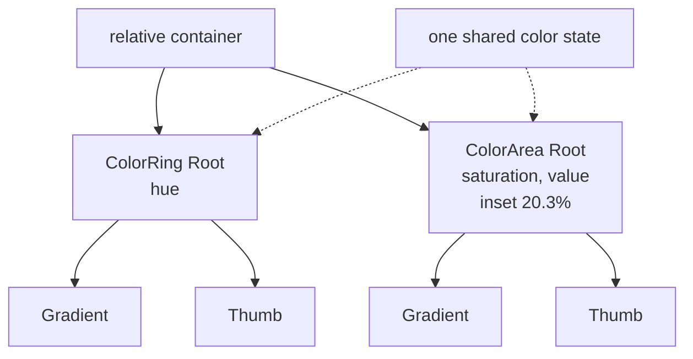

# How to Build a Color Picker (Square in Ring)

A hue ring with a square gradient inscribed in it, which is HSV in a single control.

<script setup>
import ColorPickerSquareInRingGuide from './demo/vue/ColorPickerSquareInRingGuide.vue'
</script>

Here's what we'll end up with:

<ColorPickerSquareInRingGuide />


<details>
<summary>Click to view the full code</summary>

::: code-group

<<< @/how-to/demo/vue/ColorPickerSquareInRingGuide.vue [Vue]
<<< @/how-to/demo/react/ColorPickerSquareInRingGuide.tsx [React]
<<< @/how-to/demo/svelte/ColorPickerSquareInRingGuide.svelte [Svelte]
<<< @/how-to/demo/angular/color-picker-square-in-ring-guide.ts [Angular]

:::

</details>

The parts, and how they nest:



## Step 1: Set up shared state

Both components read and write one color ref, so start with a single reactive value.

::: code-group

```vue [Vue]
<script setup lang="ts">
import { useColor } from "@urcolor/vue";  // [!code ++]

const { color } = useColor("hsl(210, 80%, 50%)");  // [!code ++]
</script>
```

```tsx [React]
import { useColor } from "@urcolor/react"; // [!code ++]

function MyPicker() {
  const { color, setColor } = useColor("hsl(210, 80%, 50%)"); // [!code ++]
}
```

```svelte [Svelte]
<script lang="ts">
  import { useColor } from "@urcolor/svelte"; // [!code ++]

  const colorState = useColor("hsl(210, 80%, 50%)"); // [!code ++]
</script>
```

```ts [Angular]
import { Component, signal } from "@angular/core";
import { Color } from "@urcolor/core"; // [!code ++]

@Component({
  selector: "my-picker",
  template: ``,
})
export class MyPicker {
  protected readonly color = signal<Color>(Color.parse("hsl(210, 80%, 50%)")!); // [!code ++]
}
```

:::

`useColor()` creates color state from any CSS color string. Vue returns a `{ color }` shallow ref and React returns `{ color, setColor }`. Svelte returns a rune-backed object whose `color`, `hex` and `alpha` are getters, so keep the object and read `colorState.color` rather than destructuring it, or reactivity is lost. Angular has no hook: a plain `signal<Color>()` is the state, and `[(value)]` binds to it directly.

## Step 2: Add the outer hue ring

`ColorRing` handles hue selection. A relative container positions the ring and the square together.

::: code-group

```vue [Vue]
<script setup lang="ts">
import { // [!code ++]
  useColor, // [!code ++]
  ColorRingRoot, // [!code ++]
  ColorRingTrack, // [!code ++]
  ColorRingGradient, // [!code ++]
  ColorRingThumb, // [!code ++]
} from "@urcolor/vue"; // [!code ++]

const { color } = useColor("hsl(210, 80%, 50%)");
</script>

<template>
  <!-- [!code ++:24] -->
  <div class="relative size-64">
    <ColorRingRoot
      v-model="color"
      color-space="hsv"
      channel="h"
      :inner-radius="0.84"
      class="absolute inset-0"
      style="container-type: inline-size"
    >
      <ColorRingTrack class="relative block size-full">
        <ColorRingGradient
          class="absolute inset-0 block"
          :channel-overrides="{ s: 1, v: 1, alpha: 1 }"
        />
        <ColorRingThumb
          class="
            size-4 rounded-full border-2 border-white
            shadow-[0_0_0_1px_rgba(0,0,0,0.3),0_2px_4px_rgba(0,0,0,0.3)]
            focus-visible:shadow-[0_0_0_1px_rgba(0,0,0,0.3),0_0_0_3px_rgba(66,153,225,0.6)]
          "
          aria-label="Hue"
        />
      </ColorRingTrack>
    </ColorRingRoot>
  </div>
</template>
```

```tsx [React]
import { useColor, ColorRing } from "@urcolor/react"; // [!code ++]

function MyPicker() {
  const { color, setColor } = useColor("hsl(210, 80%, 50%)");

  return (
    // [!code ++:26]
    <div className="relative size-64">
      <ColorRing.Root
        value={color}
        onValueChange={setColor}
        colorSpace="hsv"
        channel="h"
        innerRadius={0.84}
        className="absolute inset-0"
        style={{ containerType: "inline-size" }}
      >
        <ColorRing.Track className="relative block size-full">
          <ColorRing.Gradient
            className="absolute inset-0 block"
            channelOverrides={{ s: 1, v: 1, alpha: 1 }}
          />
          <ColorRing.Thumb
            className="
              size-4 rounded-full border-2 border-white
              shadow-[0_0_0_1px_rgba(0,0,0,0.3),0_2px_4px_rgba(0,0,0,0.3)]
              focus-visible:shadow-[0_0_0_1px_rgba(0,0,0,0.3),0_0_0_3px_rgba(66,153,225,0.6)]
            "
            aria-label="Hue"
          />
        </ColorRing.Track>
      </ColorRing.Root>
    </div>
  );
}
```

```svelte [Svelte]
<script lang="ts">
  import { ColorRing, useColor } from "@urcolor/svelte"; // [!code ++]

  const colorState = useColor("hsl(210, 80%, 50%)");
</script>

<!-- [!code ++:25] -->
<div class="relative size-64">
  <ColorRing.Root
    bind:value={() => colorState.color, colorState.setColor}
    colorSpace="hsv"
    channel="h"
    innerRadius={0.84}
    class="absolute inset-0"
    style="container-type: inline-size"
  >
    <ColorRing.Track class="relative block size-full">
      <ColorRing.Gradient
        class="absolute inset-0 block"
        channelOverrides={{ s: 1, v: 1, alpha: 1 }}
      />
      <ColorRing.Thumb
        class="
          size-4 rounded-full border-2 border-white
          shadow-[0_0_0_1px_rgba(0,0,0,0.3),0_2px_4px_rgba(0,0,0,0.3)]
          focus-visible:shadow-[0_0_0_1px_rgba(0,0,0,0.3),0_0_0_3px_rgba(66,153,225,0.6)]
        "
        aria-label="Hue"
      />
    </ColorRing.Track>
  </ColorRing.Root>
</div>
```

```ts [Angular]
import { Component, signal } from "@angular/core";
import { Color } from "@urcolor/core";
import { COLOR_RING_DIRECTIVES } from "@urcolor/angular"; // [!code ++]

@Component({
  selector: "my-picker",
  imports: [...COLOR_RING_DIRECTIVES], // [!code ++]
  template: `
    <!-- [!code ++:28] -->
    <div class="relative size-64">
      <div
        urcColorRingRoot
        [(value)]="color"
        colorSpace="hsv"
        channel="h"
        innerRadius="0.84"
        class="absolute inset-0"
        style="container-type: inline-size"
      >
        <div urcColorRingTrack class="relative block size-full">
          <canvas
            urcColorRingGradient
            class="absolute inset-0 block"
            [channelOverrides]="ringOverrides"
          ></canvas>
          <div
            urcColorRingThumb
            class="
              size-4 rounded-full border-2 border-white
              shadow-[0_0_0_1px_rgba(0,0,0,0.3),0_2px_4px_rgba(0,0,0,0.3)]
              focus-visible:shadow-[0_0_0_1px_rgba(0,0,0,0.3),0_0_0_3px_rgba(66,153,225,0.6)]
            "
            aria-label="Hue"
          ></div>
        </div>
      </div>
    </div>
  `,
})
export class MyPicker {
  protected readonly color = signal<Color>(Color.parse("hsl(210, 80%, 50%)")!);

  protected readonly ringOverrides = { s: 1, v: 1, alpha: 1 }; // [!code ++]
}
```

:::

The outer `div` is the layout container, and the ring is absolutely positioned to fill it.

Vue's `v-model` and Angular's `[(value)]` are true two-way bindings. React is one-way plus `onValueChange`. Svelte's `value` is `$bindable`, but `useColor` exposes getters, so bind it with Svelte 5's function form, `bind:value={() => colorState.color, colorState.setColor}`, which is `v-model` for a getter/setter pair.

Angular ships each family as a `COLOR_*_DIRECTIVES` array, so one entry in `imports` brings in the whole set. This recipe composes two families, so Step 3 adds a second array alongside the first.

Two more per-framework details show up here. In Angular the gradient's selector is `canvas[urcColorRingGradient]`, so it goes on a `<canvas>` element you own; Vue, React and Svelte render their own canvas for you. And Angular's `channelOverrides` is bound from a `readonly` class field rather than an inline object literal, so the input keeps its identity across change detection instead of looking changed on every pass.

## Step 3: Add the inner color area

Place a `ColorArea` inside the ring to control saturation and value. Use `absolute` positioning with `inset-[20.3%]` to inscribe the square perfectly inside the ring's inner circle.

::: code-group

```vue [Vue]
<script setup lang="ts">
import {
  useColor,
  ColorRingRoot,
  ColorRingTrack,
  ColorRingGradient,
  ColorRingThumb,
  ColorAreaRoot, // [!code ++]
  ColorAreaArea, // [!code ++]
  ColorAreaGradient, // [!code ++]
  ColorAreaThumb, // [!code ++]
} from "@urcolor/vue";

const { color } = useColor("hsl(210, 80%, 50%)");
</script>

<template>
  <div class="relative size-64">
    <ColorRingRoot
      v-model="color"
      color-space="hsv"
      channel="h"
      :inner-radius="0.84"
      class="absolute inset-0"
      style="container-type: inline-size"
    >
      <ColorRingTrack class="relative block size-full">
        <ColorRingGradient
          class="absolute inset-0 block"
          :channel-overrides="{ s: 1, v: 1, alpha: 1 }"
        />
        <ColorRingThumb
          class="
            size-4 rounded-full border-2 border-white
            shadow-[0_0_0_1px_rgba(0,0,0,0.3),0_2px_4px_rgba(0,0,0,0.3)]
            focus-visible:shadow-[0_0_0_1px_rgba(0,0,0,0.3),0_0_0_3px_rgba(66,153,225,0.6)]
          "
          aria-label="Hue"
        />
      </ColorRingTrack>
    </ColorRingRoot>

    <!-- [!code ++:21] -->
    <ColorAreaRoot
      v-model="color"
      color-space="hsv"
      x-channel="s"
      y-channel="v"
      :y-inverted="true"
      class="absolute inset-[20.3%] cursor-crosshair touch-none overflow-clip rounded-sm"
    >
      <ColorAreaArea as="div" class="absolute inset-0">
        <ColorAreaGradient as="div" class="absolute inset-0" />
        <ColorAreaThumb
          as="div"
          class="
            absolute size-5 transform-(--reka-slider-area-thumb-transform)
            rounded-full border-2 border-white
            shadow-[0_0_0_1px_rgba(0,0,0,0.3),0_2px_4px_rgba(0,0,0,0.3)]
            focus-visible:shadow-[0_0_0_1px_rgba(0,0,0,0.3),0_0_0_3px_rgba(66,153,225,0.6)]
          "
        />
      </ColorAreaArea>
    </ColorAreaRoot>
  </div>
</template>
```

```tsx [React]
import { useColor, ColorRing, ColorArea } from "@urcolor/react"; // [!code ++]

function MyPicker() {
  const { color, setColor } = useColor("hsl(210, 80%, 50%)");

  return (
    <div className="relative size-64">
      <ColorRing.Root
        value={color}
        onValueChange={setColor}
        colorSpace="hsv"
        channel="h"
        innerRadius={0.84}
        className="absolute inset-0"
        style={{ containerType: "inline-size" }}
      >
        <ColorRing.Track className="relative block size-full">
          <ColorRing.Gradient
            className="absolute inset-0 block"
            channelOverrides={{ s: 1, v: 1, alpha: 1 }}
          />
          <ColorRing.Thumb
            className="
              size-4 rounded-full border-2 border-white
              shadow-[0_0_0_1px_rgba(0,0,0,0.3),0_2px_4px_rgba(0,0,0,0.3)]
              focus-visible:shadow-[0_0_0_1px_rgba(0,0,0,0.3),0_0_0_3px_rgba(66,153,225,0.6)]
            "
            aria-label="Hue"
          />
        </ColorRing.Track>
      </ColorRing.Root>

      {/* [!code ++:18] */}
      <ColorArea.Root
        value={color}
        onValueChange={setColor}
        colorSpace="hsv"
        xChannel="s"
        yChannel="v"
        yInverted
        className="absolute inset-[20.3%] cursor-crosshair touch-none overflow-clip rounded-sm"
      >
        <ColorArea.Gradient className="absolute inset-0" />
        <ColorArea.Thumb
          className="
            absolute size-5 rounded-full border-2 border-white
            shadow-[0_0_0_1px_rgba(0,0,0,0.3),0_2px_4px_rgba(0,0,0,0.3)]
            focus-visible:shadow-[0_0_0_1px_rgba(0,0,0,0.3),0_0_0_3px_rgba(66,153,225,0.6)]
          "
        />
      </ColorArea.Root>
    </div>
  );
}
```

```svelte [Svelte]
<script lang="ts">
  import { ColorArea, ColorRing, useColor } from "@urcolor/svelte"; // [!code ++]

  const colorState = useColor("hsl(210, 80%, 50%)");
</script>

<div class="relative size-64">
  <ColorRing.Root
    bind:value={() => colorState.color, colorState.setColor}
    colorSpace="hsv"
    channel="h"
    innerRadius={0.84}
    class="absolute inset-0"
    style="container-type: inline-size"
  >
    <ColorRing.Track class="relative block size-full">
      <ColorRing.Gradient
        class="absolute inset-0 block"
        channelOverrides={{ s: 1, v: 1, alpha: 1 }}
      />
      <ColorRing.Thumb
        class="
          size-4 rounded-full border-2 border-white
          shadow-[0_0_0_1px_rgba(0,0,0,0.3),0_2px_4px_rgba(0,0,0,0.3)]
          focus-visible:shadow-[0_0_0_1px_rgba(0,0,0,0.3),0_0_0_3px_rgba(66,153,225,0.6)]
        "
        aria-label="Hue"
      />
    </ColorRing.Track>
  </ColorRing.Root>

  <!-- [!code ++:17] -->
  <ColorArea.Root
    bind:value={() => colorState.color, colorState.setColor}
    colorSpace="hsv"
    xChannel="s"
    yChannel="v"
    yInverted={true}
    class="absolute inset-[20.3%] cursor-crosshair touch-none overflow-clip rounded-sm"
  >
    <ColorArea.Gradient class="absolute inset-0" />
    <ColorArea.Thumb
      class="
        absolute size-5 rounded-full border-2 border-white
        shadow-[0_0_0_1px_rgba(0,0,0,0.3),0_2px_4px_rgba(0,0,0,0.3)]
        focus-visible:shadow-[0_0_0_1px_rgba(0,0,0,0.3),0_0_0_3px_rgba(66,153,225,0.6)]
      "
    />
  </ColorArea.Root>
</div>
```

```ts [Angular]
import { Component, signal } from "@angular/core";
import { Color } from "@urcolor/core";
import { COLOR_AREA_DIRECTIVES, COLOR_RING_DIRECTIVES } from "@urcolor/angular"; // [!code ++]

@Component({
  selector: "my-picker",
  imports: [...COLOR_RING_DIRECTIVES, ...COLOR_AREA_DIRECTIVES], // [!code ++]
  template: `
    <div class="relative size-64">
      <div
        urcColorRingRoot
        [(value)]="color"
        colorSpace="hsv"
        channel="h"
        innerRadius="0.84"
        class="absolute inset-0"
        style="container-type: inline-size"
      >
        <div urcColorRingTrack class="relative block size-full">
          <canvas
            urcColorRingGradient
            class="absolute inset-0 block"
            [channelOverrides]="ringOverrides"
          ></canvas>
          <div
            urcColorRingThumb
            class="
              size-4 rounded-full border-2 border-white
              shadow-[0_0_0_1px_rgba(0,0,0,0.3),0_2px_4px_rgba(0,0,0,0.3)]
              focus-visible:shadow-[0_0_0_1px_rgba(0,0,0,0.3),0_0_0_3px_rgba(66,153,225,0.6)]
            "
            aria-label="Hue"
          ></div>
        </div>
      </div>

      <!-- [!code ++:19] -->
      <div
        urcColorAreaRoot
        [(value)]="color"
        colorSpace="hsv"
        xChannel="s"
        yChannel="v"
        yInverted
        class="absolute inset-[20.3%] cursor-crosshair touch-none overflow-clip rounded-sm"
      >
        <canvas urcColorAreaGradient class="absolute inset-0"></canvas>
        <div
          urcColorAreaThumb
          class="
            absolute size-5 rounded-full border-2 border-white
            shadow-[0_0_0_1px_rgba(0,0,0,0.3),0_2px_4px_rgba(0,0,0,0.3)]
            focus-visible:shadow-[0_0_0_1px_rgba(0,0,0,0.3),0_0_0_3px_rgba(66,153,225,0.6)]
          "
        ></div>
      </div>
    </div>
  `,
})
export class MyPicker {
  protected readonly color = signal<Color>(Color.parse("hsl(210, 80%, 50%)")!);

  protected readonly ringOverrides = { s: 1, v: 1, alpha: 1 };
}
```

:::

`inset-[20.3%]` is the number that matters: it inscribes the square exactly inside the ring's inner circle, at `50% × (1 − 0.84/√2) ≈ 20.3%`. The `:y-inverted="true"` prop flips the Y axis so value increases upward. Both components share the same `v-model="color"`, so dragging the hue ring updates the area's gradient, and dragging the area updates the color while keeping the hue ring in sync.

React, Svelte and Angular reach the same result with two naming differences. Their area root takes `xChannel` / `yChannel` where Vue takes `x-channel` / `y-channel`, and the Y flip is `yInverted` rather than `:y-inverted`. They also have no `ColorAreaArea` part: the root is the interactive surface, so the gradient and thumb are its direct children. Binding both roots to the same state is what keeps them in sync: `value={color}` plus `onValueChange={setColor}` on both roots in React, `bind:value={() => colorState.color, colorState.setColor}` twice in Svelte, `[(value)]="color"` twice in Angular.

::: tip
The components ship unstyled. The classes above are one example, written with Tailwind CSS. To compute the inset for any `inner-radius`, use `50% × (1 − innerRadius / √2)`.
:::
