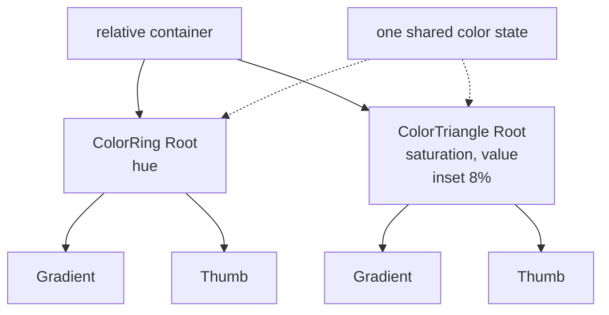

# How to Build a Color Picker (Triangle in Ring)

A hue ring with a triangle inscribed in it, the arrangement Photoshop uses.

<script setup>
import ColorPickerGuide from './demo/vue/ColorPickerTriangleInRingGuide.vue'
</script>

Here's what we'll end up with:

<ColorPickerGuide />


<details>
<summary>Click to view the full code</summary>

::: code-group

<<< @/how-to/demo/vue/ColorPickerTriangleInRingGuide.vue [Vue]
<<< @/how-to/demo/react/ColorPickerTriangleInRingGuide.tsx [React]
<<< @/how-to/demo/svelte/ColorPickerTriangleInRingGuide.svelte [Svelte]
<<< @/how-to/demo/angular/color-picker-triangle-in-ring-guide.ts [Angular]

:::

</details>

The parts, and how they nest:



## Step 1: Set up shared state

Both components read and write one color ref, so start with a single reactive value.

::: code-group

```vue [Vue]
<script setup lang="ts">
import { useColor } from "@urcolor/vue";  // [!code ++]

const { color } = useColor("hsl(210, 80%, 50%)");  // [!code ++]
</script>
```

```tsx [React]
import { useColor } from "@urcolor/react"; // [!code ++]

function MyPicker() {
  const { color, setColor } = useColor("hsl(210, 80%, 50%)"); // [!code ++]
}
```

```svelte [Svelte]
<script lang="ts">
  import { useColor } from "@urcolor/svelte"; // [!code ++]

  const colorState = useColor("hsl(210, 80%, 50%)"); // [!code ++]
</script>
```

```ts [Angular]
import { Component, signal } from "@angular/core";
import { Color } from "@urcolor/core"; // [!code ++]

@Component({
  selector: "my-picker",
  template: ``,
})
export class MyPicker {
  protected readonly color = signal<Color>(Color.parse("hsl(210, 80%, 50%)")!); // [!code ++]
}
```

:::

`useColor()` creates color state from any CSS color string. Vue returns a `{ color }` shallow ref and React returns `{ color, setColor }`. Svelte returns a rune-backed object whose `color`, `hex` and `alpha` are getters, so keep the object and read `colorState.color` rather than destructuring it, or reactivity is lost. Angular has no hook: a plain `signal<Color>()` is the state, and `[(value)]` binds to it directly.

## Step 2: Add the outer hue ring

`ColorRing` handles hue selection. A relative container positions the ring and the triangle together.

::: code-group

```vue [Vue]
<script setup lang="ts">
import { // [!code ++]
  useColor, // [!code ++]
  ColorRingRoot, // [!code ++]
  ColorRingTrack, // [!code ++]
  ColorRingGradient, // [!code ++]
  ColorRingThumb, // [!code ++]
} from "@urcolor/vue"; // [!code ++]

const { color } = useColor("hsl(210, 80%, 50%)");
</script>

<template>
  <!-- [!code ++:24] -->
  <div class="relative size-64">
    <ColorRingRoot
      v-model="color"
      color-space="hsv"
      channel="h"
      :inner-radius="0.84"
      class="absolute inset-0"
      style="container-type: inline-size"
    >
      <ColorRingTrack class="relative block size-full">
        <ColorRingGradient
          class="absolute inset-0 block"
          :channel-overrides="{ s: 1, v: 1, alpha: 1 }"
        />
        <ColorRingThumb
          class="
            size-4 rounded-full border-2 border-white
            shadow-[0_0_0_1px_rgba(0,0,0,0.3),0_2px_4px_rgba(0,0,0,0.3)]
            focus-visible:shadow-[0_0_0_1px_rgba(0,0,0,0.3),0_0_0_3px_rgba(66,153,225,0.6)]
          "
          aria-label="Hue"
        />
      </ColorRingTrack>
    </ColorRingRoot>
  </div>
</template>
```

```tsx [React]
import { useColor, ColorRing } from "@urcolor/react"; // [!code ++]

function MyPicker() {
  const { color, setColor } = useColor("hsl(210, 80%, 50%)");

  return (
    // [!code ++:26]
    <div className="relative size-64">
      <ColorRing.Root
        value={color}
        onValueChange={setColor}
        colorSpace="hsv"
        channel="h"
        innerRadius={0.84}
        className="absolute inset-0"
        style={{ containerType: "inline-size" }}
      >
        <ColorRing.Track className="relative block size-full">
          <ColorRing.Gradient
            className="absolute inset-0 block"
            channelOverrides={{ s: 1, v: 1, alpha: 1 }}
          />
          <ColorRing.Thumb
            className="
              size-4 rounded-full border-2 border-white
              shadow-[0_0_0_1px_rgba(0,0,0,0.3),0_2px_4px_rgba(0,0,0,0.3)]
              focus-visible:shadow-[0_0_0_1px_rgba(0,0,0,0.3),0_0_0_3px_rgba(66,153,225,0.6)]
            "
            aria-label="Hue"
          />
        </ColorRing.Track>
      </ColorRing.Root>
    </div>
  );
}
```

```svelte [Svelte]
<script lang="ts">
  import { ColorRing, useColor } from "@urcolor/svelte"; // [!code ++]

  const colorState = useColor("hsl(210, 80%, 50%)");
</script>

<!-- [!code ++:25] -->
<div class="relative size-64">
  <ColorRing.Root
    bind:value={() => colorState.color, colorState.setColor}
    colorSpace="hsv"
    channel="h"
    innerRadius={0.84}
    class="absolute inset-0"
    style="container-type: inline-size"
  >
    <ColorRing.Track class="relative block size-full">
      <ColorRing.Gradient
        class="absolute inset-0 block"
        channelOverrides={{ s: 1, v: 1, alpha: 1 }}
      />
      <ColorRing.Thumb
        class="
          size-4 rounded-full border-2 border-white
          shadow-[0_0_0_1px_rgba(0,0,0,0.3),0_2px_4px_rgba(0,0,0,0.3)]
          focus-visible:shadow-[0_0_0_1px_rgba(0,0,0,0.3),0_0_0_3px_rgba(66,153,225,0.6)]
        "
        aria-label="Hue"
      />
    </ColorRing.Track>
  </ColorRing.Root>
</div>
```

```ts [Angular]
import { Component, signal } from "@angular/core";
import { Color } from "@urcolor/core";
import { COLOR_RING_DIRECTIVES } from "@urcolor/angular"; // [!code ++]

@Component({
  selector: "my-picker",
  imports: [...COLOR_RING_DIRECTIVES], // [!code ++]
  template: `
    <!-- [!code ++:28] -->
    <div class="relative size-64">
      <div
        urcColorRingRoot
        [(value)]="color"
        colorSpace="hsv"
        channel="h"
        innerRadius="0.84"
        class="absolute inset-0"
        style="container-type: inline-size"
      >
        <div urcColorRingTrack class="relative block size-full">
          <canvas
            urcColorRingGradient
            class="absolute inset-0 block"
            [channelOverrides]="{ s: 1, v: 1, alpha: 1 }"
          ></canvas>
          <div
            urcColorRingThumb
            class="
              size-4 rounded-full border-2 border-white
              shadow-[0_0_0_1px_rgba(0,0,0,0.3),0_2px_4px_rgba(0,0,0,0.3)]
              focus-visible:shadow-[0_0_0_1px_rgba(0,0,0,0.3),0_0_0_3px_rgba(66,153,225,0.6)]
            "
            aria-label="Hue"
          ></div>
        </div>
      </div>
    </div>
  `,
})
export class MyPicker {
  protected readonly color = signal<Color>(Color.parse("hsl(210, 80%, 50%)")!);
}
```

:::

The outer `div` is the layout container, and the ring is absolutely positioned to fill it.

Vue's `v-model` and Angular's `[(value)]` are true two-way bindings. React is one-way plus `onValueChange`. Svelte's `value` is `$bindable`, but `useColor` exposes getters, so bind it with Svelte 5's function form, `bind:value={() => colorState.color, colorState.setColor}`, which is `v-model` for a getter/setter pair.

Angular ships each family as a `COLOR_*_DIRECTIVES` array, so one entry in `imports` brings in the whole set.

## Step 3: Add the inner color triangle

Place a `ColorTriangle` inside the ring to control saturation and value. Use `absolute` positioning with `inset` to center it.

::: code-group

```vue [Vue]
<script setup lang="ts">
import {
  useColor,
  ColorRingRoot,
  ColorRingTrack,
  ColorRingGradient,
  ColorRingThumb,
  ColorTriangleRoot, // [!code ++]
  ColorTriangleGradient, // [!code ++]
  ColorTriangleThumb, // [!code ++]
} from "@urcolor/vue";

const { color } = useColor("hsl(210, 80%, 50%)");
</script>

<template>
  <div class="relative size-64">
    <ColorRingRoot
      v-model="color"
      color-space="hsv"
      channel="h"
      :inner-radius="0.84"
      class="absolute inset-0"
      style="container-type: inline-size"
    >
      <ColorRingTrack class="relative block size-full">
        <ColorRingGradient
          class="absolute inset-0 block"
          :channel-overrides="{ s: 1, v: 1, alpha: 1 }"
        />
        <ColorRingThumb
          class="
            size-4 rounded-full border-2 border-white
            shadow-[0_0_0_1px_rgba(0,0,0,0.3),0_2px_4px_rgba(0,0,0,0.3)]
            focus-visible:shadow-[0_0_0_1px_rgba(0,0,0,0.3),0_0_0_3px_rgba(66,153,225,0.6)]
          "
          aria-label="Hue"
        />
      </ColorRingTrack>
    </ColorRingRoot>

    <!-- [!code ++:15] -->
    <ColorTriangleRoot
      v-model="color"
      color-space="hsv"
      x-channel="s"
      y-channel="v"
      class="absolute inset-[8%]"
    >
      <ColorTriangleGradient class="absolute inset-0 block" />
      <ColorTriangleThumb
        class="
          size-4 rounded-full border-2 border-white
          shadow-[0_0_0_1px_rgba(0,0,0,0.3),0_2px_4px_rgba(0,0,0,0.3)]
          focus-visible:shadow-[0_0_0_1px_rgba(0,0,0,0.3),0_0_0_3px_rgba(66,153,225,0.6)]
        "
        aria-label="Color"
      />
    </ColorTriangleRoot>
  </div>
</template>
```

```tsx [React]
import { useColor, ColorRing, ColorTriangle } from "@urcolor/react"; // [!code ++]

function MyPicker() {
  const { color, setColor } = useColor("hsl(210, 80%, 50%)");

  return (
    <div className="relative size-64">
      <ColorRing.Root
        value={color}
        onValueChange={setColor}
        colorSpace="hsv"
        channel="h"
        innerRadius={0.84}
        className="absolute inset-0"
        style={{ containerType: "inline-size" }}
      >
        <ColorRing.Track className="relative block size-full">
          <ColorRing.Gradient
            className="absolute inset-0 block"
            channelOverrides={{ s: 1, v: 1, alpha: 1 }}
          />
          <ColorRing.Thumb
            className="
              size-4 rounded-full border-2 border-white
              shadow-[0_0_0_1px_rgba(0,0,0,0.3),0_2px_4px_rgba(0,0,0,0.3)]
              focus-visible:shadow-[0_0_0_1px_rgba(0,0,0,0.3),0_0_0_3px_rgba(66,153,225,0.6)]
            "
            aria-label="Hue"
          />
        </ColorRing.Track>
      </ColorRing.Root>

      {/* [!code ++:18] */}
      <ColorTriangle.Root
        value={color}
        onValueChange={setColor}
        colorSpace="hsv"
        xChannel="s"
        yChannel="v"
        className="absolute inset-[8%]"
      >
        <ColorTriangle.Gradient className="absolute inset-0 block" />
        <ColorTriangle.Thumb
          className="
            size-4 rounded-full border-2 border-white
            shadow-[0_0_0_1px_rgba(0,0,0,0.3),0_2px_4px_rgba(0,0,0,0.3)]
            focus-visible:shadow-[0_0_0_1px_rgba(0,0,0,0.3),0_0_0_3px_rgba(66,153,225,0.6)]
          "
          aria-label="Color"
        />
      </ColorTriangle.Root>
    </div>
  );
}
```

```svelte [Svelte]
<script lang="ts">
  import { ColorRing, ColorTriangle, useColor } from "@urcolor/svelte"; // [!code ++]

  const colorState = useColor("hsl(210, 80%, 50%)");
</script>

<div class="relative size-64">
  <ColorRing.Root
    bind:value={() => colorState.color, colorState.setColor}
    colorSpace="hsv"
    channel="h"
    innerRadius={0.84}
    class="absolute inset-0"
    style="container-type: inline-size"
  >
    <ColorRing.Track class="relative block size-full">
      <ColorRing.Gradient
        class="absolute inset-0 block"
        channelOverrides={{ s: 1, v: 1, alpha: 1 }}
      />
      <ColorRing.Thumb
        class="
          size-4 rounded-full border-2 border-white
          shadow-[0_0_0_1px_rgba(0,0,0,0.3),0_2px_4px_rgba(0,0,0,0.3)]
          focus-visible:shadow-[0_0_0_1px_rgba(0,0,0,0.3),0_0_0_3px_rgba(66,153,225,0.6)]
        "
        aria-label="Hue"
      />
    </ColorRing.Track>
  </ColorRing.Root>

  <!-- [!code ++:17] -->
  <ColorTriangle.Root
    bind:value={() => colorState.color, colorState.setColor}
    colorSpace="hsv"
    xChannel="s"
    yChannel="v"
    class="absolute inset-[8%]"
  >
    <ColorTriangle.Gradient class="absolute inset-0 block" />
    <ColorTriangle.Thumb
      class="
        size-4 rounded-full border-2 border-white
        shadow-[0_0_0_1px_rgba(0,0,0,0.3),0_2px_4px_rgba(0,0,0,0.3)]
        focus-visible:shadow-[0_0_0_1px_rgba(0,0,0,0.3),0_0_0_3px_rgba(66,153,225,0.6)]
      "
      aria-label="Color"
    />
  </ColorTriangle.Root>
</div>
```

```ts [Angular]
import { Component, signal } from "@angular/core";
import { Color } from "@urcolor/core";
import { COLOR_RING_DIRECTIVES, COLOR_TRIANGLE_DIRECTIVES } from "@urcolor/angular"; // [!code ++]

@Component({
  selector: "my-picker",
  imports: [...COLOR_RING_DIRECTIVES, ...COLOR_TRIANGLE_DIRECTIVES], // [!code ++]
  template: `
    <div class="relative size-64">
      <div
        urcColorRingRoot
        [(value)]="color"
        colorSpace="hsv"
        channel="h"
        innerRadius="0.84"
        class="absolute inset-0"
        style="container-type: inline-size"
      >
        <div urcColorRingTrack class="relative block size-full">
          <canvas
            urcColorRingGradient
            class="absolute inset-0 block"
            [channelOverrides]="{ s: 1, v: 1, alpha: 1 }"
          ></canvas>
          <div
            urcColorRingThumb
            class="
              size-4 rounded-full border-2 border-white
              shadow-[0_0_0_1px_rgba(0,0,0,0.3),0_2px_4px_rgba(0,0,0,0.3)]
              focus-visible:shadow-[0_0_0_1px_rgba(0,0,0,0.3),0_0_0_3px_rgba(66,153,225,0.6)]
            "
            aria-label="Hue"
          ></div>
        </div>
      </div>

      <!-- [!code ++:19] -->
      <div
        urcColorTriangleRoot
        [(value)]="color"
        colorSpace="hsv"
        xChannel="s"
        yChannel="v"
        class="absolute inset-[8%]"
      >
        <canvas urcColorTriangleGradient class="absolute inset-0 block"></canvas>
        <div
          urcColorTriangleThumb
          class="
            size-4 rounded-full border-2 border-white
            shadow-[0_0_0_1px_rgba(0,0,0,0.3),0_2px_4px_rgba(0,0,0,0.3)]
            focus-visible:shadow-[0_0_0_1px_rgba(0,0,0,0.3),0_0_0_3px_rgba(66,153,225,0.6)]
          "
          aria-label="Color"
        ></div>
      </div>
    </div>
  `,
})
export class MyPicker {
  protected readonly color = signal<Color>(Color.parse("hsl(210, 80%, 50%)")!);
}
```

:::

`inset-[8%]` is the number that matters: it places the triangle so its vertices touch the ring's inner edge. Both components share the same `v-model="color"`, so dragging the hue ring updates the triangle's gradient, and dragging the triangle updates the color while keeping the hue ring in sync.

React passes the same `color` / `setColor` pair to both roots, Svelte binds the same `colorState` on both roots, and Angular binds the same `color` signal with `[(value)]` twice, which gives the identical shared-state wiring. Two naming details differ: Vue spells the triangle's axes `x-channel` / `y-channel`, while React, Svelte and Angular spell them `xChannel` / `yChannel`; and in Angular both gradients are `<canvas>` elements you own, under the selectors `canvas[urcColorRingGradient]` and `canvas[urcColorTriangleGradient]`, whereas Vue, React and Svelte render the canvas for you inside a wrapper element.

The triangle ships one combined thumb: `<ColorTriangle.Thumb />` in React and Svelte, `ColorTriangleThumb` in Vue, `urcColorTriangleThumb` in Angular. There are no separate per-axis thumbs: one focusable handle moves across both channels.

The full demo at the top of this page rotates the triangle with a CSS `transform` and passes `inverted`, so it points the same way in every framework. Vue additionally accepts an `orientation` prop that React, Svelte and Angular do not ship; it does not affect the geometry, which comes from `inverted` and the transform alone.

::: tip
The components ship unstyled. The classes above are one example, written with Tailwind CSS. Adjust the `inset` value based on your ring's `inner-radius` to fit the triangle snugly inside.
:::
