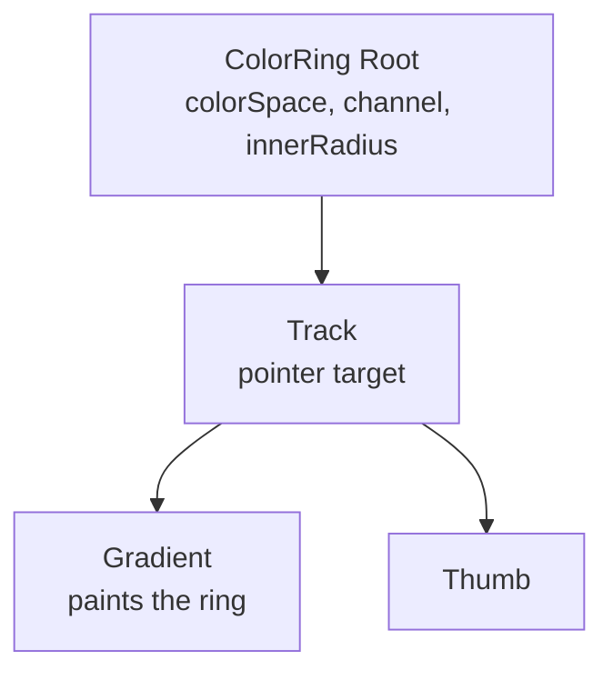

# How to Build a Color Ring

A color ring maps one channel onto a circle.

<script setup>
import ColorRingGuide from './demo/vue/ColorRingGuide.vue'
</script>

Here's what we'll end up with:

<ColorRingGuide />

<details>
<summary>Click to view the full code</summary>

::: code-group

<<< @/how-to/demo/vue/ColorRingGuide.vue [Vue]
<<< @/how-to/demo/react/ColorRingGuide.tsx [React]
<<< @/how-to/demo/svelte/ColorRingGuide.svelte [Svelte]
<<< @/how-to/demo/angular/color-ring-guide.ts [Angular]

:::

</details>

The parts, and how they nest:



## Step 1: Set up state

Import the color model and create a reactive color value.

::: code-group

```vue [Vue]
<script setup lang="ts">
import { useColor } from "@urcolor/vue";  // [!code ++]

const { color } = useColor("hsl(210, 80%, 50%)");  // [!code ++]
</script>
```

```tsx [React]
import { useColor } from "@urcolor/react"; // [!code ++]

function MyRing() {
  const { color, setColor } = useColor("hsl(210, 80%, 50%)"); // [!code ++]
}
```

```svelte [Svelte]
<script lang="ts">
  import { useColor } from "@urcolor/svelte"; // [!code ++]

  const colorState = useColor("hsl(210, 80%, 50%)"); // [!code ++]
</script>
```

```ts [Angular]
import { Component, signal } from "@angular/core";
import { Color } from "@urcolor/core"; // [!code ++]

@Component({
  selector: "my-ring",
  template: ``,
})
export class MyRing {
  protected readonly color = signal<Color>(Color.parse("hsl(210, 80%, 50%)")!); // [!code ++]
}
```

:::

`useColor()` creates color state from any CSS color string. Vue returns a `{ color }` shallow ref and React returns `{ color, setColor }`. Svelte returns a rune-backed object whose `color`, `hex` and `alpha` are getters, so keep the object and read `colorState.color` rather than destructuring it, or reactivity is lost. Angular has no hook: a plain `signal<Color>()` is the state, and `[(value)]` binds to it directly. `createColorStore()` from `@urcolor/angular` is there too, for `hex` and `alpha` projections.

## Step 2: Add the root

The root owns the state and the interactions. Tell it which color space to work in and which channel to control.

::: code-group

```vue [Vue]
<script setup lang="ts">
import { useColor, ColorRingRoot } from "@urcolor/vue"; // [!code ++]

const { color } = useColor("hsl(210, 80%, 50%)");
</script>

<template>
  <!-- [!code ++:8] -->
  <ColorRingRoot
    v-model="color"
    color-space="hsl"
    channel="h"
    :inner-radius="0.85"
  >
    <!-- children go here -->
  </ColorRingRoot>
</template>
```

```tsx [React]
import { useColor, ColorRing } from "@urcolor/react"; // [!code ++]

function MyRing() {
  const { color, setColor } = useColor("hsl(210, 80%, 50%)");

  return (
    // [!code ++:8]
    <ColorRing.Root
      value={color}
      onValueChange={setColor}
      colorSpace="hsl"
      channel="h"
      innerRadius={0.85}
    >
      {/* children go here */}
    </ColorRing.Root>
  );
}
```

```svelte [Svelte]
<script lang="ts">
  import { ColorRing, useColor } from "@urcolor/svelte"; // [!code ++]

  const colorState = useColor("hsl(210, 80%, 50%)");
</script>

<!-- [!code ++:8] -->
<ColorRing.Root
  bind:value={() => colorState.color, colorState.setColor}
  colorSpace="hsl"
  channel="h"
  innerRadius={0.85}
>
  <!-- children go here -->
</ColorRing.Root>
```

```ts [Angular]
import { Component, signal } from "@angular/core";
import { Color } from "@urcolor/core";
import { COLOR_RING_DIRECTIVES } from "@urcolor/angular"; // [!code ++]

@Component({
  selector: "my-ring",
  imports: [...COLOR_RING_DIRECTIVES], // [!code ++]
  template: `
    <!-- [!code ++:9] -->
    <div
      urcColorRingRoot
      [(value)]="color"
      colorSpace="hsl"
      channel="h"
      innerRadius="0.85"
    >
      <!-- children go here -->
    </div>
  `,
})
export class MyRing {
  protected readonly color = signal<Color>(Color.parse("hsl(210, 80%, 50%)")!);
}
```

:::

Vue's `v-model` and Angular's `[(value)]` are true two-way bindings. React is one-way plus `onValueChange`. Svelte's `value` is `$bindable`, but `useColor` exposes getters, so bind it with Svelte 5's function form, `bind:value={() => colorState.color, colorState.setColor}`, which is `v-model` for a getter/setter pair.

Angular ships each family as a `COLOR_*_DIRECTIVES` array, so one entry in `imports` brings in the whole set.

- `color-space` / `colorSpace`: the color space to work in (`hsl`, `oklch`, `hsv`, etc.)
- `channel`: the channel this ring controls (`h`, `s`, `l`, `c`, etc.)
- `inner-radius` / `innerRadius`: the inner radius as a fraction of the outer radius (`0`–`1`), controls ring thickness

## Step 3: Add the track and gradient

The track takes the pointer events, and the gradient paints the ring on a canvas. In Angular the gradient's selector is `canvas[urcColorRingGradient]`, so it goes on a `<canvas>` element you own; the other three render their own canvas for you.

::: code-group

```vue [Vue]
<script setup lang="ts">
import {
  useColor,
  ColorRingRoot,
  ColorRingTrack, // [!code ++]
  ColorRingGradient, // [!code ++]
} from "@urcolor/vue";

const { color } = useColor("hsl(210, 80%, 50%)");
</script>

<template>
  <ColorRingRoot
    v-model="color"
    color-space="hsl"
    channel="h"
    :inner-radius="0.85"
    class="relative block size-64"
    style="container-type: inline-size"
  >
    <!-- [!code ++:4] -->
    <ColorRingTrack class="relative block size-full">
      <ColorRingGradient class="absolute inset-0 block" />
    </ColorRingTrack>
  </ColorRingRoot>
</template>
```

```tsx [React]
import { useColor, ColorRing } from "@urcolor/react";

function MyRing() {
  const { color, setColor } = useColor("hsl(210, 80%, 50%)");

  return (
    <ColorRing.Root
      value={color}
      onValueChange={setColor}
      colorSpace="hsl"
      channel="h"
      innerRadius={0.85}
      className="relative block size-64"
      style={{ containerType: "inline-size" }}
    >
      {/* [!code ++:4] */}
      <ColorRing.Track className="relative block size-full">
        <ColorRing.Gradient className="absolute inset-0 block" />
      </ColorRing.Track>
    </ColorRing.Root>
  );
}
```

```svelte [Svelte]
<script lang="ts">
  import { ColorRing, useColor } from "@urcolor/svelte";

  const colorState = useColor("hsl(210, 80%, 50%)");
</script>

<ColorRing.Root
  bind:value={() => colorState.color, colorState.setColor}
  colorSpace="hsl"
  channel="h"
  innerRadius={0.85}
  class="relative block size-64"
  style="container-type: inline-size"
>
  <!-- [!code ++:3] -->
  <ColorRing.Track class="relative block size-full">
    <ColorRing.Gradient class="absolute inset-0 block" />
  </ColorRing.Track>
</ColorRing.Root>
```

```ts [Angular]
import { Component, signal } from "@angular/core";
import { Color } from "@urcolor/core";
import { COLOR_RING_DIRECTIVES } from "@urcolor/angular";

@Component({
  selector: "my-ring",
  imports: [...COLOR_RING_DIRECTIVES],
  template: `
    <div
      urcColorRingRoot
      [(value)]="color"
      colorSpace="hsl"
      channel="h"
      innerRadius="0.85"
      class="relative block size-64"
      style="container-type: inline-size"
    >
      <!-- [!code ++:3] -->
      <div urcColorRingTrack class="relative block size-full">
        <canvas urcColorRingGradient class="absolute inset-0 block"></canvas>
      </div>
    </div>
  `,
})
export class MyRing {
  protected readonly color = signal<Color>(Color.parse("hsl(210, 80%, 50%)")!);
}
```

:::

The root needs `container-type: inline-size` for the component to measure itself.

## Step 4: Add the thumb

The thumb is the draggable handle. The component positions it along the ring.

::: code-group

```vue [Vue]
<script setup lang="ts">
import {
  useColor,
  ColorRingRoot,
  ColorRingTrack,
  ColorRingGradient,
  ColorRingThumb, // [!code ++]
} from "@urcolor/vue";

const { color } = useColor("hsl(210, 80%, 50%)");
</script>

<template>
  <ColorRingRoot
    v-model="color"
    color-space="hsl"
    channel="h"
    :inner-radius="0.85"
    class="relative block size-64"
    style="container-type: inline-size"
  >
    <ColorRingTrack class="relative block size-full">
      <ColorRingGradient class="absolute inset-0 block" />
      <!-- [!code ++:8] -->
      <ColorRingThumb
        class="
          size-4 rounded-full border-2 border-white
          shadow-[0_0_0_1px_rgba(0,0,0,0.3),0_2px_4px_rgba(0,0,0,0.3)]
          focus-visible:shadow-[0_0_0_1px_rgba(0,0,0,0.3),0_0_0_3px_rgba(66,153,225,0.6)]
        "
        aria-label="Hue"
      />
    </ColorRingTrack>
  </ColorRingRoot>
</template>
```

```tsx [React]
import { useColor, ColorRing } from "@urcolor/react";

function MyRing() {
  const { color, setColor } = useColor("hsl(210, 80%, 50%)");

  return (
    <ColorRing.Root
      value={color}
      onValueChange={setColor}
      colorSpace="hsl"
      channel="h"
      innerRadius={0.85}
      className="relative block size-64"
      style={{ containerType: "inline-size" }}
    >
      <ColorRing.Track className="relative block size-full">
        <ColorRing.Gradient className="absolute inset-0 block" />
        {/* [!code ++:8] */}
        <ColorRing.Thumb
          className="
            size-4 rounded-full border-2 border-white
            shadow-[0_0_0_1px_rgba(0,0,0,0.3),0_2px_4px_rgba(0,0,0,0.3)]
            focus-visible:shadow-[0_0_0_1px_rgba(0,0,0,0.3),0_0_0_3px_rgba(66,153,225,0.6)]
          "
          aria-label="Hue"
        />
      </ColorRing.Track>
    </ColorRing.Root>
  );
}
```

```svelte [Svelte]
<script lang="ts">
  import { ColorRing, useColor } from "@urcolor/svelte";

  const colorState = useColor("hsl(210, 80%, 50%)");
</script>

<ColorRing.Root
  bind:value={() => colorState.color, colorState.setColor}
  colorSpace="hsl"
  channel="h"
  innerRadius={0.85}
  class="relative block size-64"
  style="container-type: inline-size"
>
  <ColorRing.Track class="relative block size-full">
    <ColorRing.Gradient class="absolute inset-0 block" />
    <!-- [!code ++:8] -->
    <ColorRing.Thumb
      class="
        size-4 rounded-full border-2 border-white
        shadow-[0_0_0_1px_rgba(0,0,0,0.3),0_2px_4px_rgba(0,0,0,0.3)]
        focus-visible:shadow-[0_0_0_1px_rgba(0,0,0,0.3),0_0_0_3px_rgba(66,153,225,0.6)]
      "
      aria-label="Hue"
    />
  </ColorRing.Track>
</ColorRing.Root>
```

```ts [Angular]
import { Component, signal } from "@angular/core";
import { Color } from "@urcolor/core";
import { COLOR_RING_DIRECTIVES } from "@urcolor/angular";

@Component({
  selector: "my-ring",
  imports: [...COLOR_RING_DIRECTIVES],
  template: `
    <div
      urcColorRingRoot
      [(value)]="color"
      colorSpace="hsl"
      channel="h"
      innerRadius="0.85"
      class="relative block size-64"
      style="container-type: inline-size"
    >
      <div urcColorRingTrack class="relative block size-full">
        <canvas urcColorRingGradient class="absolute inset-0 block"></canvas>
        <!-- [!code ++:9] -->
        <div
          urcColorRingThumb
          class="
            size-4 rounded-full border-2 border-white
            shadow-[0_0_0_1px_rgba(0,0,0,0.3),0_2px_4px_rgba(0,0,0,0.3)]
            focus-visible:shadow-[0_0_0_1px_rgba(0,0,0,0.3),0_0_0_3px_rgba(66,153,225,0.6)]
          "
          aria-label="Hue"
        ></div>
      </div>
    </div>
  `,
})
export class MyRing {
  protected readonly color = signal<Color>(Color.parse("hsl(210, 80%, 50%)")!);
}
```

:::

::: tip
The components ship unstyled. The classes above are one example, written with Tailwind CSS; any styling approach works.
:::

## Adjusting ring thickness

The inner-radius prop sets the ring thickness as a fraction of the outer radius. `0` gives a full circle and `0.9` a thin ring:

::: code-group

```vue{5} [Vue]
<template>
  <ColorRingRoot
    v-model="color"
    color-space="hsl"
    :inner-radius="0.7"
    channel="h"
  >
    <!-- ... -->
  </ColorRingRoot>
</template>
```

```tsx{5} [React]
<ColorRing.Root
  value={color}
  onValueChange={setColor}
  colorSpace="hsl"
  innerRadius={0.7}
  channel="h"
>
  {/* ... */}
</ColorRing.Root>
```

```svelte{4} [Svelte]
<ColorRing.Root
  bind:value={() => colorState.color, colorState.setColor}
  colorSpace="hsl"
  innerRadius={0.7}
  channel="h"
>
  <!-- ... -->
</ColorRing.Root>
```

```html{5} [Angular]
<div
  urcColorRingRoot
  [(value)]="color"
  colorSpace="hsl"
  innerRadius="0.7"
  channel="h"
>
  <!-- ... -->
</div>
```

:::

## Changing start angle

The start-angle prop rotates where the ring gradient begins, in degrees:

::: code-group

```vue{5} [Vue]
<template>
  <ColorRingRoot
    v-model="color"
    color-space="hsl"
    :start-angle="90"
    channel="h"
  >
    <!-- ... -->
  </ColorRingRoot>
</template>
```

```tsx{5} [React]
<ColorRing.Root
  value={color}
  onValueChange={setColor}
  colorSpace="hsl"
  startAngle={90}
  channel="h"
>
  {/* ... */}
</ColorRing.Root>
```

```svelte{4} [Svelte]
<ColorRing.Root
  bind:value={() => colorState.color, colorState.setColor}
  colorSpace="hsl"
  startAngle={90}
  channel="h"
>
  <!-- ... -->
</ColorRing.Root>
```

```html{5} [Angular]
<div
  urcColorRingRoot
  [(value)]="color"
  colorSpace="hsl"
  startAngle="90"
  channel="h"
>
  <!-- ... -->
</div>
```

:::

## Different channels

Switching the `channel` prop controls a different property. A saturation ring:

::: code-group

```vue{5} [Vue]
<template>
  <ColorRingRoot
    v-model="color"
    color-space="hsl"
    channel="s"
  >
    <!-- ... -->
  </ColorRingRoot>
</template>
```

```tsx{5} [React]
<ColorRing.Root
  value={color}
  onValueChange={setColor}
  colorSpace="hsl"
  channel="s"
>
  {/* ... */}
</ColorRing.Root>
```

```svelte{4} [Svelte]
<ColorRing.Root
  bind:value={() => colorState.color, colorState.setColor}
  colorSpace="hsl"
  channel="s"
>
  <!-- ... -->
</ColorRing.Root>
```

```html{5} [Angular]
<div
  urcColorRingRoot
  [(value)]="color"
  colorSpace="hsl"
  channel="s"
>
  <!-- ... -->
</div>
```

:::

## Listening to changes

Vue emits `@update:model-value` while dragging and `@change-end` on release; React calls `onValueChange` while dragging and `onValueCommit` on release. Svelte uses the same pair as React, `onValueChange` while dragging and `onValueCommit` on release; Angular emits `(valueChange)` while dragging and `(valueCommit)` on release. Angular's `(valueChange)` is the output half of `[(value)]`, so when you listen to it explicitly you bind the input one-way as `[value]="color()"` and write the signal yourself.

::: code-group

```vue{3-8,15-16} [Vue]
<script setup lang="ts">
// ...
const onColorChange = (color: Color) => {
  console.log("dragging", color.toString());
};
const onColorChangeEnd = (color: Color) => {
  console.log("committed", color.toString());
};
</script>

<template>
  <ColorRingRoot
    v-model="color"
    color-space="hsl"
    @update:model-value="onColorChange"
    @change-end="onColorChangeEnd"
    channel="h"
  >
    <!-- ... -->
  </ColorRingRoot>
</template>
```

```tsx{3-8,15-16} [React]
import { Color } from "@urcolor/core";

const onColorChange = (color: Color) => {
  console.log("dragging", color.toString());
};
const onColorCommit = (color: Color) => {
  console.log("committed", color.toString());
};

<ColorRing.Root
  value={color}
  onValueChange={onColorChange}
  onValueCommit={onColorCommit}
  colorSpace="hsl"
  channel="h"
>
  {/* ... */}
</ColorRing.Root>
```

```svelte{4-9,15-16} [Svelte]
<script lang="ts">
  import type { Color } from "@urcolor/core";
  // ...
  const onColorChange = (color: Color) => {
    console.log("dragging", color.toString());
  };
  const onColorCommit = (color: Color) => {
    console.log("committed", color.toString());
  };
</script>

<ColorRing.Root
  bind:value={() => colorState.color, colorState.setColor}
  colorSpace="hsl"
  onValueChange={onColorChange}
  onValueCommit={onColorCommit}
  channel="h"
>
  <!-- ... -->
</ColorRing.Root>
```

```ts{12-13,24-31} [Angular]
import { Component, signal } from "@angular/core";
import { Color } from "@urcolor/core";
import { COLOR_RING_DIRECTIVES } from "@urcolor/angular";

@Component({
  selector: "my-ring",
  imports: [...COLOR_RING_DIRECTIVES],
  template: `
    <div
      urcColorRingRoot
      [value]="color()"
      (valueChange)="onColorChange($event)"
      (valueCommit)="onColorCommit($event)"
      colorSpace="hsl"
      channel="h"
    >
      <!-- ... -->
    </div>
  `,
})
export class MyRing {
  protected readonly color = signal<Color>(Color.parse("hsl(210, 80%, 50%)")!);

  protected onColorChange(color: Color): void {
    this.color.set(color);
    console.log("dragging", color.toString());
  }

  protected onColorCommit(color: Color): void {
    console.log("committed", color.toString());
  }
}
```

:::
