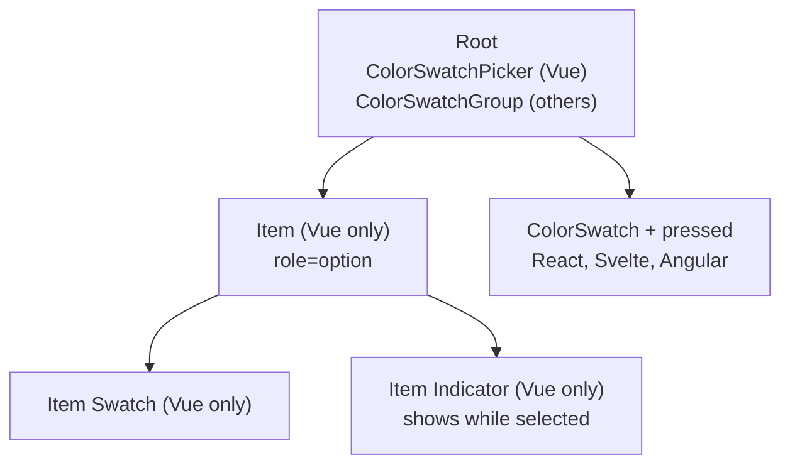

# How to Build a Color Swatch Picker

A swatch picker is a keyboard-navigable palette: one tab stop, arrow keys inside.

<script setup>
import ColorSwatchPickerGuide from './demo/vue/ColorSwatchPickerGuide.vue'
</script>

Here's what we'll end up with:

<ColorSwatchPickerGuide />

::: info Different names, same idea
Vue ships this as `ColorSwatchPicker`, a listbox of `ColorSwatchPickerItem`s.
React ships it as `ColorSwatchGroup`, whose items are ordinary `ColorSwatch`
components that pick the group up from context. The selection model differs too:
Vue's `v-model` is a string (or an array of strings with `multiple`), React's
`value` is always an array.

Svelte and Angular follow React and call the family `ColorSwatchGroup`, with
ordinary `ColorSwatch` items and a `value` that is always an array of strings.
They split the work differently, though: the group owns the selection array and
roving focus, while each swatch owns its own pressed state, so you wire the two
together with `pressed` plus `onPressedChange` (Svelte) or `(pressedChange)`
(Angular). Neither ships an item, item-swatch, or indicator part.
:::

<details>
<summary>Click to view the full code</summary>

::: code-group

<<< @/how-to/demo/vue/ColorSwatchPickerGuide.vue [Vue]
<<< @/how-to/demo/react/ColorSwatchGroupGuide.tsx [React]
<<< @/how-to/demo/svelte/ColorSwatchPickerGuide.svelte [Svelte]
<<< @/how-to/demo/angular/color-swatch-picker-guide.ts [Angular]

:::

</details>

The parts, and how they nest:



## Step 1: Set up state

Define the palette and the selection state.

::: code-group

```vue [Vue]
<script setup lang="ts">
import { ref } from "vue";  // [!code ++]

const colors = [  // [!code ++]
  "hsl(210, 80%, 50%)",  // [!code ++]
  "hsl(350, 90%, 60%)",  // [!code ++]
  "hsl(120, 60%, 45%)",  // [!code ++]
  "hsl(45, 100%, 55%)",  // [!code ++]
];  // [!code ++]

const selected = ref<string>(colors[0]!);  // [!code ++]
</script>
```

```tsx [React]
import { useState } from "react"; // [!code ++]

function MyGroup() {
  const colors = [ // [!code ++]
    "hsl(210, 80%, 50%)", // [!code ++]
    "hsl(350, 90%, 60%)", // [!code ++]
    "hsl(120, 60%, 45%)", // [!code ++]
    "hsl(45, 100%, 55%)", // [!code ++]
  ]; // [!code ++]

  const [selected, setSelected] = useState<string[]>([colors[0]!]); // [!code ++]
}
```

```svelte [Svelte]
<script lang="ts">
  const colors = [ // [!code ++]
    "hsl(210, 80%, 50%)", // [!code ++]
    "hsl(350, 90%, 60%)", // [!code ++]
    "hsl(120, 60%, 45%)", // [!code ++]
    "hsl(45, 100%, 55%)", // [!code ++]
  ]; // [!code ++]

  let selected = $state<string[]>([colors[0]!]); // [!code ++]
</script>
```

```ts [Angular]
import { Component, signal } from "@angular/core";

const COLORS = [ // [!code ++]
  "hsl(210, 80%, 50%)", // [!code ++]
  "hsl(350, 90%, 60%)", // [!code ++]
  "hsl(120, 60%, 45%)", // [!code ++]
  "hsl(45, 100%, 55%)", // [!code ++]
]; // [!code ++]

@Component({
  selector: "my-group",
  template: ``,
})
export class MyGroup {
  protected readonly colors = COLORS; // [!code ++]
  protected readonly selected = signal<string[]>([COLORS[0]!]); // [!code ++]
}
```

:::

In Vue the selection is a single string, and only becomes an array of strings when
you opt into `multiple`. In React it is always an array, even in single-select mode.
Svelte and Angular match React with `string[]` in both modes. Svelte needs no import
at all here, since `$state` is a rune rather than a function; Angular has no hook,
so a plain `signal<string[]>()` is the state and `[(value)]` binds to it directly.

## Step 2: Add the root

The root owns the selection state and moves the highlight under the arrow keys.

::: code-group

```vue [Vue]
<script setup lang="ts">
import { ref } from "vue";
import { ColorSwatchPickerRoot } from "@urcolor/vue"; // [!code ++]

const colors = [
  "hsl(210, 80%, 50%)",
  "hsl(350, 90%, 60%)",
  "hsl(120, 60%, 45%)",
  "hsl(45, 100%, 55%)",
];

const selected = ref<string>(colors[0]!);
</script>

<template>
  <!-- [!code ++:7] -->
  <ColorSwatchPickerRoot
    v-model="selected"
    as="div"
    class="flex items-center gap-2"
  >
    <!-- items go here -->
  </ColorSwatchPickerRoot>
</template>
```

```tsx [React]
import { useState } from "react";
import { ColorSwatchGroup } from "@urcolor/react"; // [!code ++]

function MyGroup() {
  const colors = [
    "hsl(210, 80%, 50%)",
    "hsl(350, 90%, 60%)",
    "hsl(120, 60%, 45%)",
    "hsl(45, 100%, 55%)",
  ];
  const [selected, setSelected] = useState<string[]>([colors[0]!]);

  return (
    // [!code ++:5]
    <ColorSwatchGroup.Root
      value={selected}
      onValueChange={setSelected}
      type="single"
      className="flex items-center gap-2"
    >
      {/* items go here */}
    </ColorSwatchGroup.Root>
  );
}
```

```svelte [Svelte]
<script lang="ts">
  import { ColorSwatchGroup } from "@urcolor/svelte"; // [!code ++]

  const colors = [
    "hsl(210, 80%, 50%)",
    "hsl(350, 90%, 60%)",
    "hsl(120, 60%, 45%)",
    "hsl(45, 100%, 55%)",
  ];

  let selected = $state<string[]>([colors[0]!]);
</script>

<!-- [!code ++:7] -->
<ColorSwatchGroup.Root
  bind:value={selected}
  type="single"
  class="flex items-center gap-2"
>
  <!-- items go here -->
</ColorSwatchGroup.Root>
```

```ts [Angular]
import { Component, signal } from "@angular/core";
import { COLOR_SWATCH_GROUP_DIRECTIVES } from "@urcolor/angular"; // [!code ++]

const COLORS = [
  "hsl(210, 80%, 50%)",
  "hsl(350, 90%, 60%)",
  "hsl(120, 60%, 45%)",
  "hsl(45, 100%, 55%)",
];

@Component({
  selector: "my-group",
  imports: [...COLOR_SWATCH_GROUP_DIRECTIVES], // [!code ++]
  template: `
    <!-- [!code ++:8] -->
    <div
      urcColorSwatchGroupRoot
      [(value)]="selected"
      type="single"
      class="flex items-center gap-2"
    >
      <!-- items go here -->
    </div>
  `,
})
export class MyGroup {
  protected readonly colors = COLORS;
  protected readonly selected = signal<string[]>([COLORS[0]!]);
}
```

:::

Vue's root renders `role="listbox"` and is single-select and horizontal by default.
React's takes `type="single"` or `type="multiple"` to say how many colors can be
selected at once. Svelte and Angular take the same `type` prop, and both render
`role="group"` rather than a listbox, because the swatches inside are toggle buttons.

Vue's `v-model` and Angular's `[(value)]` are true two-way bindings. React is
one-way plus `onValueChange`. Svelte's `value` is `$bindable`, so a plain
`bind:value={selected}` over a `$state` array is `v-model` here. The
getter/setter form the other guides use is only needed when the state comes from
a `useColor` hook.

Angular ships every part of a family as a `COLOR_*_DIRECTIVES` array, so one entry
in `imports` brings in the whole set. This picker draws on two families, so by the
next step `imports` lists both.

## Step 3: Add swatch items

In Vue, `ColorSwatchPickerItem`'s `value` is both the selection key and the color it
stands for, and `ColorSwatchPickerItemSwatch` reads that color from the item and
paints it. In React, the ordinary `ColorSwatch` detects the surrounding group and
renders itself as a selectable toggle instead of a static swatch.

::: code-group

```vue [Vue]
<script setup lang="ts">
import { ref } from "vue";
import {
  ColorSwatchPickerRoot,
  ColorSwatchPickerItem, // [!code ++]
  ColorSwatchPickerItemSwatch, // [!code ++]
} from "@urcolor/vue";

const colors = [
  "hsl(210, 80%, 50%)",
  "hsl(350, 90%, 60%)",
  "hsl(120, 60%, 45%)",
  "hsl(45, 100%, 55%)",
];

const selected = ref<string>(colors[0]!);
</script>

<template>
  <ColorSwatchPickerRoot
    v-model="selected"
    as="div"
    class="flex items-center gap-2"
  >
    <!-- [!code ++:15] -->
    <ColorSwatchPickerItem
      v-for="color in colors"
      :key="color"
      :value="color"
      as="div"
      class="
        relative size-10 cursor-pointer rounded-lg outline-none
        data-[highlighted]:outline-2 data-[highlighted]:outline-offset-2
      "
    >
      <ColorSwatchPickerItemSwatch
        as="div"
        class="size-full rounded-lg"
      />
    </ColorSwatchPickerItem>
  </ColorSwatchPickerRoot>
</template>
```

```tsx [React]
import { useState } from "react";
import { ColorSwatchGroup, ColorSwatch } from "@urcolor/react";

function MyGroup() {
  const colors = [
    "hsl(210, 80%, 50%)",
    "hsl(350, 90%, 60%)",
    "hsl(120, 60%, 45%)",
    "hsl(45, 100%, 55%)",
  ];
  const [selected, setSelected] = useState<string[]>([colors[0]!]);

  return (
    <ColorSwatchGroup.Root
      value={selected}
      onValueChange={setSelected}
      type="single"
      className="flex items-center gap-2"
    >
      {/* [!code ++:10] */}
      {colors.map((color) => (
        <ColorSwatch
          key={color}
          value={color}
          className="
            size-10 cursor-pointer rounded-lg
            flex items-center justify-center outline-none
          "
        />
      ))}
    </ColorSwatchGroup.Root>
  );
}
```

```svelte [Svelte]
<script lang="ts">
  import { ColorSwatch, ColorSwatchGroup } from "@urcolor/svelte"; // [!code ++]

  const colors = [
    "hsl(210, 80%, 50%)",
    "hsl(350, 90%, 60%)",
    "hsl(120, 60%, 45%)",
    "hsl(45, 100%, 55%)",
  ];

  let selected = $state<string[]>([colors[0]!]);
</script>

<ColorSwatchGroup.Root
  bind:value={selected}
  type="single"
  class="flex items-center gap-2"
>
  <!-- [!code ++:8] -->
  {#each colors as color (color)}
    <ColorSwatch
      value={color}
      pressed={selected.includes(color)}
      onPressedChange={() => (selected = [color])}
      class="flex size-10 cursor-pointer items-center justify-center rounded-lg outline-none"
    />
  {/each}
</ColorSwatchGroup.Root>
```

```ts [Angular]
import { Component, signal } from "@angular/core";
import { COLOR_SWATCH_DIRECTIVES, COLOR_SWATCH_GROUP_DIRECTIVES } from "@urcolor/angular"; // [!code ++]

const COLORS = [
  "hsl(210, 80%, 50%)",
  "hsl(350, 90%, 60%)",
  "hsl(120, 60%, 45%)",
  "hsl(45, 100%, 55%)",
];

@Component({
  selector: "my-group",
  imports: [...COLOR_SWATCH_GROUP_DIRECTIVES, ...COLOR_SWATCH_DIRECTIVES], // [!code ++]
  template: `
    <div
      urcColorSwatchGroupRoot
      [(value)]="selected"
      type="single"
      class="flex items-center gap-2"
    >
      <!-- [!code ++:9] -->
      @for (color of colors; track color) {
        <button
          urcColorSwatch
          [value]="color"
          [pressed]="selected().includes(color)"
          (pressedChange)="selected.set([color])"
          class="flex size-10 cursor-pointer items-center justify-center rounded-lg outline-none"
        ></button>
      }
    </div>
  `,
})
export class MyGroup {
  protected readonly colors = COLORS;
  protected readonly selected = signal<string[]>([COLORS[0]!]);
}
```

:::

Vue's items render `role="option"` with `data-state="checked"` or `"unchecked"`,
plus `data-highlighted` on the item the keyboard is currently on. Style against
those attributes.

Svelte and Angular have no item wrapper: the swatch *is* the item. Binding
`pressed` is what turns a `ColorSwatch` from a static `role="img"` sample into a
toggle button, and the group finds those buttons in the DOM to run roving focus
over them, which is why in Angular the swatch goes on a `<button>` you own.
Both mark the selected swatch with `aria-pressed` and `data-pressed`, so style
against those instead of `data-state`. And neither ships a checkerboard part:
the swatch paints the transparency grid itself, under the color.

## Step 4: Add the selected indicator

Vue's `ColorSwatchPickerItemIndicator` renders its children only while its item is
selected, so a checkmark appears on exactly the chosen swatches without any state
juggling in your template. React has no indicator part, so render your own marker
against the selection state. Svelte and Angular have no indicator part either, so
they do the same with `{#if}` and `@if`.

::: code-group

```vue [Vue]
<script setup lang="ts">
import { ref } from "vue";
import {
  ColorSwatchPickerRoot,
  ColorSwatchPickerItem,
  ColorSwatchPickerItemSwatch,
  ColorSwatchPickerItemIndicator, // [!code ++]
} from "@urcolor/vue";
import { Check } from "lucide-vue-next"; // [!code ++]

// ...
</script>

<template>
  <ColorSwatchPickerRoot
    v-model="selected"
    as="div"
    class="flex items-center gap-2"
  >
    <ColorSwatchPickerItem
      v-for="color in colors"
      :key="color"
      :value="color"
      as="div"
      class="
        relative size-10 cursor-pointer rounded-lg outline-none
        data-[highlighted]:outline-2 data-[highlighted]:outline-offset-2
      "
    >
      <ColorSwatchPickerItemSwatch
        as="div"
        class="size-full rounded-lg"
      />
      <!-- [!code ++:8] -->
      <ColorSwatchPickerItemIndicator
        as="span"
        class="absolute inset-0 grid place-items-center"
      >
        <Check
          class="size-5 text-white drop-shadow-[0_1px_2px_rgba(0,0,0,0.5)]"
        />
      </ColorSwatchPickerItemIndicator>
    </ColorSwatchPickerItem>
  </ColorSwatchPickerRoot>
</template>
```

```tsx [React]
import { ColorSwatchGroup, ColorSwatch } from "@urcolor/react";
import { Check } from "lucide-react"; // [!code ++]

<ColorSwatchGroup.Root
  value={selected}
  onValueChange={setSelected}
  type="single"
  className="flex items-center gap-2"
>
  {colors.map((color) => (
    <ColorSwatch
      key={color}
      value={color}
      className="size-10 cursor-pointer rounded-lg flex items-center justify-center outline-none"
    >
      {/* [!code ++:3] */}
      {selected.includes(color) && (
        <Check className="size-5 text-white drop-shadow-[0_1px_2px_rgba(0,0,0,0.5)]" />
      )}
    </ColorSwatch>
  ))}
</ColorSwatchGroup.Root>
```

```svelte [Svelte]
<script lang="ts">
  import { ColorSwatch, ColorSwatchGroup } from "@urcolor/svelte";

  // ...
  let selected = $state<string[]>([colors[0]!]);
</script>

<ColorSwatchGroup.Root
  bind:value={selected}
  type="single"
  class="flex items-center gap-2"
>
  {#each colors as color (color)}
    <ColorSwatch
      value={color}
      pressed={selected.includes(color)}
      onPressedChange={() => (selected = [color])}
      class="flex size-10 cursor-pointer items-center justify-center rounded-lg outline-none"
    >
      <!-- [!code ++:8] -->
      {#if selected.includes(color)}
        <svg
          class="size-5 text-white drop-shadow-[0_1px_2px_rgba(0,0,0,0.5)]"
          viewBox="0 0 24 24" fill="none" stroke="currentColor" stroke-width="2"
        >
          <polyline points="20 6 9 17 4 12" />
        </svg>
      {/if}
    </ColorSwatch>
  {/each}
</ColorSwatchGroup.Root>
```

```ts [Angular]
import { Component, signal } from "@angular/core";
import { COLOR_SWATCH_DIRECTIVES, COLOR_SWATCH_GROUP_DIRECTIVES } from "@urcolor/angular";

@Component({
  selector: "my-group",
  imports: [...COLOR_SWATCH_GROUP_DIRECTIVES, ...COLOR_SWATCH_DIRECTIVES],
  template: `
    <div
      urcColorSwatchGroupRoot
      [(value)]="selected"
      type="single"
      class="flex items-center gap-2"
    >
      @for (color of colors; track color) {
        <button
          urcColorSwatch
          [value]="color"
          [pressed]="selected().includes(color)"
          (pressedChange)="selected.set([color])"
          class="flex size-10 cursor-pointer items-center justify-center rounded-lg outline-none"
        >
          <!-- [!code ++:8] -->
          @if (selected().includes(color)) {
            <svg
              class="size-5 text-white drop-shadow-[0_1px_2px_rgba(0,0,0,0.5)]"
              viewBox="0 0 24 24" fill="none" stroke="currentColor" stroke-width="2"
            >
              <polyline points="20 6 9 17 4 12" />
            </svg>
          }
        </button>
      }
    </div>
  `,
})
export class MyGroup {
  protected readonly colors = COLORS;
  protected readonly selected = signal<string[]>([COLORS[0]!]);
}
```

:::

::: tip
The components ship unstyled. The classes above are one example, written with Tailwind CSS; any styling approach works.
:::

## Multiple selection

::: code-group

```vue{2,8} [Vue]
<script setup lang="ts">
const selected = ref<string[]>([]);
</script>

<template>
  <ColorSwatchPickerRoot
    v-model="selected"
    multiple
    as="div"
  >
    <!-- ... -->
  </ColorSwatchPickerRoot>
</template>
```

```tsx{4} [React]
<ColorSwatchGroup.Root
  value={selected}
  onValueChange={setSelected}
  type="multiple"
  className="flex items-center gap-2"
>
  {/* ... */}
</ColorSwatchGroup.Root>
```

```svelte{2,7} [Svelte]
<script lang="ts">
  let selected = $state<string[]>([]);
</script>

<ColorSwatchGroup.Root
  bind:value={selected}
  type="multiple"
  class="flex items-center gap-2"
>
  <!-- ... -->
</ColorSwatchGroup.Root>
```

```html{4} [Angular]
<div
  urcColorSwatchGroupRoot
  [(value)]="selected"
  type="multiple"
  class="flex items-center gap-2"
>
  <!-- ... -->
</div>
```

:::

Because the swatch owns its own pressed state in Svelte and Angular, `type` alone
does not make a multi-select picker work: the handler has to add and remove too.
Swap `onPressedChange={() => (selected = [color])}` for one that toggles the value
in and out of the array, and likewise for Angular's `(pressedChange)`.

In Vue, `selection-behavior` decides what a click on an already-selected swatch
does. The default, `"toggle"`, deselects it; `"replace"` keeps it selected and
replaces the rest of the selection instead:

```vue{5}
<template>
  <ColorSwatchPickerRoot
    v-model="selected"
    multiple
    selection-behavior="replace"
  >
    <!-- ... -->
  </ColorSwatchPickerRoot>
</template>
```

## Keyboard navigation

The picker is one tab stop. Once focus is inside, the arrow keys move the highlight:

- **Arrow keys**: move the highlight (left/right when horizontal, up/down when vertical)
- **Home / End**: jump to the first or last swatch
- **Space / Enter**: select the highlighted swatch
- **Ctrl/Cmd + A**: select every swatch, when multiple selection is on (Vue)

In Vue, set `orientation="vertical"` to swap which arrow keys navigate:

```vue{4}
<template>
  <ColorSwatchPickerRoot
    v-model="selected"
    orientation="vertical"
    as="div"
    class="flex flex-col gap-2"
  >
    <!-- ... -->
  </ColorSwatchPickerRoot>
</template>
```

::: warning
Typeahead does not work here. The underlying listbox resolves an option's search
text from its `textValue` or `textContent`, and a swatch has neither, so typing a
color name or hex only highlights the first swatch.
:::

## Disabled items

Individual swatches, or the whole picker, can be disabled:

```vue{4,8}
<template>
  <ColorSwatchPickerRoot
    v-model="selected"
    disabled
  >
    <ColorSwatchPickerItem
      :value="color"
      disabled
    />
  </ColorSwatchPickerRoot>
</template>
```

## Listening to changes

::: code-group

```vue{3-5,11} [Vue]
<script setup lang="ts">
// ...
const onSelectionChange = (value: string | string[] | undefined) => {
  console.log("selected:", value);
};
</script>

<template>
  <ColorSwatchPickerRoot
    v-model="selected"
    @update:model-value="onSelectionChange"
  >
    <!-- ... -->
  </ColorSwatchPickerRoot>
</template>
```

```tsx{3-5,9} [React]
import { ColorSwatchGroup } from "@urcolor/react";

const onSelectionChange = (value: string[]) => {
  console.log("selected:", value);
};

<ColorSwatchGroup.Root
  value={selected}
  onValueChange={onSelectionChange}
  type="single"
>
  {/* ... */}
</ColorSwatchGroup.Root>
```

```svelte{4-6,12} [Svelte]
<script lang="ts">
  // ...
  let selected = $state<string[]>([]);
  const onSelectionChange = (value: string[]) => {
    console.log("selected:", value);
  };
</script>

<ColorSwatchGroup.Root
  bind:value={selected}
  type="single"
  onValueChange={onSelectionChange}
>
  <!-- ... -->
</ColorSwatchGroup.Root>
```

```ts{11,21-24} [Angular]
import { Component, signal } from "@angular/core";
import { COLOR_SWATCH_GROUP_DIRECTIVES } from "@urcolor/angular";

@Component({
  selector: "my-group",
  imports: [...COLOR_SWATCH_GROUP_DIRECTIVES],
  template: `
    <div
      urcColorSwatchGroupRoot
      [value]="selected()"
      (valueChange)="onSelectionChange($event)"
      type="single"
    >
      <!-- ... -->
    </div>
  `,
})
export class MyGroup {
  protected readonly selected = signal<string[]>([]);

  protected onSelectionChange(value: string[]): void {
    this.selected.set(value);
    console.log("selected:", value);
  }
}
```

:::

Svelte calls `onValueChange` and Angular emits `(valueChange)`; both hand you the
whole selection array, exactly like React. Angular's `(valueChange)` is the output
half of `[(value)]`, so when you listen to it explicitly you bind the input one-way
as `[value]="selected()"` and write the signal yourself. Neither family has a
commit event, because a selection has no drag to release.

Vue's root also emits `@highlight` when the keyboard highlight moves, `@entry-focus`
when focus enters the picker, and `@leave` when the pointer leaves it.
