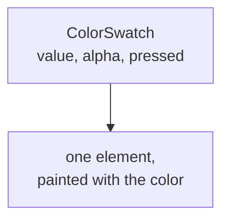

# How to Build Color Swatches

A swatch renders one color as a filled element, static or selectable.

<script setup>
import ColorSwatchGuide from './demo/vue/ColorSwatchGuide.vue'
</script>

Here's what we'll end up with:

<ColorSwatchGuide />

<details>
<summary>Click to view the full code</summary>

::: code-group

<<< @/how-to/demo/vue/ColorSwatchGuide.vue [Vue]
<<< @/how-to/demo/react/ColorSwatchGuide.tsx [React]
<<< @/how-to/demo/svelte/ColorSwatchGuide.svelte [Svelte]
<<< @/how-to/demo/angular/color-swatch-guide.ts [Angular]

:::

</details>

The parts, and how they nest:



## Step 1: Set up state

Import the color model and define the colors.

::: code-group

```vue [Vue]
<script setup lang="ts">
import { useColor } from "@urcolor/vue";  // [!code ++]

const { color } = useColor("hsl(210, 80%, 50%)");  // [!code ++]
</script>
```

```tsx [React]
import { useColor } from "@urcolor/react"; // [!code ++]

function MySwatch() {
  const { color } = useColor("hsl(210, 80%, 50%)"); // [!code ++]
}
```

```svelte [Svelte]
<script lang="ts">
  import { useColor } from "@urcolor/svelte"; // [!code ++]

  const colorState = useColor("hsl(210, 80%, 50%)"); // [!code ++]
</script>
```

```ts [Angular]
import { Component, signal } from "@angular/core";
import { Color } from "@urcolor/core"; // [!code ++]

@Component({
  selector: "my-swatch",
  template: ``,
})
export class MySwatch {
  protected readonly color = signal<Color>(Color.parse("hsl(210, 80%, 50%)")!); // [!code ++]
}
```

:::

`useColor()` creates color state from any CSS color string. Vue returns a `{ color }` shallow ref and React returns `{ color, setColor }`. Svelte returns a rune-backed object whose `color`, `hex` and `alpha` are getters, so keep the object and read `colorState.color` rather than destructuring it, or reactivity is lost. Angular has no hook: a plain `signal<Color>()` is the state, and the swatch reads it with `[value]="color()"`.

## Step 2: Render a swatch

The swatch root renders one color as a filled element. Vue passes it as `model-value`, React and Svelte as `value`, Angular as `[value]`.

::: code-group

```vue [Vue]
<script setup lang="ts">
import { useColor, ColorSwatchRoot } from "@urcolor/vue"; // [!code ++]

const { color } = useColor("hsl(210, 80%, 50%)");
</script>

<template>
  <!-- [!code ++:5] -->
  <ColorSwatchRoot
    :model-value="color"
    class="size-10 rounded-lg"
  />
</template>
```

```tsx [React]
import { useColor, ColorSwatch } from "@urcolor/react"; // [!code ++]

function MySwatch() {
  const { color } = useColor("hsl(210, 80%, 50%)");

  return (
    // [!code ++:4]
    <ColorSwatch.Root
      value={color}
      className="size-10 rounded-lg"
    />
  );
}
```

```svelte [Svelte]
<script lang="ts">
  import { ColorSwatch, useColor } from "@urcolor/svelte"; // [!code ++]

  const colorState = useColor("hsl(210, 80%, 50%)");
</script>

<!-- [!code ++:4] -->
<ColorSwatch
  value={colorState.color}
  class="size-10 rounded-lg"
/>
```

```ts [Angular]
import { Component, signal } from "@angular/core";
import { Color } from "@urcolor/core";
import { COLOR_SWATCH_DIRECTIVES } from "@urcolor/angular"; // [!code ++]

@Component({
  selector: "my-swatch",
  imports: [...COLOR_SWATCH_DIRECTIVES], // [!code ++]
  template: `
    <!-- [!code ++:5] -->
    <div
      urcColorSwatch
      [value]="color()"
      class="size-10 rounded-lg"
    ></div>
  `,
})
export class MySwatch {
  protected readonly color = signal<Color>(Color.parse("hsl(210, 80%, 50%)")!);
}
```

:::

The swatch paints the color as a background and nothing else. Sizing, border radius and the rest are yours.

Svelte and Angular ship the swatch as a single part rather than a `Root` namespace member: `ColorSwatch` is the component itself, and `[urcColorSwatch]` is an attribute directive for whatever element you want: a `<div>` for a static sample, a `<button>` when it should be pressable. The `value` prop is display-only in all four frameworks; the two-way binding on a swatch is `pressed`, which Svelte exposes as `$bindable` (`bind:pressed`) and Angular as a `model()` (`[(pressed)]`).

Angular ships each family as a `COLOR_*_DIRECTIVES` array, so one entry in `imports` brings in the whole set.

::: tip
The components ship unstyled. The classes above are one example, written with Tailwind CSS; any styling approach works.
:::

## Alpha transparency

The `alpha` prop puts a checkerboard behind a semi-transparent color:

::: code-group

```vue{4} [Vue]
<template>
  <ColorSwatchRoot
    :model-value="color"
    alpha
    class="size-10 rounded-lg"
  />
</template>
```

```tsx{3} [React]
<ColorSwatch.Root
  value={color}
  alpha
  className="size-10 rounded-lg"
/>
```

```svelte{3} [Svelte]
<ColorSwatch
  value={colorState.color}
  alpha
  class="size-10 rounded-lg"
/>
```

```html{4} [Angular]
<div
  urcColorSwatch
  [value]="color()"
  alpha
  class="size-10 rounded-lg"
></div>
```

:::

Without `alpha` the color renders fully opaque, whatever its alpha channel says.

## Checkerboard size

The checkerboard cell size, in pixels:

::: code-group

```vue{5} [Vue]
<template>
  <ColorSwatchRoot
    :model-value="color"
    alpha
    :checker-size="8"
    class="size-10 rounded-lg"
  />
</template>
```

```tsx{4} [React]
<ColorSwatch.Root
  value={color}
  alpha
  checkerSize={8}
  className="size-10 rounded-lg"
/>
```

```svelte{4} [Svelte]
<ColorSwatch
  value={colorState.color}
  alpha
  checkerSize={8}
  class="size-10 rounded-lg"
/>
```

```html{5} [Angular]
<div
  urcColorSwatch
  [value]="color()"
  alpha
  checkerSize="8"
  class="size-10 rounded-lg"
></div>
```

:::

## Multiple swatches

A palette is a loop over an array of colors:

::: code-group

```vue{7-14,19-35} [Vue]
<script setup lang="ts">
import { shallowRef } from "vue";
import { Color } from "@urcolor/core";
import { ColorSwatchRoot } from "@urcolor/vue";
import { Check } from "lucide-vue-next";

const colors = [
  Color.parse("hsl(210, 80%, 50%)")!,
  Color.parse("hsl(350, 90%, 60%)")!,
  Color.parse("hsl(120, 60%, 45%)")!,
  Color.parse("hsla(45, 100%, 55%, 0.5)")!,
];

const selected = shallowRef(colors[0]);
</script>

<template>
  <div class="flex items-center gap-3">
    <ColorSwatchRoot
      v-for="(color, i) in colors"
      :key="i"
      :model-value="color"
      alpha
      class="
        size-10 cursor-pointer rounded-lg
        flex items-center justify-center
      "
      @click="selected = color"
    >
      <Check
        class="size-5 text-white drop-shadow-[0_1px_2px_rgba(0,0,0,0.5)] transition-opacity duration-150"
        :class="selected === color ? 'opacity-100' : 'opacity-0'"
      />
    </ColorSwatchRoot>
  </div>
</template>
```

```tsx{5-10,17-27} [React]
import { useState } from "react";
import { Color } from "@urcolor/core";
import { ColorSwatch } from "@urcolor/react";
import { Check } from "lucide-react";

const colors = [
  Color.parse("hsl(210, 80%, 50%)")!,
  Color.parse("hsl(350, 90%, 60%)")!,
  Color.parse("hsl(120, 60%, 45%)")!,
  Color.parse("hsla(45, 100%, 55%, 0.5)")!,
];

function MyPalette() {
  const [selected, setSelected] = useState(0);

  return (
    <div className="flex items-center gap-3">
      {colors.map((color, i) => (
        <ColorSwatch.Root
          key={i}
          value={color}
          alpha
          className="size-10 cursor-pointer rounded-lg flex items-center justify-center"
          onClick={() => setSelected(i)}
        >
          <Check
            className="size-5 text-white drop-shadow-[0_1px_2px_rgba(0,0,0,0.5)] transition-opacity duration-150"
            style={{ opacity: selected === i ? 1 : 0 }}
          />
        </ColorSwatch.Root>
      ))}
    </div>
  );
}
```

```svelte{5-12,17-32} [Svelte]
<script lang="ts">
  import { Color } from "@urcolor/core";
  import { ColorSwatch } from "@urcolor/svelte";

  const colors = [
    Color.parse("hsl(210, 80%, 50%)")!,
    Color.parse("hsl(350, 90%, 60%)")!,
    Color.parse("hsl(120, 60%, 45%)")!,
    Color.parse("hsla(45, 100%, 55%, 0.5)")!,
  ];

  let selected = $state(0);
</script>

<div class="flex items-center gap-3">
  {#each colors as color, i (i)}
    <ColorSwatch
      value={color}
      alpha
      class="flex size-10 cursor-pointer items-center justify-center rounded-lg"
      onclick={() => (selected = i)}
    >
      <svg
        class="size-5 text-white drop-shadow-[0_1px_2px_rgba(0,0,0,0.5)] transition-opacity duration-150 {selected === i ? 'opacity-100' : 'opacity-0'}"
        viewBox="0 0 24 24"
        fill="none"
        stroke="currentColor"
        stroke-width="2"
      >
        <polyline points="20 6 9 17 4 12" />
      </svg>
    </ColorSwatch>
  {/each}
</div>
```

```ts{11-28,34-41} [Angular]
import { Component, signal } from "@angular/core";
import { Color } from "@urcolor/core";
import { COLOR_SWATCH_DIRECTIVES } from "@urcolor/angular";

@Component({
  selector: "my-palette",
  imports: [...COLOR_SWATCH_DIRECTIVES],
  template: `
    <div class="flex items-center gap-3">
      @for (color of colors; track $index) {
        <div
          urcColorSwatch
          [value]="color"
          alpha
          class="flex size-10 cursor-pointer items-center justify-center rounded-lg"
          (click)="selected.set($index)"
        >
          <svg
            class="size-5 text-white drop-shadow-[0_1px_2px_rgba(0,0,0,0.5)] transition-opacity duration-150"
            [style.opacity]="selected() === $index ? 1 : 0"
            viewBox="0 0 24 24"
            fill="none"
            stroke="currentColor"
            stroke-width="2"
          >
            <polyline points="20 6 9 17 4 12" />
          </svg>
        </div>
      }
    </div>
  `,
})
export class MyPalette {
  protected readonly colors = [
    Color.parse("hsl(210, 80%, 50%)")!,
    Color.parse("hsl(350, 90%, 60%)")!,
    Color.parse("hsl(120, 60%, 45%)")!,
    Color.parse("hsla(45, 100%, 55%, 0.5)")!,
  ];

  protected readonly selected = signal(0);
}
```

:::

Svelte reaches for `{#each}` and Angular for `@for`, and both keep the click handler on the swatch itself. Svelte's `onclick` lands on the rendered element through the rest props, and Angular's `(click)` is a native listener on the element you own. If you would rather not track selection by hand, bind `pressed` instead (`bind:pressed` in Svelte, `[(pressed)]` in Angular) and the swatch upgrades itself to a toggle button with `aria-pressed`, Enter/Space activation, and a `data-pressed` attribute to style against.

## String colors

A plain CSS color string works in place of a `Color` object:

::: code-group

```vue [Vue]
<template>
  <ColorSwatchRoot
    model-value="oklch(0.6 0.15 210)"
    class="size-10 rounded-lg"
  />
</template>
```

```tsx [React]
<ColorSwatch.Root
  value="oklch(0.6 0.15 210)"
  className="size-10 rounded-lg"
/>
```

```svelte [Svelte]
<ColorSwatch
  value="oklch(0.6 0.15 210)"
  class="size-10 rounded-lg"
/>
```

```html [Angular]
<div
  urcColorSwatch
  value="oklch(0.6 0.15 210)"
  class="size-10 rounded-lg"
></div>
```

:::
