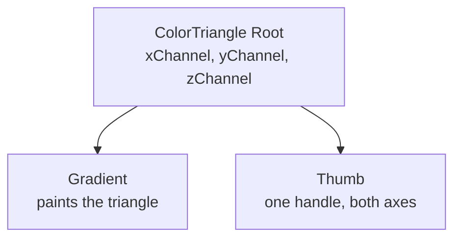

# How to Build a Color Triangle

A color triangle maps two channels onto a triangular gradient, or three in barycentric mode.

<script setup>
import ColorTriangleGuide from './demo/vue/ColorTriangleGuide.vue'
</script>

Here's what we'll end up with:

<ColorTriangleGuide />

<details>
<summary>Click to view the full code</summary>

::: code-group

<<< @/how-to/demo/vue/ColorTriangleGuide.vue [Vue]
<<< @/how-to/demo/react/ColorTriangleGuide.tsx [React]
<<< @/how-to/demo/svelte/ColorTriangleGuide.svelte [Svelte]
<<< @/how-to/demo/angular/color-triangle-guide.ts [Angular]

:::

</details>

The parts, and how they nest:



## Step 1: Set up state

Import the color model and create the color state.

::: code-group

```vue [Vue]
<script setup lang="ts">
import { useColor } from "@urcolor/vue";  // [!code ++]

const { color } = useColor("hsl(210, 80%, 50%)");  // [!code ++]
</script>
```

```tsx [React]
import { useColor } from "@urcolor/react"; // [!code ++]

function MyTriangle() {
  const { color, setColor } = useColor("hsl(210, 80%, 50%)"); // [!code ++]
}
```

```svelte [Svelte]
<script lang="ts">
  import { useColor } from "@urcolor/svelte"; // [!code ++]

  const colorState = useColor("hsl(210, 80%, 50%)"); // [!code ++]
</script>
```

```ts [Angular]
import { Component, signal } from "@angular/core";
import { Color } from "@urcolor/core"; // [!code ++]

@Component({
  selector: "my-triangle",
  template: ``,
})
export class MyTriangle {
  protected readonly color = signal<Color>(Color.parse("hsl(210, 80%, 50%)")!); // [!code ++]
}
```

:::

`useColor()` creates color state from any CSS color string. Vue returns a `{ color }` shallow ref and React returns `{ color, setColor }`. Svelte returns a rune-backed object whose `color`, `hex` and `alpha` are getters, so keep the object and read `colorState.color` rather than destructuring it, or reactivity is lost. Angular has no hook: a plain `signal<Color>()` is the state, and `[(value)]` binds to it directly. `createColorStore()` from `@urcolor/angular` is there too, for `hex` and `alpha` projections.

## Step 2: Add the root

The root owns the state and the interactions. Tell it which color space to work in and which channels map to the triangle's axes.

::: code-group

```vue [Vue]
<script setup lang="ts">
import { useColor, ColorTriangleRoot } from "@urcolor/vue"; // [!code ++]

const { color } = useColor("hsl(210, 80%, 50%)");
</script>

<template>
  <!-- [!code ++:8] -->
  <ColorTriangleRoot
    v-model="color"
    color-space="hsv"
    x-channel="s"
    y-channel="v"
  >
    <!-- children go here -->
  </ColorTriangleRoot>
</template>
```

```tsx [React]
import { useColor, ColorTriangle } from "@urcolor/react"; // [!code ++]

function MyTriangle() {
  const { color, setColor } = useColor("hsl(210, 80%, 50%)");

  return (
    // [!code ++:8]
    <ColorTriangle.Root
      value={color}
      onValueChange={setColor}
      colorSpace="hsv"
      xChannel="s"
      yChannel="v"
    >
      {/* children go here */}
    </ColorTriangle.Root>
  );
}
```

```svelte [Svelte]
<script lang="ts">
  import { ColorTriangle, useColor } from "@urcolor/svelte"; // [!code ++]

  const colorState = useColor("hsl(210, 80%, 50%)");
</script>

<!-- [!code ++:8] -->
<ColorTriangle.Root
  bind:value={() => colorState.color, colorState.setColor}
  colorSpace="hsv"
  xChannel="s"
  yChannel="v"
>
  <!-- children go here -->
</ColorTriangle.Root>
```

```ts [Angular]
import { Component, signal } from "@angular/core";
import { Color } from "@urcolor/core";
import { COLOR_TRIANGLE_DIRECTIVES } from "@urcolor/angular"; // [!code ++]

@Component({
  selector: "my-triangle",
  imports: [...COLOR_TRIANGLE_DIRECTIVES], // [!code ++]
  template: `
    <!-- [!code ++:9] -->
    <div
      urcColorTriangleRoot
      [(value)]="color"
      colorSpace="hsv"
      xChannel="s"
      yChannel="v"
    >
      <!-- children go here -->
    </div>
  `,
})
export class MyTriangle {
  protected readonly color = signal<Color>(Color.parse("hsl(210, 80%, 50%)")!);
}
```

:::

Vue's `v-model` and Angular's `[(value)]` are true two-way bindings. React is one-way plus `onValueChange`. Svelte's `value` is `$bindable`, but `useColor` exposes getters, so bind it with Svelte 5's function form, `bind:value={() => colorState.color, colorState.setColor}`, which is `v-model` for a getter/setter pair.

Angular ships each family as a `COLOR_*_DIRECTIVES` array, so one entry in `imports` brings in the whole set.

- `color-space` / `colorSpace`: the color space to work in (`hsv`, `hsl`, `srgb`, etc.)
- `x-channel` / `xChannel`: the channel mapped to the horizontal axis
- `y-channel` / `yChannel`: the channel mapped to the vertical axis

## Step 3: Add the gradient

The gradient paints the plane inside the triangle. In Angular the gradient's selector is `canvas[urcColorTriangleGradient]`, so it goes on a `<canvas>` element you own; the other three render their own canvas for you.

::: code-group

```vue [Vue]
<script setup lang="ts">
import {
  useColor,
  ColorTriangleRoot,
  ColorTriangleGradient, // [!code ++]
} from "@urcolor/vue";

const { color } = useColor("hsl(210, 80%, 50%)");
</script>

<template>
  <ColorTriangleRoot
    v-model="color"
    color-space="hsv"
    x-channel="s"
    y-channel="v"
    class="relative block size-64"
  >
    <ColorTriangleGradient class="absolute inset-0 block" /> <!-- [!code ++] -->
  </ColorTriangleRoot>
</template>
```

```tsx [React]
import { useColor, ColorTriangle } from "@urcolor/react";

function MyTriangle() {
  const { color, setColor } = useColor("hsl(210, 80%, 50%)");

  return (
    <ColorTriangle.Root
      value={color}
      onValueChange={setColor}
      colorSpace="hsv"
      xChannel="s"
      yChannel="v"
      className="relative block size-64"
    >
      <ColorTriangle.Gradient className="absolute inset-0 block" /> {/* [!code ++] */}
    </ColorTriangle.Root>
  );
}
```

```svelte [Svelte]
<script lang="ts">
  import { ColorTriangle, useColor } from "@urcolor/svelte";

  const colorState = useColor("hsl(210, 80%, 50%)");
</script>

<ColorTriangle.Root
  bind:value={() => colorState.color, colorState.setColor}
  colorSpace="hsv"
  xChannel="s"
  yChannel="v"
  class="relative block size-64"
>
  <ColorTriangle.Gradient class="absolute inset-0 block" /> <!-- [!code ++] -->
</ColorTriangle.Root>
```

```ts [Angular]
import { Component, signal } from "@angular/core";
import { Color } from "@urcolor/core";
import { COLOR_TRIANGLE_DIRECTIVES } from "@urcolor/angular";

@Component({
  selector: "my-triangle",
  imports: [...COLOR_TRIANGLE_DIRECTIVES],
  template: `
    <div
      urcColorTriangleRoot
      [(value)]="color"
      colorSpace="hsv"
      xChannel="s"
      yChannel="v"
      class="relative block size-64"
    >
      <!-- [!code ++] -->
      <canvas urcColorTriangleGradient class="absolute inset-0 block"></canvas>
    </div>
  `,
})
export class MyTriangle {
  protected readonly color = signal<Color>(Color.parse("hsl(210, 80%, 50%)")!);
}
```

:::

## Step 4: Add the thumb

The thumb is the draggable handle. The component positions it inside the triangle.

::: code-group

```vue [Vue]
<script setup lang="ts">
import {
  useColor,
  ColorTriangleRoot,
  ColorTriangleGradient,
  ColorTriangleThumb, // [!code ++]
} from "@urcolor/vue";

const { color } = useColor("hsl(210, 80%, 50%)");
</script>

<template>
  <ColorTriangleRoot
    v-model="color"
    color-space="hsv"
    x-channel="s"
    y-channel="v"
    class="relative block size-64"
  >
    <ColorTriangleGradient class="absolute inset-0 block" />
    <!-- [!code ++:8] -->
    <ColorTriangleThumb
      class="
        size-4 rounded-full border-2 border-white
        shadow-[0_0_0_1px_rgba(0,0,0,0.3),0_2px_4px_rgba(0,0,0,0.3)]
        focus-visible:shadow-[0_0_0_1px_rgba(0,0,0,0.3),0_0_0_3px_rgba(66,153,225,0.6)]
      "
      aria-label="Color"
    />
  </ColorTriangleRoot>
</template>
```

```tsx [React]
import { useColor, ColorTriangle } from "@urcolor/react";

function MyTriangle() {
  const { color, setColor } = useColor("hsl(210, 80%, 50%)");

  return (
    <ColorTriangle.Root
      value={color}
      onValueChange={setColor}
      colorSpace="hsv"
      xChannel="s"
      yChannel="v"
      className="relative block size-64"
    >
      <ColorTriangle.Gradient className="absolute inset-0 block" />
      {/* [!code ++:8] */}
      <ColorTriangle.Thumb
        className="
          size-4 rounded-full border-2 border-white
          shadow-[0_0_0_1px_rgba(0,0,0,0.3),0_2px_4px_rgba(0,0,0,0.3)]
          focus-visible:shadow-[0_0_0_1px_rgba(0,0,0,0.3),0_0_0_3px_rgba(66,153,225,0.6)]
        "
        aria-label="Color"
      />
    </ColorTriangle.Root>
  );
}
```

```svelte [Svelte]
<script lang="ts">
  import { ColorTriangle, useColor } from "@urcolor/svelte";

  const colorState = useColor("hsl(210, 80%, 50%)");
</script>

<ColorTriangle.Root
  bind:value={() => colorState.color, colorState.setColor}
  colorSpace="hsv"
  xChannel="s"
  yChannel="v"
  class="relative block size-64"
>
  <ColorTriangle.Gradient class="absolute inset-0 block" />
  <!-- [!code ++:8] -->
  <ColorTriangle.Thumb
    class="
      size-4 rounded-full border-2 border-white
      shadow-[0_0_0_1px_rgba(0,0,0,0.3),0_2px_4px_rgba(0,0,0,0.3)]
      focus-visible:shadow-[0_0_0_1px_rgba(0,0,0,0.3),0_0_0_3px_rgba(66,153,225,0.6)]
    "
    aria-label="Color"
  />
</ColorTriangle.Root>
```

```ts [Angular]
import { Component, signal } from "@angular/core";
import { Color } from "@urcolor/core";
import { COLOR_TRIANGLE_DIRECTIVES } from "@urcolor/angular";

@Component({
  selector: "my-triangle",
  imports: [...COLOR_TRIANGLE_DIRECTIVES],
  template: `
    <div
      urcColorTriangleRoot
      [(value)]="color"
      colorSpace="hsv"
      xChannel="s"
      yChannel="v"
      class="relative block size-64"
    >
      <canvas urcColorTriangleGradient class="absolute inset-0 block"></canvas>
      <!-- [!code ++:9] -->
      <div
        urcColorTriangleThumb
        class="
          size-4 rounded-full border-2 border-white
          shadow-[0_0_0_1px_rgba(0,0,0,0.3),0_2px_4px_rgba(0,0,0,0.3)]
          focus-visible:shadow-[0_0_0_1px_rgba(0,0,0,0.3),0_0_0_3px_rgba(66,153,225,0.6)]
        "
        aria-label="Color"
      ></div>
    </div>
  `,
})
export class MyTriangle {
  protected readonly color = signal<Color>(Color.parse("hsl(210, 80%, 50%)")!);
}
```

:::

::: tip
The components ship unstyled. The classes above are one example, written with Tailwind CSS; any styling approach works.
:::

## Rotation

Rotate the root with CSS. The geometry is fixed, and the root maps pointer
positions back through whatever transform it carries, so dragging keeps
following the corner it points at:

::: code-group

```vue{6} [Vue]
<template>
  <ColorTriangleRoot
    v-model="color"
    color-space="hsv"
    x-channel="s"
    y-channel="v"
    style="transform: rotate(180deg)"
  >
    <!-- ... -->
  </ColorTriangleRoot>
</template>
```

```tsx{6} [React]
<ColorTriangle.Root
  value={color}
  onValueChange={setColor}
  colorSpace="hsv"
  xChannel="s"
  yChannel="v"
  style={{ transform: "rotate(180deg)" }}
>
  {/* ... */}
</ColorTriangle.Root>
```

```svelte{5} [Svelte]
<ColorTriangle.Root
  bind:value={() => colorState.color, colorState.setColor}
  colorSpace="hsv"
  xChannel="s"
  yChannel="v"
  style="transform: rotate(180deg)"
>
  <!-- ... -->
</ColorTriangle.Root>
```

```html{6} [Angular]
<div
  urcColorTriangleRoot
  [(value)]="color"
  colorSpace="hsv"
  xChannel="s"
  yChannel="v"
  style="transform: rotate(180deg)"
>
  <!-- ... -->
</div>
```

:::

Any transform works, not only rotation: scale, skew and their combinations are
all undone before a pointer position is read. A transform on an *ancestor* is
not, so keep it on the root itself.

## Three-channel mode

A Z channel turns on barycentric three-channel mode, mapping all three channels to the triangle's vertices. It suits RGB mixing:

::: code-group

```vue{4-7} [Vue]
<template>
  <ColorTriangleRoot
    v-model="color"
    color-space="srgb"
    x-channel="r"
    y-channel="g"
    z-channel="b"
  >
    <!-- ... -->
  </ColorTriangleRoot>
</template>
```

```tsx{4-7} [React]
<ColorTriangle.Root
  value={color}
  onValueChange={setColor}
  colorSpace="srgb"
  xChannel="r"
  yChannel="g"
  zChannel="b"
>
  {/* ... */}
</ColorTriangle.Root>
```

```svelte{3-6} [Svelte]
<ColorTriangle.Root
  bind:value={() => colorState.color, colorState.setColor}
  colorSpace="srgb"
  xChannel="r"
  yChannel="g"
  zChannel="b"
>
  <!-- ... -->
</ColorTriangle.Root>
```

```html{4-7} [Angular]
<div
  urcColorTriangleRoot
  [(value)]="color"
  colorSpace="srgb"
  xChannel="r"
  yChannel="g"
  zChannel="b"
>
  <!-- ... -->
</div>
```

:::

::: info The first keypress "jumps"
In three-channel mode the values are barycentric coordinates, where only the ratio
between them means anything, so every write is renormalized back onto the simplex.
An `srgb` color at `r/g/b 50 / 50 / 180` becomes `46 / 45 / 163` the first time you
press Arrow Right (which steps red by one and, as a side effect of the
renormalization, redistributes all three channels onto the simplex). That is
inherent to the geometry, not a bug; from then on the values move smoothly.
:::

Keyboard control follows the same axes as the color area: Arrow Left/Right step X,
Arrow Up/Down step Y, and in three-channel mode only, Page Up/Page Down step Z.
Hold Shift for ten steps at a time.

## Listening to changes

Vue emits `@update:model-value` while dragging and `@change-end` on release; React and Svelte both call `onValueChange` while dragging and `onValueCommit` on release; Angular emits `(valueChange)` while dragging and `(valueCommit)` on release. Angular's `(valueChange)` is the output half of `[(value)]`, so when you listen to it explicitly you bind the input one-way as `[value]="color()"` and write the signal yourself.

::: code-group

```vue{3-8,15-16} [Vue]
<script setup lang="ts">
// ...
const onColorChange = (color: Color) => {
  console.log("dragging", color.toString());
};
const onColorChangeEnd = (color: Color) => {
  console.log("committed", color.toString());
};
</script>

<template>
  <ColorTriangleRoot
    v-model="color"
    color-space="hsv"
    @update:model-value="onColorChange"
    @change-end="onColorChangeEnd"
    x-channel="s"
    y-channel="v"
  >
    <!-- ... -->
  </ColorTriangleRoot>
</template>
```

```tsx{3-8,15-16} [React]
import { Color } from "@urcolor/core";

const onColorChange = (color: Color) => {
  console.log("dragging", color.toString());
};
const onColorCommit = (color: Color) => {
  console.log("committed", color.toString());
};

<ColorTriangle.Root
  value={color}
  onValueChange={onColorChange}
  onValueCommit={onColorCommit}
  colorSpace="hsv"
  xChannel="s"
  yChannel="v"
>
  {/* ... */}
</ColorTriangle.Root>
```

```svelte{4-9,15-16} [Svelte]
<script lang="ts">
  import type { Color } from "@urcolor/core";
  // ...
  const onColorChange = (color: Color) => {
    console.log("dragging", color.toString());
  };
  const onColorCommit = (color: Color) => {
    console.log("committed", color.toString());
  };
</script>

<ColorTriangle.Root
  bind:value={() => colorState.color, colorState.setColor}
  colorSpace="hsv"
  onValueChange={onColorChange}
  onValueCommit={onColorCommit}
  xChannel="s"
  yChannel="v"
>
  <!-- ... -->
</ColorTriangle.Root>
```

```ts{12-13,25-32} [Angular]
import { Component, signal } from "@angular/core";
import { Color } from "@urcolor/core";
import { COLOR_TRIANGLE_DIRECTIVES } from "@urcolor/angular";

@Component({
  selector: "my-triangle",
  imports: [...COLOR_TRIANGLE_DIRECTIVES],
  template: `
    <div
      urcColorTriangleRoot
      [value]="color()"
      (valueChange)="onColorChange($event)"
      (valueCommit)="onColorCommit($event)"
      colorSpace="hsv"
      xChannel="s"
      yChannel="v"
    >
      <!-- ... -->
    </div>
  `,
})
export class MyTriangle {
  protected readonly color = signal<Color>(Color.parse("hsl(210, 80%, 50%)")!);

  protected onColorChange(color: Color): void {
    this.color.set(color);
    console.log("dragging", color.toString());
  }

  protected onColorCommit(color: Color): void {
    console.log("committed", color.toString());
  }
}
```

:::
