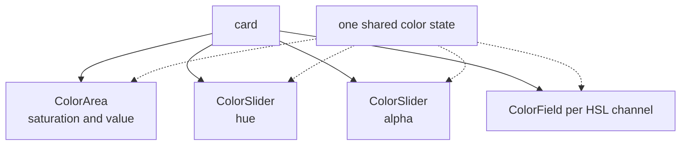

# How to Build a Material UI Color Picker

A Material-style picker: a color area, a hue slider, an alpha slider and one field per channel.

<script setup>
import MaterialColorPickerGuide from './demo/vue/MaterialColorPickerGuide.vue'
</script>

Here's what we'll end up with:

<MaterialColorPickerGuide />


<details>
<summary>Click to view the full code</summary>

::: code-group

<<< @/how-to/demo/vue/MaterialColorPickerGuide.vue [Vue]
<<< @/how-to/demo/react/MaterialColorPickerGuide.tsx [React]
<<< @/how-to/demo/svelte/MaterialColorPickerGuide.svelte [Svelte]
<<< @/how-to/demo/angular/material-color-picker-guide.ts [Angular]

:::

</details>

The parts, and how they nest:



## Step 1: Set up shared state

Every component reads and writes one color ref.

::: code-group

```vue [Vue]
<script setup lang="ts">
import { useColor } from "@urcolor/vue";  // [!code ++]

const { color } = useColor("hsl(210, 80%, 50%)");  // [!code ++]
</script>
```

```tsx [React]
import { useColor } from "@urcolor/react"; // [!code ++]

function MaterialColorPicker() {
  const { color, setColor } = useColor("hsl(210, 80%, 50%)"); // [!code ++]
}
```

```svelte [Svelte]
<script lang="ts">
  import { useColor } from "@urcolor/svelte"; // [!code ++]

  const colorState = useColor("hsl(210, 80%, 50%)"); // [!code ++]
</script>
```

```ts [Angular]
import { Component, signal } from "@angular/core";
import { Color } from "@urcolor/core"; // [!code ++]

@Component({
  selector: "material-color-picker",
  template: ``,
})
export class MaterialColorPicker {
  protected readonly color = signal<Color>(Color.parse("hsl(210, 80%, 50%)")!); // [!code ++]
}
```

:::

`useColor()` creates color state from any CSS color string. Vue returns a `{ color }` shallow ref and React returns `{ color, setColor }`. Svelte returns a rune-backed object whose `color`, `hex` and `alpha` are getters, so keep the object and read `colorState.color` rather than destructuring it, or reactivity is lost. Angular has no hook: a plain `signal<Color>()` is the state, and `[(value)]` binds to it directly. Every part below binds to that same one piece of state, which is what keeps the area, the sliders and the fields in sync.

## Step 2: Add the color area

`ColorArea` is the plane for picking saturation and value in HSV.

::: code-group

```vue [Vue]
<script setup lang="ts">
import { // [!code ++]
  useColor, // [!code ++]
  ColorAreaRoot, // [!code ++]
  ColorAreaArea, // [!code ++]
  ColorAreaGradient, // [!code ++]
  ColorAreaThumb, // [!code ++]
} from "@urcolor/vue"; // [!code ++]

const { color } = useColor("hsl(210, 80%, 50%)");
</script>

<template>
  <!-- [!code ++:23] -->
  <div class="flex w-full max-w-xs flex-col gap-3 rounded-xl p-3">
    <ColorAreaRoot
      v-model="color"
      color-space="hsv"
      x-channel="s"
      y-channel="v"
      :y-inverted="true"
      class="relative h-[180px] w-full cursor-crosshair touch-none overflow-clip rounded-lg"
    >
      <ColorAreaArea as="div" class="absolute inset-0">
        <ColorAreaGradient as="div" class="absolute inset-0" />
        <ColorAreaThumb
          as="div"
          class="
            absolute size-5 transform-(--reka-slider-area-thumb-transform)
            rounded-full border-2 border-white
            shadow-[0_0_0_1px_rgba(0,0,0,0.3),0_2px_4px_rgba(0,0,0,0.3)]
            focus-visible:shadow-[0_0_0_1px_rgba(0,0,0,0.3),0_0_0_3px_rgba(66,153,225,0.6)]
          "
        />
      </ColorAreaArea>
    </ColorAreaRoot>
  </div>
</template>
```

```tsx [React]
import { useColor, ColorArea } from "@urcolor/react"; // [!code ++]

function MaterialColorPicker() {
  const { color, setColor } = useColor("hsl(210, 80%, 50%)");

  return (
    // [!code ++:20]
    <div className="flex w-full max-w-xs flex-col gap-3 rounded-xl p-3">
      <ColorArea.Root
        value={color}
        onValueChange={setColor}
        colorSpace="hsv"
        xChannel="s"
        yChannel="v"
        yInverted
        className="relative block h-[180px] w-full cursor-crosshair touch-none overflow-clip rounded-lg"
      >
        <ColorArea.Gradient className="absolute inset-0" />
        <ColorArea.Thumb
          className="
            absolute size-5 rounded-full border-2 border-white
            shadow-[0_0_0_1px_rgba(0,0,0,0.3),0_2px_4px_rgba(0,0,0,0.3)]
            focus-visible:shadow-[0_0_0_1px_rgba(0,0,0,0.3),0_0_0_3px_rgba(66,153,225,0.6)]
          "
        />
      </ColorArea.Root>
    </div>
  );
}
```

```svelte [Svelte]
<script lang="ts">
  import { ColorArea, useColor } from "@urcolor/svelte"; // [!code ++]

  const colorState = useColor("hsl(210, 80%, 50%)");
</script>

<!-- [!code ++:19] -->
<div class="flex w-full max-w-xs flex-col gap-3 rounded-xl p-3">
  <ColorArea.Root
    bind:value={() => colorState.color, colorState.setColor}
    colorSpace="hsv"
    xChannel="s"
    yChannel="v"
    yInverted
    class="relative block h-[180px] w-full cursor-crosshair touch-none overflow-clip rounded-lg"
  >
    <ColorArea.Gradient class="absolute inset-0" />
    <ColorArea.Thumb
      class="
        absolute size-5 rounded-full border-2 border-white
        shadow-[0_0_0_1px_rgba(0,0,0,0.3),0_2px_4px_rgba(0,0,0,0.3)]
        focus-visible:shadow-[0_0_0_1px_rgba(0,0,0,0.3),0_0_0_3px_rgba(66,153,225,0.6)]
      "
    />
  </ColorArea.Root>
</div>
```

```ts [Angular]
import { Component, signal } from "@angular/core";
import { Color } from "@urcolor/core";
import { COLOR_AREA_DIRECTIVES } from "@urcolor/angular"; // [!code ++]

@Component({
  selector: "material-color-picker",
  imports: [...COLOR_AREA_DIRECTIVES], // [!code ++]
  template: `
    <!-- [!code ++:21] -->
    <div class="flex w-full max-w-xs flex-col gap-3 rounded-xl p-3">
      <div
        urcColorAreaRoot
        [(value)]="color"
        colorSpace="hsv"
        xChannel="s"
        yChannel="v"
        yInverted
        class="relative block h-[180px] w-full cursor-crosshair touch-none overflow-clip rounded-lg"
      >
        <canvas urcColorAreaGradient class="absolute inset-0"></canvas>
        <div
          urcColorAreaThumb
          class="
            absolute size-5 rounded-full border-2 border-white
            shadow-[0_0_0_1px_rgba(0,0,0,0.3),0_2px_4px_rgba(0,0,0,0.3)]
            focus-visible:shadow-[0_0_0_1px_rgba(0,0,0,0.3),0_0_0_3px_rgba(66,153,225,0.6)]
          "
        ></div>
      </div>
    </div>
  `,
})
export class MaterialColorPicker {
  protected readonly color = signal<Color>(Color.parse("hsl(210, 80%, 50%)")!);
}
```

:::

Vue's `v-model` and Angular's `[(value)]` are true two-way bindings. React is one-way plus `onValueChange`. Svelte's `value` is `$bindable`, but `useColor` exposes getters, so bind it with Svelte 5's function form, `bind:value={() => colorState.color, colorState.setColor}`, which is `v-model` for a getter/setter pair.

Angular ships each family as a `COLOR_*_DIRECTIVES` array, so one entry in `imports` brings in the whole set. This recipe composes three families, so it ends up with three entries.

Two structural differences are worth calling out. Vue nests the gradient and thumb inside a `ColorAreaArea` element; React, Svelte and Angular have no `Area` part, so `Gradient` and `Thumb` are direct children of `Root`. And the axis props are named `x-channel` / `y-channel` / `:y-inverted` in Vue but `xChannel` / `yChannel` / `yInverted` in React, Svelte and Angular. In Angular the gradient's selector is `canvas[urcColorAreaGradient]`, so it goes on a `<canvas>` element you own; Vue, React and Svelte render their own canvas for you. The thumb positions itself in all four, so you never set `top`/`left` yourself.

## Step 3: Add the hue slider

A `ColorSlider` below the area controls hue.

::: code-group

```vue [Vue]
<script setup lang="ts">
import {
  useColor,
  ColorAreaRoot,
  ColorAreaArea,
  ColorAreaGradient,
  ColorAreaThumb,
  ColorSliderRoot, // [!code ++]
  ColorSliderTrack, // [!code ++]
  ColorSliderGradient, // [!code ++]
  ColorSliderThumb, // [!code ++]
} from "@urcolor/vue";

const { color } = useColor("hsl(210, 80%, 50%)");
</script>

<template>
  <div class="flex w-full max-w-xs flex-col gap-3 rounded-xl p-3">
    <ColorAreaRoot
      v-model="color"
      color-space="hsv"
      x-channel="s"
      y-channel="v"
      :y-inverted="true"
      class="relative h-[180px] w-full cursor-crosshair touch-none overflow-clip rounded-lg"
    >
      <ColorAreaArea as="div" class="absolute inset-0">
        <ColorAreaGradient as="div" class="absolute inset-0" />
        <ColorAreaThumb
          as="div"
          class="
            absolute size-5 transform-(--reka-slider-area-thumb-transform)
            rounded-full border-2 border-white
            shadow-[0_0_0_1px_rgba(0,0,0,0.3),0_2px_4px_rgba(0,0,0,0.3)]
            focus-visible:shadow-[0_0_0_1px_rgba(0,0,0,0.3),0_0_0_3px_rgba(66,153,225,0.6)]
          "
        />
      </ColorAreaArea>
    </ColorAreaRoot>

    <!-- [!code ++:16] -->
    <ColorSliderRoot
      v-model="color"
      color-space="hsv"
      channel="h"
    >
      <ColorSliderTrack class="relative h-4 overflow-hidden rounded-full">
        <ColorSliderGradient
          class="absolute inset-0 rounded-full"
          :colors="['red', 'yellow', 'lime', 'cyan', 'blue', 'magenta', 'red']"
        />
        <ColorSliderThumb
          class="
            block size-4 rounded-full border-2 border-white
            shadow-[0_0_0_1px_rgba(0,0,0,0.3),0_2px_4px_rgba(0,0,0,0.3)]
            focus-visible:shadow-[0_0_0_1px_rgba(0,0,0,0.3),0_0_0_3px_rgba(66,153,225,0.6)]
          "
          aria-label="Hue"
        />
      </ColorSliderTrack>
    </ColorSliderRoot>
  </div>
</template>
```

```tsx [React]
import { useColor, ColorArea, ColorSlider } from "@urcolor/react"; // [!code ++]

function MaterialColorPicker() {
  const { color, setColor } = useColor("hsl(210, 80%, 50%)");

  return (
    <div className="flex w-full max-w-xs flex-col gap-3 rounded-xl p-3">
      <ColorArea.Root
        value={color}
        onValueChange={setColor}
        colorSpace="hsv"
        xChannel="s"
        yChannel="v"
        yInverted
        className="relative block h-[180px] w-full cursor-crosshair touch-none overflow-clip rounded-lg"
      >
        <ColorArea.Gradient className="absolute inset-0" />
        <ColorArea.Thumb
          className="
            absolute size-5 rounded-full border-2 border-white
            shadow-[0_0_0_1px_rgba(0,0,0,0.3),0_2px_4px_rgba(0,0,0,0.3)]
            focus-visible:shadow-[0_0_0_1px_rgba(0,0,0,0.3),0_0_0_3px_rgba(66,153,225,0.6)]
          "
        />
      </ColorArea.Root>

      {/* [!code ++:23] */}
      <ColorSlider.Root
        value={color}
        onValueChange={setColor}
        colorSpace="hsv"
        channel="h"
      >
        <ColorSlider.Control>
          <ColorSlider.Track className="relative h-4 overflow-hidden rounded-full">
            <ColorSlider.Gradient
              className="absolute inset-0 rounded-full"
              colors={["red", "yellow", "lime", "cyan", "blue", "magenta", "red"]}
            />
            <ColorSlider.Thumb
              className="
                block size-4 rounded-full border-2 border-white
                shadow-[0_0_0_1px_rgba(0,0,0,0.3),0_2px_4px_rgba(0,0,0,0.3)]
                focus-visible:shadow-[0_0_0_1px_rgba(0,0,0,0.3),0_0_0_3px_rgba(66,153,225,0.6)]
              "
              aria-label="Hue"
            />
          </ColorSlider.Track>
        </ColorSlider.Control>
      </ColorSlider.Root>
    </div>
  );
}
```

```svelte [Svelte]
<script lang="ts">
  import { ColorArea, ColorSlider, useColor } from "@urcolor/svelte"; // [!code ++]

  const colorState = useColor("hsl(210, 80%, 50%)");
</script>

<div class="flex w-full max-w-xs flex-col gap-3 rounded-xl p-3">
  <ColorArea.Root
    bind:value={() => colorState.color, colorState.setColor}
    colorSpace="hsv"
    xChannel="s"
    yChannel="v"
    yInverted
    class="relative block h-[180px] w-full cursor-crosshair touch-none overflow-clip rounded-lg"
  >
    <ColorArea.Gradient class="absolute inset-0" />
    <ColorArea.Thumb
      class="
        absolute size-5 rounded-full border-2 border-white
        shadow-[0_0_0_1px_rgba(0,0,0,0.3),0_2px_4px_rgba(0,0,0,0.3)]
        focus-visible:shadow-[0_0_0_1px_rgba(0,0,0,0.3),0_0_0_3px_rgba(66,153,225,0.6)]
      "
    />
  </ColorArea.Root>

  <!-- [!code ++:20] -->
  <ColorSlider.Root
    bind:value={() => colorState.color, colorState.setColor}
    colorSpace="hsv"
    channel="h"
  >
    <ColorSlider.Track class="relative h-4 overflow-hidden rounded-full">
      <ColorSlider.Gradient
        class="absolute inset-0 rounded-full"
        colors={["red", "yellow", "lime", "cyan", "blue", "magenta", "red"]}
      />
      <ColorSlider.Thumb
        class="
          block size-4 rounded-full border-2 border-white
          shadow-[0_0_0_1px_rgba(0,0,0,0.3),0_2px_4px_rgba(0,0,0,0.3)]
          focus-visible:shadow-[0_0_0_1px_rgba(0,0,0,0.3),0_0_0_3px_rgba(66,153,225,0.6)]
        "
        aria-label="Hue"
      />
    </ColorSlider.Track>
  </ColorSlider.Root>
</div>
```

```ts [Angular]
import { Component, signal } from "@angular/core";
import { Color } from "@urcolor/core";
import { COLOR_AREA_DIRECTIVES, COLOR_SLIDER_DIRECTIVES } from "@urcolor/angular"; // [!code ++]

@Component({
  selector: "material-color-picker",
  imports: [...COLOR_AREA_DIRECTIVES, ...COLOR_SLIDER_DIRECTIVES], // [!code ++]
  template: `
    <div class="flex w-full max-w-xs flex-col gap-3 rounded-xl p-3">
      <div
        urcColorAreaRoot
        [(value)]="color"
        colorSpace="hsv"
        xChannel="s"
        yChannel="v"
        yInverted
        class="relative block h-[180px] w-full cursor-crosshair touch-none overflow-clip rounded-lg"
      >
        <canvas urcColorAreaGradient class="absolute inset-0"></canvas>
        <div
          urcColorAreaThumb
          class="
            absolute size-5 rounded-full border-2 border-white
            shadow-[0_0_0_1px_rgba(0,0,0,0.3),0_2px_4px_rgba(0,0,0,0.3)]
            focus-visible:shadow-[0_0_0_1px_rgba(0,0,0,0.3),0_0_0_3px_rgba(66,153,225,0.6)]
          "
        ></div>
      </div>

      <!-- [!code ++:18] -->
      <div urcColorSliderRoot [(value)]="color" colorSpace="hsv" channel="h">
        <div urcColorSliderTrack class="relative h-4 overflow-hidden rounded-full">
          <canvas
            urcColorSliderGradient
            class="absolute inset-0 rounded-full"
            [colors]="['red', 'yellow', 'lime', 'cyan', 'blue', 'magenta', 'red']"
          ></canvas>
          <div
            urcColorSliderThumb
            class="
              block size-4 rounded-full border-2 border-white
              shadow-[0_0_0_1px_rgba(0,0,0,0.3),0_2px_4px_rgba(0,0,0,0.3)]
              focus-visible:shadow-[0_0_0_1px_rgba(0,0,0,0.3),0_0_0_3px_rgba(66,153,225,0.6)]
            "
            aria-label="Hue"
          ></div>
        </div>
      </div>
    </div>
  `,
})
export class MaterialColorPicker {
  protected readonly color = signal<Color>(Color.parse("hsl(210, 80%, 50%)")!);
}
```

:::

The slider binds to the same color as the area, so dragging either one updates the other. Vue, Svelte and Angular go straight from the slider root to the track; React wraps the track in a `ColorSlider.Control`, which Base UI's slider requires. Angular puts the gradient on a `<canvas>` because its selector is `canvas[urcColorSliderGradient]`.

## Step 4: Add the alpha slider

Another `ColorSlider` controls alpha. `ColorSliderGradient` paints the checkerboard behind its own canvas, so transparency shows without a separate element.

::: code-group

```vue [Vue]
<script setup lang="ts">
import {
  useColor,
  ColorAreaRoot,
  ColorAreaArea,
  ColorAreaGradient,
  ColorAreaThumb,
  ColorSliderRoot,
  ColorSliderTrack,
  ColorSliderGradient,
  ColorSliderThumb,
} from "@urcolor/vue";

const { color } = useColor("hsl(210, 80%, 50%)");
</script>

<template>
  <div class="flex w-full max-w-xs flex-col gap-3 rounded-xl p-3">
    <!-- ...color area and hue slider... -->

    <!-- [!code ++:16] -->
    <ColorSliderRoot
      v-model="color"
      color-space="hsv"
      channel="alpha"
    >
      <ColorSliderTrack class="relative h-4 overflow-hidden rounded-full">
        <ColorSliderGradient class="absolute inset-0 rounded-full" />
        <ColorSliderThumb
          class="
            block size-4 rounded-full border-2 border-white
            shadow-[0_0_0_1px_rgba(0,0,0,0.3),0_2px_4px_rgba(0,0,0,0.3)]
            focus-visible:shadow-[0_0_0_1px_rgba(0,0,0,0.3),0_0_0_3px_rgba(66,153,225,0.6)]
          "
          aria-label="Alpha"
        />
      </ColorSliderTrack>
    </ColorSliderRoot>
  </div>
</template>
```

```tsx [React]
import { useColor, ColorArea, ColorSlider } from "@urcolor/react";

function MaterialColorPicker() {
  const { color, setColor } = useColor("hsl(210, 80%, 50%)");

  return (
    <div className="flex w-full max-w-xs flex-col gap-3 rounded-xl p-3">
      {/* ...color area and hue slider... */}

      {/* [!code ++:20] */}
      <ColorSlider.Root
        value={color}
        onValueChange={setColor}
        colorSpace="hsv"
        channel="alpha"
      >
        <ColorSlider.Control>
          <ColorSlider.Track className="relative h-4 overflow-hidden rounded-full">
            <ColorSlider.Gradient className="absolute inset-0 rounded-full" />
            <ColorSlider.Thumb
              className="
                block size-4 rounded-full border-2 border-white
                shadow-[0_0_0_1px_rgba(0,0,0,0.3),0_2px_4px_rgba(0,0,0,0.3)]
                focus-visible:shadow-[0_0_0_1px_rgba(0,0,0,0.3),0_0_0_3px_rgba(66,153,225,0.6)]
              "
              aria-label="Alpha"
            />
          </ColorSlider.Track>
        </ColorSlider.Control>
      </ColorSlider.Root>
    </div>
  );
}
```

```svelte [Svelte]
<script lang="ts">
  import { ColorArea, ColorSlider, useColor } from "@urcolor/svelte";

  const colorState = useColor("hsl(210, 80%, 50%)");
</script>

<div class="flex w-full max-w-xs flex-col gap-3 rounded-xl p-3">
  <!-- ...color area and hue slider... -->

  <!-- [!code ++:17] -->
  <ColorSlider.Root
    bind:value={() => colorState.color, colorState.setColor}
    colorSpace="hsv"
    channel="alpha"
  >
    <ColorSlider.Track class="relative h-4 overflow-hidden rounded-full">
      <ColorSlider.Gradient class="absolute inset-0 rounded-full" />
      <ColorSlider.Thumb
        class="
          block size-4 rounded-full border-2 border-white
          shadow-[0_0_0_1px_rgba(0,0,0,0.3),0_2px_4px_rgba(0,0,0,0.3)]
          focus-visible:shadow-[0_0_0_1px_rgba(0,0,0,0.3),0_0_0_3px_rgba(66,153,225,0.6)]
        "
        aria-label="Alpha"
      />
    </ColorSlider.Track>
  </ColorSlider.Root>
</div>
```

```ts [Angular]
import { Component, signal } from "@angular/core";
import { Color } from "@urcolor/core";
import { COLOR_AREA_DIRECTIVES, COLOR_SLIDER_DIRECTIVES } from "@urcolor/angular";

@Component({
  selector: "material-color-picker",
  imports: [...COLOR_AREA_DIRECTIVES, ...COLOR_SLIDER_DIRECTIVES],
  template: `
    <div class="flex w-full max-w-xs flex-col gap-3 rounded-xl p-3">
      <!-- ...color area and hue slider... -->

      <!-- [!code ++:14] -->
      <div urcColorSliderRoot [(value)]="color" colorSpace="hsv" channel="alpha">
        <div urcColorSliderTrack class="relative h-4 overflow-hidden rounded-full">
          <canvas urcColorSliderGradient class="absolute inset-0 rounded-full"></canvas>
          <div
            urcColorSliderThumb
            class="
              block size-4 rounded-full border-2 border-white
              shadow-[0_0_0_1px_rgba(0,0,0,0.3),0_2px_4px_rgba(0,0,0,0.3)]
              focus-visible:shadow-[0_0_0_1px_rgba(0,0,0,0.3),0_0_0_3px_rgba(66,153,225,0.6)]
            "
            aria-label="Alpha"
          ></div>
        </div>
      </div>
    </div>
  `,
})
export class MaterialColorPicker {
  protected readonly color = signal<Color>(Color.parse("hsl(210, 80%, 50%)")!);
}
```

:::

`ColorSliderGradient` renders the checkerboard behind the canvas itself, so transparency is visible with no extra element. That holds in Vue, React, Svelte and Angular alike. None of them need a separate `Checkerboard` part, because the gradient already paints one. Dropping the `colors` prop is what makes the gradient derive its stops from the channel, which for `alpha` means fully transparent to fully opaque in the current color.

## Step 5: Add color field inputs

A `ColorField` per HSL channel lets people type exact values.

::: code-group

```vue [Vue]
<script setup lang="ts">
import { Label } from "reka-ui"; // [!code ++]
import {
  useColor,
  ColorAreaRoot,
  ColorAreaArea,
  ColorAreaGradient,
  ColorAreaThumb,
  ColorSliderRoot,
  ColorSliderTrack,
  ColorSliderGradient,
  ColorSliderThumb,
  ColorFieldRoot, // [!code ++]
  ColorFieldInput, // [!code ++]
  ColorFieldIncrement, // [!code ++]
  ColorFieldDecrement, // [!code ++]
} from "@urcolor/vue";

const { color, channels } = useColor("hsl(210, 80%, 50%)"); // [!code ++]
</script>

<template>
  <div class="flex w-full max-w-xs flex-col gap-3 rounded-xl p-3">
    <!-- ...color area, hue slider, alpha slider... -->

    <!-- [!code ++:30] -->
    <div class="flex flex-1 flex-wrap gap-2">
      <div
        v-for="ch in channels"
        :key="ch.key"
        class="flex min-w-[60px] flex-1 flex-col gap-1"
      >
        <Label
          :for="`material-field-${ch.key}`"
          class="text-xs font-semibold"
        >{{ ch.label }}</Label>
        <ColorFieldRoot
          v-model="color"
          color-space="hsl"
          :channel="ch.key"
          class="flex items-center overflow-hidden rounded-md border"
        >
          <ColorFieldDecrement
            class="flex size-7 shrink-0 cursor-pointer items-center justify-center"
          >
            &minus;
          </ColorFieldDecrement>
          <ColorFieldInput
            :id="`material-field-${ch.key}`"
            class="w-0 min-w-0 flex-1 border-none bg-transparent px-0.5 py-1 text-center font-mono text-sm outline-none"
          />
          <ColorFieldIncrement
            class="flex size-7 shrink-0 cursor-pointer items-center justify-center"
          >
            +
          </ColorFieldIncrement>
        </ColorFieldRoot>
      </div>
    </div>
  </div>
</template>
```

```tsx [React]
import { useColor, ColorArea, ColorField, ColorSlider } from "@urcolor/react"; // [!code ++]

function MaterialColorPicker() {
  const { color, setColor, channels } = useColor("hsl(210, 80%, 50%)", "hsl"); // [!code ++]

  return (
    <div className="flex w-full max-w-xs flex-col gap-3 rounded-xl p-3">
      {/* ...color area, hue slider, alpha slider... */}

      {/* [!code ++:34] */}
      <div className="flex flex-1 flex-wrap gap-2">
        {channels.map((ch) => (
          <div key={ch.key} className="flex min-w-[60px] flex-1 flex-col gap-1">
            <label
              htmlFor={`material-field-${ch.key}`}
              className="text-xs font-semibold"
            >
              {ch.label}
            </label>
            <ColorField.Root
              value={color}
              onValueChange={setColor}
              colorSpace="hsl"
              channel={ch.key}
              className="flex items-center overflow-hidden rounded-md border"
            >
              <ColorField.Decrement
                className="flex size-7 shrink-0 cursor-pointer items-center justify-center"
              >
                &minus;
              </ColorField.Decrement>
              <ColorField.Input
                id={`material-field-${ch.key}`}
                className="w-0 min-w-0 flex-1 border-none bg-transparent px-0.5 py-1 text-center font-mono text-sm outline-none"
              />
              <ColorField.Increment
                className="flex size-7 shrink-0 cursor-pointer items-center justify-center"
              >
                +
              </ColorField.Increment>
            </ColorField.Root>
          </div>
        ))}
      </div>
    </div>
  );
}
```

```svelte [Svelte]
<script lang="ts">
  import { ColorArea, ColorField, ColorSlider, useColor } from "@urcolor/svelte"; // [!code ++]

  const colorState = useColor("hsl(210, 80%, 50%)", "hsl"); // [!code ++]
</script>

<div class="flex w-full max-w-xs flex-col gap-3 rounded-xl p-3">
  <!-- ...color area, hue slider, alpha slider... -->

  <!-- [!code ++:31] -->
  <div class="flex flex-1 flex-wrap gap-2">
    {#each colorState.channels as ch (ch.key)}
      <div class="flex min-w-[60px] flex-1 flex-col gap-1">
        <label
          for={`material-field-${ch.key}`}
          class="text-xs font-semibold"
        >{ch.label}</label>
        <ColorField.Root
          bind:value={() => colorState.color, colorState.setColor}
          colorSpace="hsl"
          channel={ch.key}
          class="flex items-center overflow-hidden rounded-md border"
        >
          <ColorField.Decrement
            class="flex size-7 shrink-0 cursor-pointer items-center justify-center"
          >
            &minus;
          </ColorField.Decrement>
          <ColorField.Input
            id={`material-field-${ch.key}`}
            class="w-0 min-w-0 flex-1 border-none bg-transparent px-0.5 py-1 text-center font-mono text-sm outline-none"
          />
          <ColorField.Increment
            class="flex size-7 shrink-0 cursor-pointer items-center justify-center"
          >
            +
          </ColorField.Increment>
        </ColorField.Root>
      </div>
    {/each}
  </div>
</div>
```

```ts [Angular]
import { Component, signal } from "@angular/core";
import { Color } from "@urcolor/core";
import { channelsOf } from "@urcolor/shared"; // [!code ++]
import { // [!code ++]
  COLOR_AREA_DIRECTIVES, // [!code ++]
  COLOR_FIELD_DIRECTIVES, // [!code ++]
  COLOR_SLIDER_DIRECTIVES, // [!code ++]
} from "@urcolor/angular"; // [!code ++]

@Component({
  selector: "material-color-picker",
  imports: [...COLOR_AREA_DIRECTIVES, ...COLOR_SLIDER_DIRECTIVES, ...COLOR_FIELD_DIRECTIVES], // [!code ++]
  template: `
    <div class="flex w-full max-w-xs flex-col gap-3 rounded-xl p-3">
      <!-- ...color area, hue slider, alpha slider... -->

      <!-- [!code ++:37] -->
      <div class="flex flex-1 flex-wrap gap-2">
        @for (ch of channels; track ch.key) {
          <div class="flex min-w-[60px] flex-1 flex-col gap-1">
            <label
              [attr.for]="'material-field-' + ch.key"
              class="text-xs font-semibold"
            >{{ ch.label }}</label>
            <div
              urcColorFieldRoot
              [(value)]="color"
              colorSpace="hsl"
              [channel]="ch.key"
              class="flex items-center overflow-hidden rounded-md border"
            >
              <button
                type="button"
                urcColorFieldDecrement
                class="flex size-7 shrink-0 cursor-pointer items-center justify-center"
              >
                &minus;
              </button>
              <input
                urcColorFieldInput
                [id]="'material-field-' + ch.key"
                class="w-0 min-w-0 flex-1 border-none bg-transparent px-0.5 py-1 text-center font-mono text-sm outline-none"
              />
              <button
                type="button"
                urcColorFieldIncrement
                class="flex size-7 shrink-0 cursor-pointer items-center justify-center"
              >
                +
              </button>
            </div>
          </div>
        }
      </div>
    </div>
  `,
})
export class MaterialColorPicker {
  protected readonly color = signal<Color>(Color.parse("hsl(210, 80%, 50%)")!);
  protected readonly channels = channelsOf("hsl");
}
```

:::

`useColor` already knows the channels: each one carries a key and a label, which is all a field needs. The second argument pins them to `hsl`, so dragging the HSV area cannot renumber the fields underneath. Angular has no `useColor`, so its component reads the same list from `channelsOf`; `createColorStore` exposes it as a `channels` signal for anyone using the store.

Angular's field parts are element-scoped: the selectors are `input[urcColorFieldInput]`, `button[urcColorFieldIncrement]` and `button[urcColorFieldDecrement]`, so you write the `<input>` and the two `<button type="button">` elements yourself. Vue, React and Svelte render those elements for you.

::: tip
The components ship unstyled. The classes above are one example, written with Tailwind CSS. You can style the card, inputs, and sliders however you like.
:::
